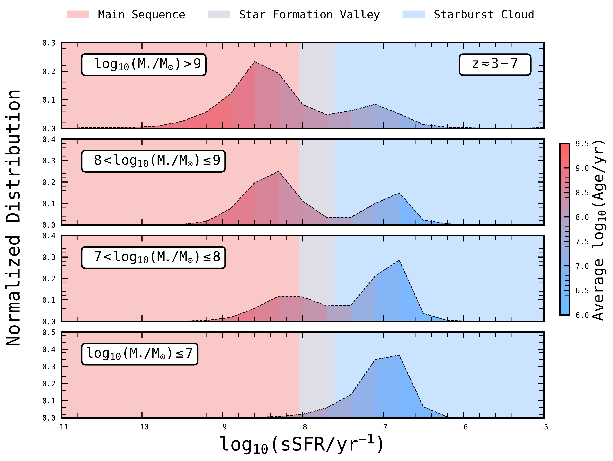

$\newcommand{\ensuremath}{}$
$\newcommand{\xspace}{}$
$\newcommand{\object}[1]{\texttt{#1}}$
$\newcommand{\farcs}{{.}''}$
$\newcommand{\farcm}{{.}'}$
$\newcommand{\arcsec}{''}$
$\newcommand{\arcmin}{'}$
$\newcommand{\ion}[2]{#1#2}$
$\newcommand{\textsc}[1]{\textrm{#1}}$
$\newcommand{\hl}[1]{\textrm{#1}}$
$\newcommand{\footnote}[1]{}$
$\newcommand{\gsim}{{\;\raise0.3ex\hbox{>\kern-0.75em\raise-1.1ex\hbox{\sim}}\;}}$

# $\bf{The emergence of the Star Formation Main Sequence with redshift unfolded by JWST}$

<mark>Appeared on: 2024-06-21</mark> -  _15 pages, 4 figures. Submitted to ApJ_

P. Rinaldi, et al. -- incl., <mark>L. Boogaard</mark>, <mark>F. Walter</mark>

**Abstract:** We investigate the correlation between stellar mass (M $_{\star}$ ) and star formation rate (SFR) across the stellar mass range $\log_{10}(\rm M_{\star}/M_{\odot}) \approx 6-11$ . We consider almost 50,000 star-forming galaxies at $z\approx3-7$ , leveraging data from COSMOS/SMUVS, JADES/GOODS-SOUTH, and MIDIS/XDF. This is the first study spanning such a wide  stellar mass range without relying on gravitational lensing effects. We locate our galaxies on the $\mathrm{SFR - M_{\star}}$ plane to assess how the location of galaxies in the star-formation  main sequence (MS) and starburst (SB) region evolves with stellar mass and redshift. We find that the two star-forming modes tend to converge at $\log_{10}(\rm M_{\star}/M_{\odot}) < 7$ , with all galaxies found in the SB mode. By dissecting our galaxy sample in stellar mass and redshift, we show that the emergence of the star-formation MS is stellar-mass dependent: while in galaxies with $\log_{10}(\rm M_{\star}/M_{\odot}) > 9$ the MS is already well in place at $z=5-7$ , for galaxies with $\log_{10}(\rm M_{\star}/M_{\odot}) \approx 7-8$ it only becomes significant at $z<4$ .  Overall, our results are in line with previous findings that the SB mode dominates amongst low stellar-mass galaxies. The earlier emergence of the MS for massive galaxies is consistent with galaxy downsizing.

**Figure 2. -** The sSFR distribution of the entire sample (JADES/GOODS-SOUTH + COSMOS/SMUVS) divided in four distinct stellar mass bins. The entire plane is colour coded following the regions derived by [Caputi, Deshmukh and Ashby (2017)](): the star-formation MS for sSFR $>$ 10$^{-8.05}$ yr$^{-1}$, the Starburst cloud for sSFR $>$ 10$^{-7.60}$ yr$^{-1}$, and the Star Formation Valley for 10$^{-8.05}$ yr$^{-1}$$\leq$ sSFR $\leq$ 10$^{-7.60}$ yr$^{-1}$. The sSFR distribution are color coded by age, as derived by LePHARE. To consider the different areas covered by JADES/GOODS-SOUTH (67.7 arcmin$^{2}$) and COSMOS/SMUVS (0.66 deg$^{2}$), we normalized the JADES/GOODS-SOUTH counts to match the COSMOS/SMUVS survey area, which is approximately 35 times larger than that of JADES/GOODS-SOUTH. (*figure:ssfr_m_evo*)

**Figure 1. -** The $\mathrm{SFR}-\mathrm{M_{\star}}$ plane, showcasing all sources (JADES/GOODS-SOUTH + COSMOS/SMUVS) analyzed in this study, divided in redshift bins as indicated. The pale blue region marks the lower envelope for SB galaxies, based on the criteria from [Caputi, Deshmukh and Ashby (2017)](), [Caputi, Caminha and Fujimoto (2021)](). Fits for the MS and SB are derived from [Rinaldi and Caputi (2022)](). The gray shaded area represents the SFR threshold derived from the 2$\sigma$ detection of the JADES images used in this work. The vertical dashed line in each panel refers to the stellar mass completeness (75\%) of JADES sample at each redshift. The error bar showed in gray (upper right panel) indicate the median uncertainties on M$_{\star}$ and SFR. White contours are also presented to show the bimodality between MS and SB. (*figure:sfr_m_plane*)

**Figure 3. -** The sSFR distribution of the entire sample (JADES/GOODS-SOUTH + COSMOS/SMUVS) divided, this time, in four distinct stellar mass bins and four redshift bins. Each column refers to a specific redshift bin, while each row refers to a specific stellar mass bin. All 16 panels are color coded following [Caputi, Deshmukh and Ashby (2017)](): the star-formation MS for sSFR $>$ 10$^{-8.05}$ yr$^{-1}$, the Starburst cloud for sSFR $>$ 10$^{-7.60}$ yr$^{-1}$, and the Star Formation Valley for 10$^{-8.05}$ yr$^{-1}$$\leq$ sSFR $\leq$ 10$^{-7.60}$ yr$^{-1}$. Also in this case, as we did in Figure \ref{figure:ssfr_m_evo}, to consider the different areas covered by JADES/GOODS-SOUTH (67.7 arcmin$^{2}$) and COSMOS/SMUVS (0.66 deg$^{2}$), we normalized the JADES/GOODS-SOUTH counts to match the COSMOS/SMUVS survey area, which is approximately 35 times larger than that of JADES/GOODS-SOUTH. (*figure:ssfr_z_evo*)

