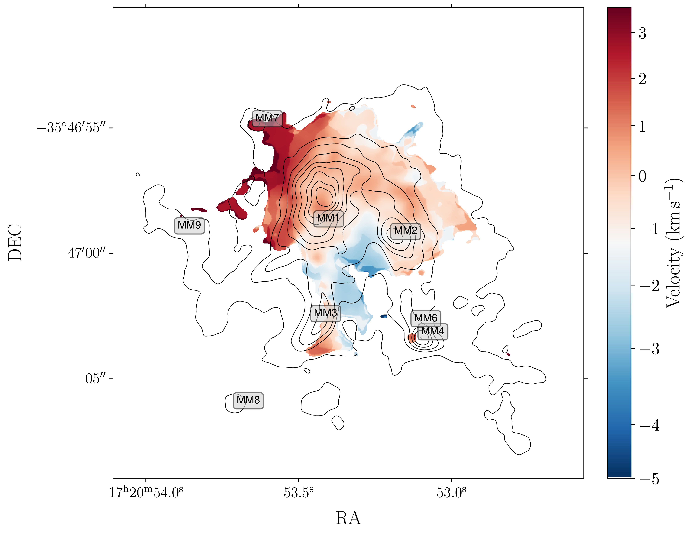
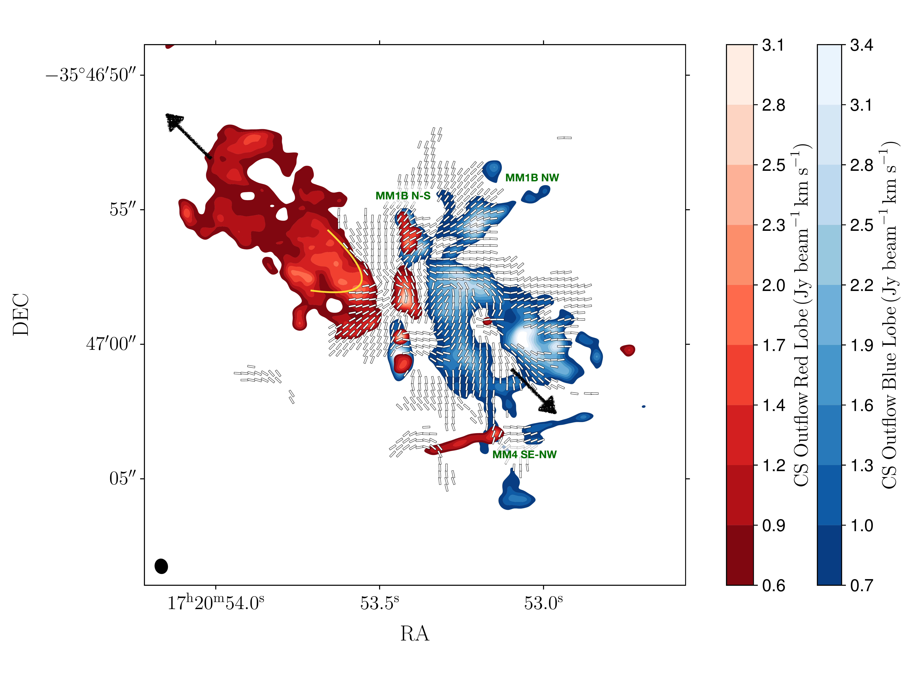
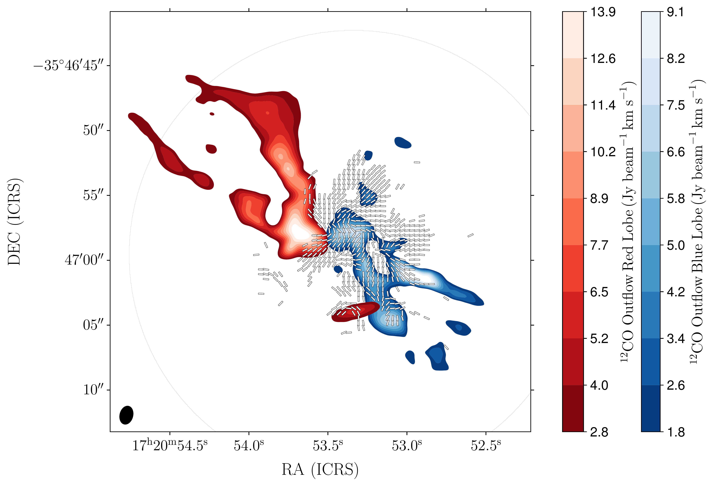

$\newcommand{\ensuremath}{}$
$\newcommand{\xspace}{}$
$\newcommand{\object}[1]{\texttt{#1}}$
$\newcommand{\farcs}{{.}''}$
$\newcommand{\farcm}{{.}'}$
$\newcommand{\arcsec}{''}$
$\newcommand{\arcmin}{'}$
$\newcommand{\ion}[2]{#1#2}$
$\newcommand{\textsc}[1]{\textrm{#1}}$
$\newcommand{\hl}[1]{\textrm{#1}}$
$\newcommand{\footnote}[1]{}$
$\newcommand$
$\newcommand$
$\newcommand{\hr}{\mbox{^h}}$
$\newcommand{\kms}{\mbox{km s^{-1}}}$
$\newcommand{\fluxunits}{\mbox{erg cm^{-2} s^{-1}}}$
$\newcommand{\uJy}{\mbox{\muJy}}$
$\newcommand{\um}{\mbox{\mum}}$
$\newcommand{\ULL}{\mbox{<27.0}}$
$\newcommand{\Msun}{\mbox{M_{\odot}}}$
$\newcommand{\Mdot}{\mbox{\dot{m}_{-4}}}$
$\newcommand{\Lsun}{\mbox{L_{\odot}}}$
$\newcommand{\E}[1]{\hbox{10^{ #1 }}}$
$\newcommand{\per}[1]{\hbox{#1^{-1}}}$
$\newcommand{\tothe}[1]{\hbox{^{#1}}}$
$\newcommand{\about}{\mbox{\sim}}$
$\newcommand{\SIG}{\mbox{W~m^{-2}~Hz^{-1}~sr^{-1}}}$
$\newcommand{\nISM}{\mbox{n_{\rm ISM}}}$
$\newcommand{\min}{\mbox{^m}}$
$\newcommand{\sec}{\mbox{^s}}$
$\newcommand{\deg}{\mbox{^{\circ}}}$
$\newcommand{\HII}{\hbox{H \small{II}}}$

# MagMar III - Resisting the Pressure, Is the Magnetic Field Overwhelmed in NGC6334I?

<mark>Appeared on: 2024-06-24</mark> -  _Accepted for Publication at the Astrophysical Journal_

P. C. Cortés, et al. -- incl., <mark>J. Liu</mark>, <mark>H. Beuther</mark>, <mark>S. Li</mark>

**Abstract:** We report on ALMA observations of polarized dust emission at 1.2 mm from NGC6334I, a source known for its significant flux outbursts. Between five months, our data show no substantial change in total intensity  and a modest 8 \% variation in linear polarization, suggesting a phase of stability or the conclusion of the outburst. The magnetic field, inferred from this polarized emission, displays a predominantly radial pattern from North-West to South-East with intricate disturbances across major cores, hinting at spiral structures. Energy analysis of CS $(J=5 \rightarrow 4)$ emission yields an outflow energy of approximately $3.5\times10^{45}$ ergs, aligning with previous interferometric studies. Utilizing the Davis-Chandrasekhar-Fermi method, we determined magnetic field strengths ranging from 1 to 11 mG, averaging at 1.9 mG. This average increases to 4 $\pm 1$ mG when incorporating Zeeman measurements. Comparative analyses using gravitational, thermal, and kinetic energy maps reveal that magnetic energy is significantly weaker, possibly explaining the observed field morphology.	We also find that the energy in the outflows and the expanding cometary ${\HII}$ region is also larger than the magnetic energy, suggesing that protostellar feedback maybe the dominant driver behind the injection of turbulence in NGC6334I at the scales sampledby our data.The gas in NGC6334I predominantly exhibits supersonic and trans-Alfvenic conditions, transitioning towards a super-Alfvenic regime, underscoring a diminished influence of the magnetic field with increasing gas density. These observations are in agreement with prior polarization studies at 220 GHz, enriching our understanding of the dynamic processes in high-mass star-forming regions.

**Figure 6. -** The figure shows to the ** left** the C$^{33}$S moment 0 map in color scale with superposed contours from dust emission starting at the $3\sigma$ level (see Figure \ref{fig:NGC6334I_I}). The white crosses correspond to the MM1 proto-cluster condensations resolved by [Brogan, Hunter and Cyganowski (2016)](). To the ** right**, we show the moment 1 map in color scale, also with dust continuum contours superposed, as $\Delta V_{i,j} = V_{i,j} - V_{\mathrm{lsr}}$, where $V_{\mathrm{lsr}}= -7.56$ is the velocity center of the C$^{33}$S line as determined by a Gaussian fit.
 (*fig:c33s_moms*)

**Figure 5. -** **\em Top:** CS($J=5 \rightarrow 4$) emission from NGC6334I's outflows  with the magnetic field overlaid. Blue and red lobes are derived from velocities -40 to -12 $\kms$ and -4 to 12 $\kms$, respectively. The outflow cavity is outlined in yellow, with individual flows labeled per Brogan2018 and the primary NE-SW flow indicated by arrows.
**\em Bottom:** CO($J=2 \rightarrow 1$) emission tracing NGC6334I's outflows with with the magnetic field overlaid. Blue and red lobes span from -45 to -25 $\kms$ and -4 to 11 $\kms$, respectively. The CO emission also reveals the cavity, with the magnetic field contouring the outflow's edges.
 (*fig:outflow*)

**Figure 1. -** This figure displays the 1.2 mm total intensity dust emission from NGC6334I. The grayscale indicates the intensity in Jy beam$^{-1}$, corresponding to the scale bar on the right. Contours represent intensity levels at 3.6, 18, 36, 72, 120, 240, 480, 720, and 960 ,mJy,beam$^{-1}$. Sources within our field of view, previously detected by [Brogan, Hunter and Cyganowski (2016)](), are marked with blue crosses and labeled in red. Notably, the MM1 source has shown signs of fragmentation, potentially forming a proto-cluster. The letters A through G denote the MM1 peak regions as identified by high-resolution ALMA observations. The magenta cross shows the position of the CM2 synchrotron/maser source, the bar at the bottom right corresponds a length scale of 2600 au, and the beam size of our ALMA image using robust=0.5 is shown by the black ellipse to the bottom left.
 (*fig:NGC6334I_I*)

