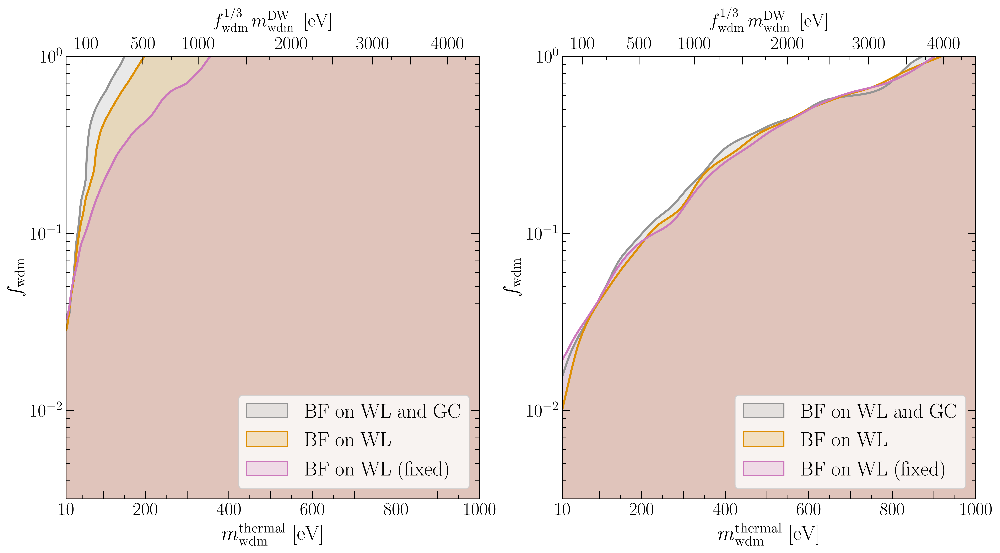
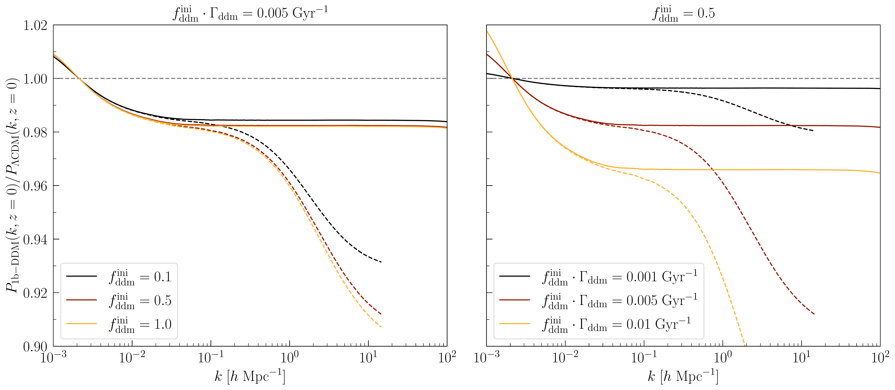

$\newcommand{\ensuremath}{}$
$\newcommand{\xspace}{}$
$\newcommand{\object}[1]{\texttt{#1}}$
$\newcommand{\farcs}{{.}''}$
$\newcommand{\farcm}{{.}'}$
$\newcommand{\arcsec}{''}$
$\newcommand{\arcmin}{'}$
$\newcommand{\ion}[2]{#1#2}$
$\newcommand{\textsc}[1]{\textrm{#1}}$
$\newcommand{\hl}[1]{\textrm{#1}}$
$\newcommand{\footnote}[1]{}$
$\newcommand{\cosmicfish}{\texttt{CosmicFish}}$
$\newcommand{\montepython}{\texttt{MontePython}}$
$\newcommand{\class}{\texttt{CLASS}}$
$\newcommand{\camb}{\texttt{CAMB}}$
$\newcommand{\bcemu}{\texttt{BCemu}}$
$\newcommand{\AP}{Alcock--Paczy\'nski}$
$\newcommand{\niof}{w_{n(z),i}}$
$\newcommand{\de}{{\rm d}}$
$\newcommand{\loga}{\log_{10}(a_{\rm dark} / {\rm Mpc}^{-1})}$
$\newcommand{\logaxi}{\log_{10}(a_{\rm dark} \xi_{\rm idr}^4 / {\rm Mpc}^{-1})}$
$\newcommand{\istfisher}{\citetalias{Blanchard:2019oqi}}$
$\newcommand{\orcid}[1]{\orcidlink{#1}}$

# $\Euclid$ preparation

<mark>Appeared on: 2024-06-27</mark> -  _31 pages, 21 figures_

E. Collaboration, et al. -- incl., <mark>K. Jahnke</mark>

**Abstract:** The $\Euclid$ mission of the European Space Agency will provide weak gravitational lensing and galaxy clustering surveys that can be used to constrain the standard cosmological model and its extensions, with an opportunity to test the properties of dark matter beyond the minimal cold dark matter paradigm.We present forecasts from the combination of the $\Euclid$ weak lensing and photometric galaxy clustering data on the parameters describing four interesting and representative non-minimal dark matter models: a mixture of cold and warm dark matter relics; unstable dark matter decaying either into massless or massive relics; and dark matter experiencing feeble interactions with relativistic relics.We model these scenarios at the level of the non-linear matter power spectrum using emulators trained on dedicated $N$ -body simulations. We use a mock $\Euclid$ likelihood and Monte Carlo Markov Chains to fit mock data and infer error bars on dark matter parameters marginalised over other parameters.We find that the $\Euclid$ photometric probe (alone or in combination with cosmic microwave background data from the $\Planck$ satellite) will be sensitive to the effect of each of the four dark matter models considered here. The improvement will be particularly spectacular for decaying and interacting dark matter models. With $\Euclid$ , the bounds on some dark matter parameters can improve by up to two orders of magnitude compared to current limits. We discuss the dependence of predicted uncertainties on different assumptions: inclusion of photometric galaxy clustering data, minimum angular scale taken into account, modelling of baryonic feedback effects.We conclude that the $\Euclid$ mission will be able to measure quantities related to the dark sector of particle physics with unprecedented sensitivity. This will provide important information for model building in high-energy physics. Any hint of a deviation from the minimal cold dark matter paradigm would have profound implications for cosmology and particle physics.

**Figure 12. -** *Left*: edges of the 95\% credible interval on the WDM mass $m_{\rm wdm}$ and fraction $f_{\rm wdm}$ for the CWDM model, with pessimistic assumptions and three data combinations: weak lensing (WL) alone, weak lensing plus galaxy clustering from the photometric survey (3\texttimes2pt), and 3\texttimes2pt combined with \Planck  CMB data. For the 3\texttimes2pt and 3\texttimes2pt + \Planck  data sets, baryonic feedback has been assumed to affect the WL power spectrum but not the GC power spectrum. The posterior is marginalised over other cosmological parameters, baryonic feedback parameters, and nuisance parameters (accounting for bias uncertainty and intrinsic alignment). The model is equivalent to pure $\Lambda$CDM towards the lower horizontal axis (small $f_{\rm wdm}$) and right vertical axis (large $m_{\rm wdm}$). The forecast assumes a flat prior on the mass of thermal WDM (lower axis) and a logarithmic prior on the WDM fraction (left axis), but we show the relation to Dodelson--Widrow masses in the upper axis (see Sect. \ref{sec:theo_CWDM} for definitions).
    *Right*: same with optimistic assumptions.
     (*fig:CWDM_pess_opt*)

**Figure 13. -** *Left*: same as Fig. \ref{fig:CWDM_pess_opt} but only for the 3\texttimes2pt dataset and with different assumptions on baryonic feedback (BF): fixed BF (magenta), BF affecting only the weak lensing (WL) power spectrum (orange), or BF affecting both the WL and galaxy clustering  (GC) power spectra (grey). The "truth" is expected to lay between the latter two cases (orange and grey), which give anyway very similar results.
    *Right*: same with optimistic assumptions.
     (*fig:CWDM_BF_comparison*)

**Figure 5. -** 
    Ratio of the linear (solid lines) and non-linear (dashed lines) power spectra of several 1b-DDM models to that of a pure $\Lambda$CDM model with the same cosmological parameters, parameterised by the fraction $f_{\rm ddm}^{\rm ini}$ and the decay rate $\Gamma_{\rm ddm}$. We work in the basis $(f_{\rm ddm}^{\rm ini},\Gamma_{\rm ddm}   f_{\rm ddm}^{\rm ini})$ to show that only the product of the two DDM parameters affects the linear power spectrum. The other parameters ($\Omega_{\rm dm}^{\rm ini}$, $\Omega_{{\rm b}}$, $h$, $A_{\rm s}$, $n_{\rm s}$) are kept fixed, and the spectra are computed today ($z=0$). The non-linear spectra are predicted by the emulator introduced in Sect. \ref{sec:nl_1bddm} and plotted up to the maximum wavenumber at which this emulator is trusted.
     (*fig:lin_1b*)

