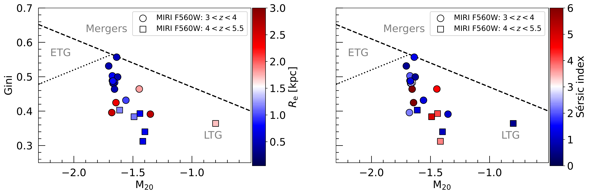
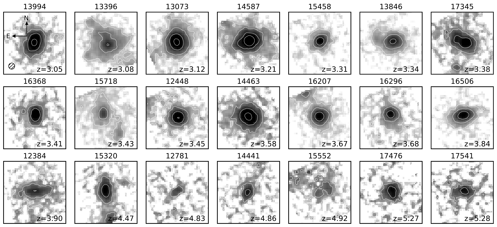

$\newcommand{\ensuremath}{}$
$\newcommand{\xspace}{}$
$\newcommand{\object}[1]{\texttt{#1}}$
$\newcommand{\farcs}{{.}''}$
$\newcommand{\farcm}{{.}'}$
$\newcommand{\arcsec}{''}$
$\newcommand{\arcmin}{'}$
$\newcommand{\ion}[2]{#1#2}$
$\newcommand{\textsc}[1]{\textrm{#1}}$
$\newcommand{\hl}[1]{\textrm{#1}}$
$\newcommand{\footnote}[1]{}$
$\newcommand{\arraystretch}{1.5}$
$\newcommand\natexlab{#1}$

# MIDIS. Near-infrared rest-frame morphology   of massive galaxies\ at $3<z<5.5$ in the Hubble eXtreme Deep Field

<mark>Appeared on: 2024-07-02</mark> -  _Submitted to A&A. 7 pages, 4 figures. Comments welcome_

L. Costantin, et al. -- incl., <mark>F. Walter</mark>, <mark>T. K. Henning</mark>

**Abstract:** Thanks to decades of observations   using the Hubble Space Telescope (HST), the structure   of galaxies at redshift $z>2$ has been widely studied   in the rest-frame ultraviolet regime, which traces recent star formation   from young stellar populations. But, we still have little information   about the spatial distribution of the older, more evolved, stellar populations,   constrained by the rest-frame infrared portion of galaxies'   spectral energy distribution. We present the morphological characterization of a sample   of 21 massive galaxies ( $\log(M_{\star}/M_{\odot})>9.5$ ) at redshift $3<z<5.5$ .   These galaxies are observed as part of the Guaranteed Time Observations   program MIDIS with the Mid-Infrared Instrument (MIRI) onboard the James Webb Space Telescope (JWST).   The deep MIRI 5.6 $\mu$ m imaging (28.64 mag $5\sigma$ depth), allows us to   characterize for the first time the rest-frame near-infrared structure of galaxies   beyond cosmic noon, at higher redshifts than possible with NIRCam, tracing their older stellar populations. We derive the galaxies' non-parametric morphology,   focusing on the Gini, $M_{20}$ , concentration, and deviation statistics.   Furthermore, we model the galaxies' light distribution with a single Sérsic   component and derive their parametric morphology. We find that at $z>3$ massive galaxies show a smooth distribution   of their rest-infrared light, strongly supporting the   increasing number of regular disk galaxies   already in place at early epochs.   On the contrary, the ultraviolet structure obtained from HST   observations (WFC3/F160W) is generally more irregular,   catching the most recent episodes of star formation.   Importantly, we find a segregation of morphologies across cosmic time,   having massive galaxies at redshift $z>4$ later-type morphologies compared to $z\sim3$ galaxies.   These findings suggest a transition phase in galaxy assembly and central mass build up   already taking place at $z\sim3-4$ . MIRI provides unique information about   the structure of the mature stellar population of high-redshift galaxies,   allowing us to unveil that massive galaxies beyond cosmic noon   are prevalently compact disk galaxies with smooth mass distribution.

**Figure 4. -** Gini-$M_{20}$ diagram, color-coded according
to concentration (top left panel), deviation (top right panel),
effective radius (bottom left panel), and Sérsic index (bottom right panel).
Galaxies are separated in two redshift bins:
$3 < z < 4$(circles) and $4 < z < 5.5$(squares).
 (*fig:figure4*)

**Figure 1. -** Gini-$M_{20}$ diagram.
Orange stars correspond to non-parametric morphology
measured on MIRI F560W images. The green points and shaded region
correspond to non-parametric morphology
measured on WFC3 F160W images.
Green and light red contours represent the $2\sigma$
levels at (observed) 1.6 $\mu$m and 5.6 $\mu$m, respectively.
ETGs, LTGs, and mergers are separated according to Eqs. (4) in \citet{Lotz.J:2008}.
 (*fig:figure2*)

**Figure 3. -** Near-infrared rest-frame morphology
(MIRI F560W band) of the 21 galaxies studied in this work.
The cutouts are $35 \times 35$ pixel$^2$,
which corresponds to $2.1 \times 2.1$ arcsec$^2$.
We report the angular resolution as the FWHM of the PSF.
 (*fig:figure1*)

