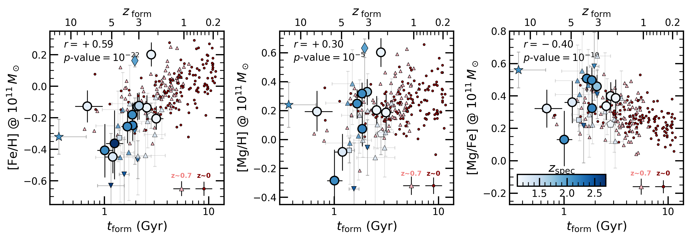
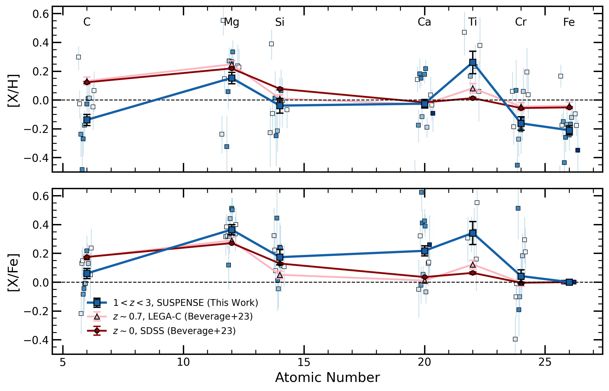

$\newcommand{\ensuremath}{}$
$\newcommand{\xspace}{}$
$\newcommand{\object}[1]{\texttt{#1}}$
$\newcommand{\farcs}{{.}''}$
$\newcommand{\farcm}{{.}'}$
$\newcommand{\arcsec}{''}$
$\newcommand{\arcmin}{'}$
$\newcommand{\ion}[2]{#1#2}$
$\newcommand{\textsc}[1]{\textrm{#1}}$
$\newcommand{\hl}[1]{\textrm{#1}}$
$\newcommand{\footnote}[1]{}$
$\newcommand{\vdag}{(v)^\dagger}$
$\newcommand$
$\newcommand$
$\newcommand{\zsol}{\log\left(Z/Z_\odot\right)}$

# Carbon and Iron Deficiencies in Quiescent Galaxies at $z=1-3$ from _JWST_-SUSPENSE:\ Implications for the Formation Histories of Massive Galaxies

<mark>Appeared on: 2024-07-05</mark> -  _Submitted to ApJ; 18 pages, 6 figures, 1 table_

A. G. Beverage, et al. -- incl., <mark>A. d. Graaff</mark>

**Abstract:** We present the stellar metallicities and multi-element abundances (C, Mg, Si, Ca, Ti, Cr, and Fe) of 15 massive (log $M/M_\odot=10.2-11.2$ ) quiescent galaxies at $z=1-3$ , derived from ultradeep _JWST_ -SUSPENSE spectra. Compared to quiescent galaxies at $z\sim0$ , these galaxies exhibit a deficiency of 0.25 dex in [ C/H ] , 0.16 dex in [ Fe/H ] , and 0.07 dex in [ Mg/H ] , implying rapid formation and quenching before significant enrichment from asymptotic giant branch stars and Type Ia supernovae. Additionally, we find that galaxies that form at higher redshift have higher [ Mg/Fe ] and lower [ Fe/H ] and [ Mg/H ] , irrespective of their observed redshift. The evolution in [ Fe/H ] and [ C/H ] is therefore primarily explained by lower redshift samples naturally including galaxies with longer star-formation timescales. On the other hand, the lower [ Mg/H ] can be explained by galaxies forming at earlier epochs expelling larger gas reservoirs during their quenching phase. Consequently, the mass-metallicity relation, primarily reflecting [ Mg/H ] , is also lower at $z=1-3$ compared to the lower redshift relation, though the slopes are similar. Finally, we compare our results to standard stellar population modeling approaches employing solar abundance patterns and non-parametric star-formation histories (using Prospector ). Our SSP-equivalent ages agree with the mass-weighted ages from Prospector , while the metallicities disagree significantly. Nonetheless, the metallicities better reflect [ Fe/H ] than total [ Z/H ] . We also find that star-formation timescales inferred from elemental abundances are significantly shorter than those from Prospector , and we discuss the resulting implications for the early formation of massive galaxies.

**Figure 3. -** The formation time ($t_{\rm form}$), [Fe/H], [Mg/H], [Fe/Mg], and [C/Mg] as a function of velocity dispersion for the $z=1-$3_JWST_-SUSPENSE quiescent galaxy sample (circles) and for other various measurements at similar redshifts from the literature. Each point is colored by its spectroscopic redshifts. To guide the eye, we include the best-fit relations and corresponding confidence intervals in each panel, fit to the $z=1-3$ data point. In the $t_{\rm form}$ panel, we instead present two relations, one for $z<1.5$ and the other for $z>1.5$. For comparison, we also include the abundances of stacks of quiescent galaxies at $z\sim0$ from SDSS  (conroy_early-type_2014, beverage_carbon_2023)  and at $z\sim0.7$ from LEGA-C  (beverage_carbon_2023) . At constant $\sigma$, the SUSPENSE galaxies form earlier and are more deficient in Fe and C than the $z<0.7$ galaxies. (*fig:abundance_panels*)

**Figure 5. -** [Fe/H], [Mg/H], and [Mg/Fe] as a function of galaxy formation time for massive quiescent galaxies at $z=0-3$. Data points for the redshift range $z=1-3$ are color-coded based on their spectroscopic redshift, and their shapes follow the same legend as Figure \ref{fig:abundance_panels}. The red circles [pink triangles] represent individual quiescent galaxies from SDSS [LEGA-C] (zhuang_glimpse_2023,  beverage_carbon_2023) . Typical uncertainties for the SDSS and LEGA-C points are shown in the bottom right of each panel. We remove the first-order dependence on stellar mass by adjusting all measurements to reflect the abundances at $M_*=10^{11}\;M_\odot$(refer to the text for details). We calculate the Pearson correlation coefficients, including all galaxies at all redshifts, and list the corresponding correlations (r) and $p$-values in the top left corner of each panel. Regardless of observed redshift, galaxies that form earlier have lower [Fe/H], slightly lower [Mg/H], and higher [Mg/Fe], consistent with more rapid formation and efficient quenching at earlier times. (*fig:formation_time-label*)

**Figure 4. -** The abundance patterns of the $z=1-3$ quiescent galaxies (blue squares). We show the absolute abundances, [X/H], in the top panel and the abundance ratios, [X/Fe] in the bottom panel, with the solar values marked with a dashed black line. The thick solid blue line with square markers shows the median abundance pattern of the $z=1-3$ quiescent galaxies. For comparison, we include the average abundance patterns of $z\sim0$(red solid line with circle markers) and $z\sim0.7$(pink solid line with triangle markers) galaxies with the _same_ velocity dispersions ($175-275 \mathrm{km s^{-1}}$). The $z=1-3$ galaxies are significantly deficient in [C/H] and [Fe/H] compared to lower redshift samples. The SUSPENSE galaxies also have enhanced [$\alpha$/Fe](Mg, Si, Ca), which is primarily driven by deficient [Fe/H]. (*fig:abundance_pattern*)

