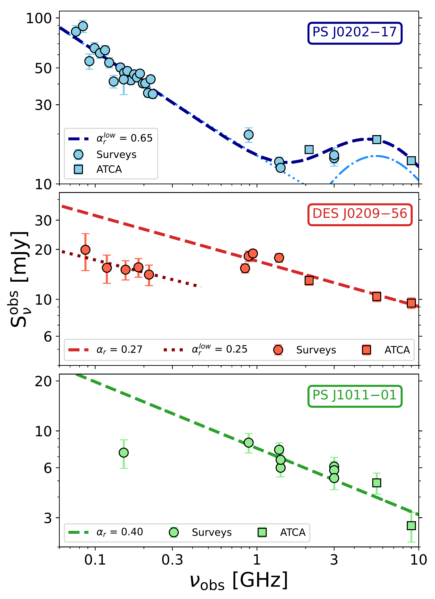

$\newcommand{\ensuremath}{}$
$\newcommand{\xspace}{}$
$\newcommand{\object}[1]{\texttt{#1}}$
$\newcommand{\farcs}{{.}''}$
$\newcommand{\farcm}{{.}'}$
$\newcommand{\arcsec}{''}$
$\newcommand{\arcmin}{'}$
$\newcommand{\ion}[2]{#1#2}$
$\newcommand{\textsc}[1]{\textrm{#1}}$
$\newcommand{\hl}[1]{\textrm{#1}}$
$\newcommand{\footnote}[1]{}$

# Multi-wavelength properties of three new radio-powerful $z\sim5.6$ QSOs discovered from RACS

<mark>Appeared on: 2024-07-08</mark> -  _Submitted to A&A on July 4th_

L. Ighina, et al. -- incl., <mark>S. Belladitta</mark>

**Abstract:** We present a multi-wavelength study on three new $z\sim5.6$ quasi stellar objects (QSOs) selected based on their radio and optical/near-infrared properties in publicly available surveys and then identified with dedicated spectroscopic observations. These are among the radio-brightest QSOs currently known at $z>5.5$ , having $\rm R=S_{\rm 5GHz}/S_{\rm 4400Å}>100$ . In this work we present their identification and we also discuss their multi-wavelength properties (from the radio to the X-ray band) based on the detection in public surveys as well as dedicated radio and X-ray observations. The three sources present a wide range of properties, in terms of relative intensity and spectral shape, highlighting the importance of multi-wavelength observations in order to accurately characterise these high- $z$ objects. In particular, from our analysis we found one source, at $z=5.61$ , that presents clear blazars properties (strong and flat radio and X-ray emission), making it one of the most distant currently known in this class. Moreover, from the fit of the optical/near-infrared photometric measurements with an accretion disc model, as well as the analysis of the CIV broad emission line in one case, we were able to estimate the mass and the accretion rate of the central black holes in these systems, finding $\rm M_{\rm BH}\sim1-10\times10^9$ M $_\odot$ accreting at a rate $\lambda_{\rm Edd}\sim0.1-0.2$ . With this work we increase the number of very-high redshift radio-powerful QSOs characterised with multi-wavelength observations, essential in order to understand the evolution and the properties of this still poorly constrained class of sources.

**Figure 7. -** Multi-wavelength rest-frame SED of the three new RL QSOs presented in this work. For each source we show the radio (red squares), optical/NIR (purple circles) and X-ray (orange diamonds) photometry discussed in the text. The black line is a QSO template from {\protect [Polletta, Tajer and Maraschi (2007)]()}, while the shaded yellow region represents frequencies affected by the hydrogen absorption from the inter-galactic medium (IGM). The dashed line is the best-fit AD model to the optical data-points (assuming $\eta\sim0.1$) together with the expected X-ray emission from the optical/UV--X-ray relation found in {\protect [ and Lusso (2016)]()}(assuming $\Gamma_{\rm X}=2$ and an exponential cut-off at 200 keV). The Corresponding shaded area in the X-rays shows the 1 and 2$\sigma$ scatter of the relation. The dotted black line at low frequency is the best-fit power law to the radio data, as described in the text. (*fig:SED*)

**Figure 4. -** Radio spectra over the $\sim0.1-10$ GHz observed frequency range of the three sources described in this work. The majority of the data points are from public surveys (circles), while the 2.1, 5.5 and 9 GHz measurements are from dedicated, simultaneous observations with ATCA (squares). The dashed line in each panel indicate the best-fit model obtained for the different objects as described in the text. (*fig:radio_spec*)

**Figure 5. -** Radio loudness as a function of the $\tilde{\alpha}_{\rm ox}$ parameter for the objects presented in this work (blue circle, red square and green upper limit) as well as for a complete radio-selected sample of $z>4$ blazars ( (Caccianiga2019, [Ighina, Caccianiga and Moretti 2019]()) ) and $z>4$ radio QSOs discussed from the literature ( ([Caccianiga, Ighina and Moretti 2024]()) , black points, and from single studies, pink symbols, see text). The shaded grey regions at $\tilde{\alpha}_{\rm ox}\sim1.35$ and log(R) $\sim2$ divide the parameter space in two main regions: X-ray-, radio-bright objects (top-right corner, likely blazars) and X-ray-, radio-faint objects (bottom-left corner, likely hosting mis-aligned jets, i.e., classic RL QSOs). (*fig:R_aox*)

