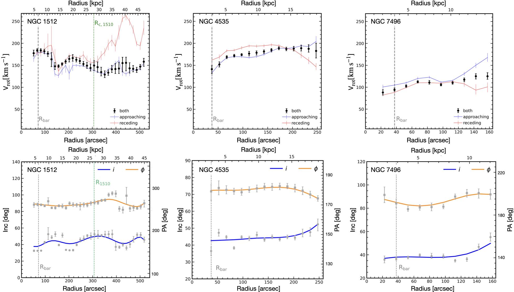
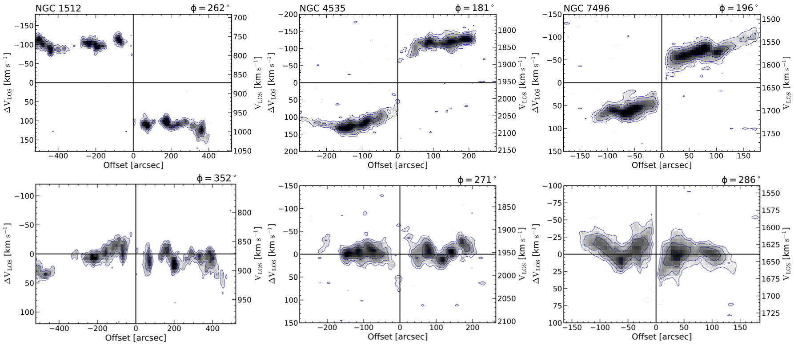

$\newcommand{\ensuremath}{}$
$\newcommand{\xspace}{}$
$\newcommand{\object}[1]{\texttt{#1}}$
$\newcommand{\farcs}{{.}''}$
$\newcommand{\farcm}{{.}'}$
$\newcommand{\arcsec}{''}$
$\newcommand{\arcmin}{'}$
$\newcommand{\ion}[2]{#1#2}$
$\newcommand{\textsc}[1]{\textrm{#1}}$
$\newcommand{\hl}[1]{\textrm{#1}}$
$\newcommand{\footnote}[1]{}$
$\newcommand{  \hi       }{\ifmmode{\rm H} \textsc{i} \else H \textsc{i} \fi}$
$\newcommand$
$\newcommand$
$\newcommand$
$\newcommand{\sample}{NGC~1512, NGC~4535, and NGC~7496}$
$\newcommand{\orcid}[1]{\href{https://orcid.org/#1}{\includegraphics[width=10pt]{figs/orcid.pdf}}}$
$\newcommand{\Bonn}{Argelander-Institut für Astronomie, Universität Bonn, Auf dem Hügel 71, 53121 Bonn, Germany}$
$\newcommand{\NRAO}{National Radio Astronomy Observatory, 520 Edgemont Road, Charlottesville, VA 22903, USA}$
$\newcommand{\OSU}{Department of Astronomy, The Ohio State University, 140 West 18th Ave, Columbus, OH 43210, USA}$
$\newcommand{ÇAP}{Center for Cosmology and Astroparticle Physics, 191 West Woodruff Avenue, Columbus, OH 43210, USA}$
$\newcommand{\Princeton}{Department of Astrophysical Sciences, Princeton University, 4 Ivy Lane, Princeton, NJ 08544, USA}$
$\newcommand{\MPIA}{\affiliation{Max-Planck-Institut für Astronomie, Königstuhl 17, D-69117, Heidelberg, Germany}}$
$\newcommand{\HeidelbergARI}{\affiliation{Astronomisches Rechen-Institut, Zentrum für Astronomie der Universität Heidelberg, Mönchhofstra\ss e 12-14, D-69120 Heidelberg, Germany}}$
$\newcommand{\HeidelbergITA}{Universität Heidelberg, Zentrum für Astronomie, Institut für Theoretische Astrophysik, Albert-Ueberle-Stra{\ss}e 2,69120 Heidelberg, Germany}$
$\newcommand{\HeidelbergZWR}{Universität Heidelberg, Interdisziplinäres Zentrum für Wissenschaftliches Rechnen, Im Neuenheimer Feld 205, 69120 Heidelberg, Germany}$
$\newcommand{\ESO}{\affiliation{European Southern Observatory, Karl-Schwarzschild Stra{\ss}e 2, D-85748 Garching bei München, Germany}}$
$\newcommand{\Alberta}{\affiliation{Department of Physics, University of Alberta, Edmonton, AB T6G 2E1, Canada}}$
$\newcommand{\OAN}{Observatorio Astron{ó}mico Nacional (IGN), C/ Alfonso XII, 3, E-28014 Madrid, Spain}$
$\newcommand{\astron}{Netherlands Institute for Radio Astronomy (ASTRON),  Oude Hoogeveensedijk 4, 7991 PD Dwingeloo, Netherlands}$
$\newcommand{\kapeyn}{Kapteyn Astronomical Institute, University of Groningen, PO Box 800, 9700 AV Groningen, The Netherlands}$
$\newcommand{\UCT}{Department of Astronomy, University of Cape Town, Private Bag X3, 7701 Rondebosch, South Africa}$
$\newcommand{\MPE}{\affiliation{Max-Planck-Institut für extraterrestrische Physik, Giessenbachstra{\ss}e 1, D-85748 Garching, Germany}}$
$\newcommand{\Conneticut}{Department of Physics, University of Connecticut, Storrs, CT, 06269, USA}$
$\newcommand{\ASIAA}{Institute of Astronomy and Astrophysics, Academia Sinica, Astronomy-Mathematics Building, No. 1, Sec. 4, Roosevelt Road, Taipei 10617, Taiwan}$
$\newcommand{\NRAOsoc}{National Radio Astronomy Observatory, 1003 Lopezville Road, Socorro, NM 87801, USA}$
$\newcommand{\Wyoming}{Department of Physics & Astronomy, University of Wyoming, Laramie, WY 82071}$
$\newcommand{\Tamkang}{Department of Physics, Tamkang University, No.151, Yingzhuan Road, Tamsui District, New Taipei City 251301, Taiwan}$
$\newcommand{\SanDiego}{Center for Astrophysics and Space Sciences, University of California, San Diego, 9500 Gilman Drive MC0424, La Jolla, CA 92093, USA}$
$\newcommand{\Oxford}{Sub-department of Astrophysics, Department of Physics, University of Oxford, Keble Road, Oxford OX1 3RH, UK}$
$\newcommand{\sectionautorefname}{Section}$

# Neutral atomic and molecular gas dynamics in the nearby spiral galaxies NGC 1512, NGC 4535, and NGC 7496

<mark>Appeared on: 2024-07-08</mark> -  _accepted for publication in A&A; 13 pages, 9 Figures (+2 appendix pages)_

S. Laudage, et al. -- incl., <mark>E. Schinnerer</mark>, <mark>S. Stuber</mark>, <mark>J. Neumann</mark>

**Abstract:** Neutral atomic gas ( $\rm H i$ ) effectively traces galactic dynamics across mid to large galactocentric radii. However, its limitations in observing small-scale changes within the central few kiloparsecs, coupled with the often observed $\hi$ deficit in galactic centers, necessitates the use of molecular gas emission as a preferred tracer in these regions. Understanding the dynamics of both neutral atomic and molecular gas is crucial for a more complete understanding of how galaxies evolve, funnel gas from the outer disk into their central parts, and eventually form stars. In this work we aim to quantify the dynamics of both, the neutral atomic and molecular gas, in the nearby spiral galaxies NGC 1512, NGC 4535, and NGC 7496 using new MeerKAT $\hi$ observations together with ALMA CO (2-1) observations from the PHANGS collaboration. We use the analysis tool $\BB$ to fit tilted ring models to the $\hi$ and CO observations. A combined approach of using the $\hi$ to constrain the true disk orientation parameters before applying these to the CO datasets is tested. This paper sets expectations for the results of the upcoming high-resolution $\hi$ coverage of many galaxies in the PHANGS-ALMA sample using MeerKAT or VLA, to establish a robust methodology for characterizing galaxy orientations and deriving dynamics from combing new $\hi$ with existing CO data.

**Figure 3. -** _Top row:_ Final $\hi$ rotation curves (black circles) for NGC 1512 (left), NGC 4535 (middle) and NGC 7496 (right) overplotted with rotation curves derived by only considering the approaching (blue) and the receding (red) side of the galaxy. The bar radius is indicated with a dashed grey line and the distance of NGC 1510 is indicated with the green dashed line. _Bottom row:_ The panels show the adopted geometry in our fitting procedure for NGC 1512 (left), NGC 4535 (middle) and NGC 7496 (right) for the $\hi$ observations. The grey squares and circles represent the inclination $i$ and position angle $\phi$ results for each ring after the second fitting stage, respectively. The blue (inclination) and yellow (position angle) lines represent the regularization function that was used to smooth out the geometry in the final stage of the fitting procedure. (*fig:ResultsHI*)

**Figure 1. -** _Top row:_ Moment 1 maps from PHANGS MeerKAT $\hi$ observations of NGC 1512, NGC 4535, and NGC 7496 built with the strict masking procedure described in Section \ref{sec:Methods}.  The maps are overplotted with isovelocity-lines (grey) in intervals of \SI{30}{\kilo\meter\per\second}. _Middle row:_ Integrated intensity or Moment 0 maps from the MeerKAT $\hi$ observations built with the same masking procedure. The location of the companion galaxy NGC 1510 is indicated by the white circle. _Bottom row:_ Integrated intensity or Moment 0 maps of the three galaxies built from CO observations taken from PHANGS-ALMA. The extent of the CO maps is indicated in comparison to the $\hi$ maps. (*fig:moment1_HI*)

**Figure 2. -** \centering_Top row:_ Line-of-sight velocities along the major axis position from the $\hi$ observations of NGC 1512 (left), NGC 4535 (middle), and NGC 7496 (right). _Bottom row:_ Line-of-sight velocities along the minor axis. The x-axis represents the offset of the galactic center and the y-axis represents the observed velocities with (left) and without (right) subtracting the systemic velocity of the galaxy. (*fig:PVs_MAJOR*)

