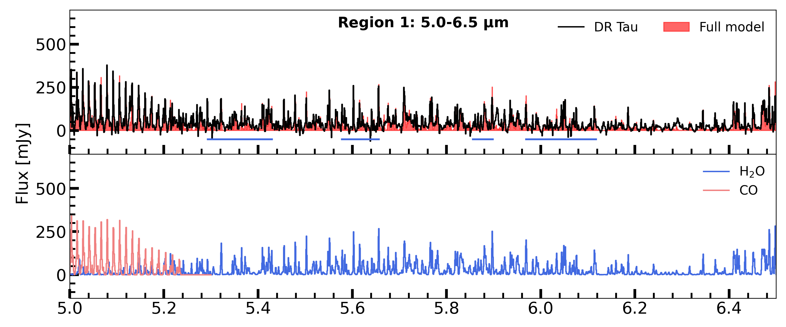
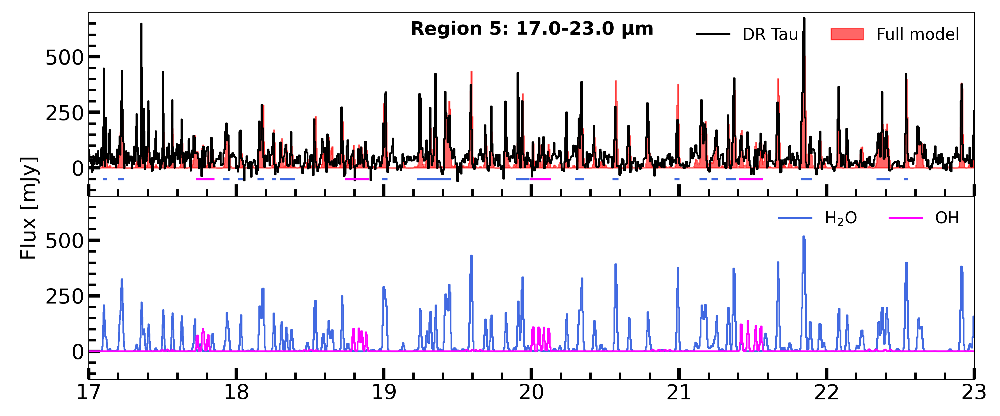

$\newcommand{\ensuremath}{}$
$\newcommand{\xspace}{}$
$\newcommand{\object}[1]{\texttt{#1}}$
$\newcommand{\farcs}{{.}''}$
$\newcommand{\farcm}{{.}'}$
$\newcommand{\arcsec}{''}$
$\newcommand{\arcmin}{'}$
$\newcommand{\ion}[2]{#1#2}$
$\newcommand{\textsc}[1]{\textrm{#1}}$
$\newcommand{\hl}[1]{\textrm{#1}}$
$\newcommand{\footnote}[1]{}$

# MINDS. The DR Tau disk II: probing the hot and cold $\ce{H_2O}$ reservoirs in the JWST-MIRI spectrum

<mark>Appeared on: 2024-07-09</mark> -  _Accepted for publication in Astronomy & Astrophysics on 05/07/2024_

M. Temmink, et al. -- incl., <mark>T. Henning</mark>, <mark>G. Perotti</mark>, <mark>K. Schwarz</mark>

**Abstract:** The Medium Resolution Spectrometer (MRS) of the Mid-InfraRed Instrument (MIRI) on the James Webb Space Telescope (JWST) gives insights into the chemical richness and complexity of the inner regions of planet-forming disks. Several disks that are compact in the millimetre dust emission have been found by Spitzer to be particularly bright in $\ce{H_2O}$ , which is thought to be caused by the inward drift of icy pebbles. Here, we analyse the $\ce{H_2O}$ -rich spectrum of the compact disk DR Tau using high-quality JWST-MIRI observations. We infer the $\ce{H_2O}$ column densities (in cm $^{-2}$ ) using methods presented in previous works, as well as introducing a new method to fully characterise the pure rotational spectrum. We aim to further characterise the abundances of $\ce{H_2O}$ in the inner regions of this disk and its abundance relative to $\ce{CO}$ . We also search for emission of other molecular species, such as $\ce{CH_4}$ , $\ce{NH_3}$ , $\ce{CS}$ , $\ce{H_2}$ , $\ce{SO_2}$ , and larger hydrocarbons; commonly detected species, such as $\ce{CO}$ , $\ce{CO_2}$ , $\ce{HCN}$ , and $\ce{C_2H_2}$ , have been investigated in our previous paper. We first use 0D local thermodynamic equilibrium (LTE) slab models to investigate the excitation properties observed in different wavelength regions across the entire spectrum, probing both the ro-vibrational and rotational transitions. To further analyse the pure rotational spectrum ( $\geq$ 10 $\mathrm{\mu}$ m), we use the spectrum of a large, structured disk (CI Tau) as a template to search for differences with our compact disk. Finally, we fit multiple components to characterise the radial (and vertical) temperature gradient(s) present in the spectrum of DR Tau. The 0D slab models indicate a radial gradient in the disk, as the excitation temperature (emitting radius) decreases (increases) with increasing wavelength, which is confirmed by the analysis involving the large disk template. To explain the derived emitting radii, we need a larger inclination for the inner disk ( $i\sim$ 10-23◦ee), agreeing with our previous analysis on $\ce{CO}$ . From our multi-component fit, we find that at least three temperature components ( $T_1\sim$ 800 K, $T_2\sim$ 470 K, and $T_3\sim$ 180 K) are required to reproduce the observed rotational spectrum of $\ce{H_2O}$ arising from the inner $R_\textnormal{em}\sim$ 0.3-8 au. By comparing line ratios, we derived an upper limit on the column densities (in cm $^{-2}$ ) for the first two components of $\log_{10}(N)\leq$ 18.4 within $\sim$ 1.2 au. We note that the models with a pure temperature gradient provide as robust results as the more complex models, which include spatial line shielding. No robust detection of the isotopologue $\ce{H_2 ^{18}O}$ can be made and upper limits are provided for other molecular species. Our analysis confirms the presence of a pure radial temperature gradient present in the inner disk of DR Tau, which can be described by at least three components. This gradient scales roughly as $\sim R_\textnormal{em}^{-0.5}$ in the emitting layers, in the inner 2 au. As the observed $\ce{H_2O}$ is mainly optically thick, a lower limit on the abundance ratio of $\ce{H_2O}$ / $\ce{CO}$ $\sim$ 0.17 is derived, suggesting a potential depletion of $\ce{H_2O}$ . Similarly to previous work, we detect a cold $\ce{H_2O}$ component ( $T\sim$ 180 K) originating from near the snowline, now with a multi-component analysis. Yet, we cannot conclude whether an enhancement of the $\ce{H_2O}$ reservoir is observed following radial drift. A consistent analysis of a larger sample is necessary to study the importance of drift in enhancing the $\ce{H_2O}$ abundances.

**Figure 10. -** Best fitting slab models (without line overlap) for the different regions. In each subfigure, the top panel displays the continuum subtracted JWST spectrum in a specific region, while the full model spectrum is shown in red. The bottom panels show the models for the individually detected molecules. In addition, we show the \ce{CO} model in pink from \citet{TemminkEA24}. The horizontal bar in each top panel indicate the line regions used in the $\chi^2_\textnormal{red}$-fits. (*fig:RegionSpectra*)

**Figure 11. -** Continuation of Figure \ref{fig:RegionSpectra}. The best fit to the \ce{OH} emission is shown in magenta. In addition, we show the best fitting slab models, adopted from \citet{TemminkEA24}, for \ce{CO_2}(green), \ce{HCN}(orange), and \ce{C_2H_2}(yellow) in the wavelength region of 13.6-16.3 $\mathrm{\mu}$m.  (*fig:RegionSpectra*)

**Figure 5. -** The spectra (across 13.4-24.0 $\mathrm{\mu}$m) of DR Tau (grey) and CI Tau (black, scaled; see Section \ref{sec:LDT-CITau}) shown together with the residual spectrum (in red) of DR Tau after subtraction of the scaled spectrum of CI Tau. The best fitting \ce{H_2O} slab model ($T$=375 K) to the residuals is shown in blue. The black dashed box just shortward of $\sim$24.0 $\mathrm{\mu}$m indicates the pair of lines identified by \citet{BanzattiEA23Subm}, hinting at a third component ($\sim$170 K) needed to fully explain the observed \ce{H_2O} reservoir. (*fig:LDTemplate*)

