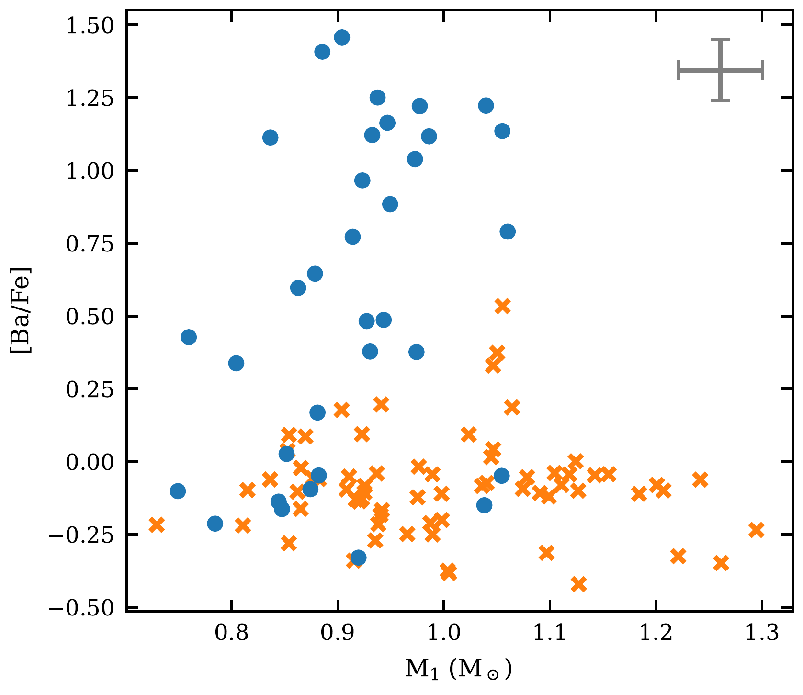
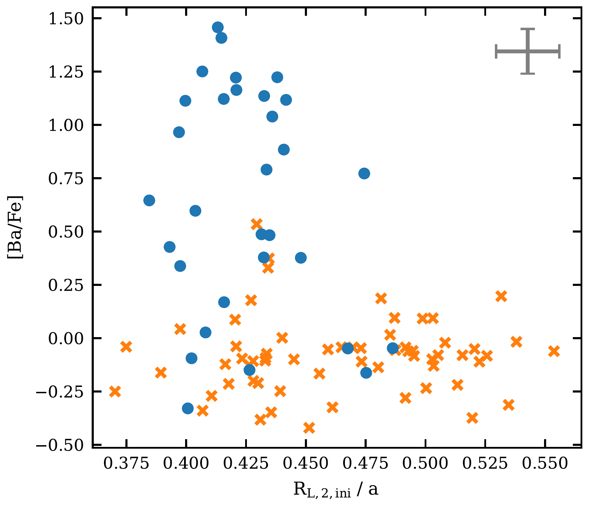
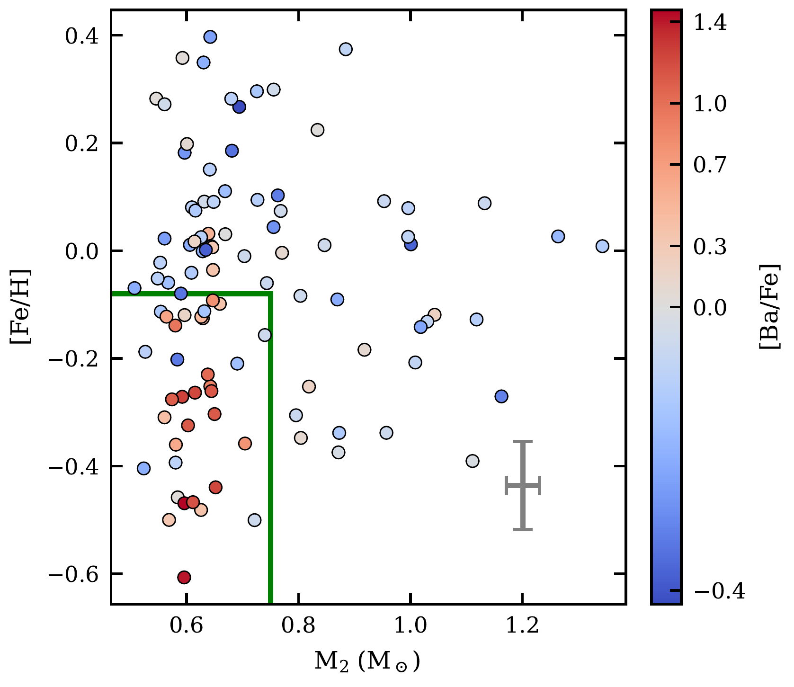
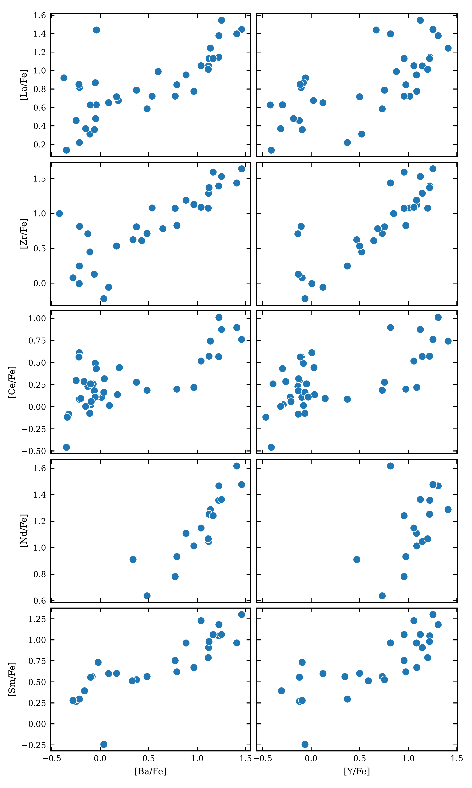

$\newcommand{\ensuremath}{}$
$\newcommand{\xspace}{}$
$\newcommand{\object}[1]{\texttt{#1}}$
$\newcommand{\farcs}{{.}''}$
$\newcommand{\farcm}{{.}'}$
$\newcommand{\arcsec}{''}$
$\newcommand{\arcmin}{'}$
$\newcommand{\ion}[2]{#1#2}$
$\newcommand{\textsc}[1]{\textrm{#1}}$
$\newcommand{\hl}[1]{\textrm{#1}}$
$\newcommand{\footnote}[1]{}$
$\newcommand{\noun}[1]{\textsc{\MakeLowercase{#1}}}$
$\newcommand{\citehere}[1]{\textcolor{RubineRed}{(CITE:~#1)}}$
$\newcommand{\bluenote}[1]{\textcolor{NavyBlue}{#1}}$
$\newcommand{\rednote}[1]{\textcolor{Red}{\textbf{#1}}}$
$\newcommand{\code}{\texttt}$
$\newcommand{\m}[1]{M_#1}$
$\newcommand{\msun}{M_\odot}$
$\newcommand{\bah}{[Ba/H]}$
$\newcommand{\bafe}{[Ba/Fe]}$
$\newcommand{\yh}{[Y/H]}$
$\newcommand{\yfe}{[Y/Fe]}$
$\newcommand{\sH}{[s/H]}$
$\newcommand{\sfe}{[s/Fe]}$
$\newcommand{\rl}{r\textsubscript{L}}$
$\newcommand{\rorb}{R\textsubscript{orb}}$

# Ba Enrichment in Gaia MS+WD Binaries: Tracing _s_-Process Element Production

<mark>Appeared on: 2024-07-10</mark> -  _12 pages, 10 figures_

P. Rekhi, et al. -- incl., <mark>H.-W. Rix</mark>

**Abstract:** A large population of intermediate-separation binaries, consisting of a main-sequence (MS) star and a white dwarf (WD), has recently emerged from Gaia's third data release (DR3), posing challenges to current models of binary evolution. Here we examine the _s_ -process element abundances in these systems using data from GALAH DR3. Following refined sample analysis with parameter estimates based on GALAH spectra, we find a distinct locus where enhanced _s_ -process elements depend on both the WD mass and metallicity, consistent with loci identified in previous asymptotic giant branch (AGB) nucleosynthesis studies with higher _s_ -process yields. Notably, these enhanced abundances show no correlation with the systems' orbital parameters, supporting a history of accretion in intermediate-separation MS+WD systems. Consequently, our results form a direct observational evidence of a connection between AGB masses and _s_ -process yields. We conclude by showing that the GALAH DR3 survey includes numerous Ba dwarf stars, within and beyond the mass range covered in our current sample, which can further elucidate _s_ -process element distributions in MS+WD binaries.

**Figure 8. -** Barium abundance as a function of (a) primary mass, (b) eccentricity, (c) period and (d) Roche-lobe radius of the WD progenitor normalized by the orbital separation. Median error bars are shown in grey. The stars plotted as blue dots belong to the region $\m$2 $<0.75$ and [Fe/H] $<-0.08$, and those plotted as orange crosses are outside the given region (see Figure \ref{fig: feh_m2} and text for explanation). The restricted domain of the _s_-process enriched stars in the above plots is a direct consequence of the restriction on $\m$2.
    Roche-lobe radii are computed using the formula given by Eggleton_1983_AproximationsRadii, with the initial-final mass relation used to obtain progenitor masses taken from [ and Ramirez-Ruiz (2018)](). (*fig: Ba_fe orbital params*)

**Figure 5. -** (a) Barium and (b) Yttrium abundance as a function of iron abundance of the primary and mass of the secondary (which we assume is a WD). Median error bars are shown in grey. We note that enhanced Ba abundances are found almost exclusively in the region of $\m$2 $<0.75$ and [Fe/H]$<-0.08$(bounded in green), with Y enhanced stars extending to higher metallicities.  (*fig: feh_m2*)

**Figure 10. -** Correlations between abundance measurements of _s_-process elements in the NCE sample. Although, GALAH flags high abundances of _s_-process elements other than Ba and Y as possibly unreliable, we demonstrate here that their abundances are positively correlated with Ba and Y, justifying their use as representative of the _s_-process in this work.  (*fig: s-proc corner*)

