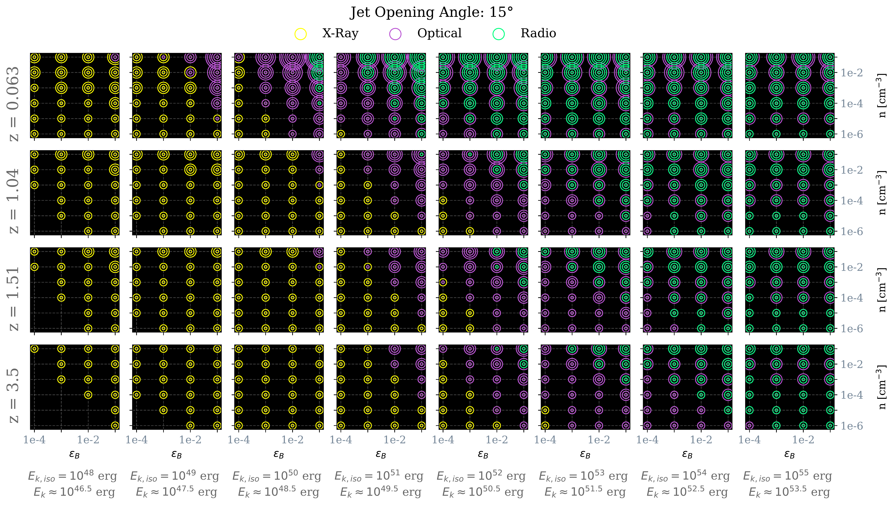

$\newcommand{\ensuremath}{}$
$\newcommand{\xspace}{}$
$\newcommand{\object}[1]{\texttt{#1}}$
$\newcommand{\farcs}{{.}''}$
$\newcommand{\farcm}{{.}'}$
$\newcommand{\arcsec}{''}$
$\newcommand{\arcmin}{'}$
$\newcommand{\ion}[2]{#1#2}$
$\newcommand{\textsc}[1]{\textrm{#1}}$
$\newcommand{\hl}[1]{\textrm{#1}}$
$\newcommand{\footnote}[1]{}$
$\newcommand{\vdag}{(v)^\dagger}$
$\newcommand$
$\newcommand$
$\newcommand{\SEM}[1]{{\color{cyan} #1}}$
$\newcommand\ra{#1#2#3}$
$\newcommand\dec{#1#2#3}$
$\newcommand{\Msol}{\rm{M_{\odot}}}$
$\newcommand{\nod}{\nodata}$
$\newcommand{\swift}{{\it Swift}}$
$\newcommand{\chandra}{{\it Chandra}}$
$\newcommand{\sn}{AT 2020xnd}$
$\newcommand{\cow}{AT 2018cow}$
$\newcommand{\koala}{ZTF18 abvkwla}$
$\newcommand{\css}{CSS 161010}$

# Constraints on Relativistic Jets from the Fast X-ray Transient 210423 using Prompt Radio Follow-up Observations

<mark>Appeared on: 2024-07-11</mark> -  _14 pages, 6 figures_

D. Ibrahimzade, et al. -- incl., <mark>K. Paterson</mark>

**Abstract:** Fast X-ray Transients (FXTs) are a new observational class of phenomena with no clear physical origin. This is at least partially a consequence of limited multi-wavelength follow up of this class of transients in real time. Here we present deep optical ( $g-$ and $i-$ band) photometry with Keck, and prompt radio observations with the VLA of FXT 210423 obtained at $\delta t \approx 14-36$ days since the X-ray trigger. We use these multi-band observations, combined with publicly available data sets, to constrain the presence and physical properties of on-axis and off-axis relativistic jets such as those that can be launched by neutron-star mergers and tidal disruption events, which are among the proposed theoretical scenarios of FXTs. Considering a wide range of possible redshifts $z\le3.5$ , circumstellar medium (CSM) density $n=10^{-6}-10^{-1} \rm{cm^{-3}}$ , isotropic-equivalent jet kinetic energy $E_{k,iso}=10^{48}-10^{55} \rm{erg}$ , we find that we can rule out wide jets with opening angle $\theta_{j}=15◦ee$ viewed within $10◦ee$ off-axis. For more collimated jets ( $\theta_{j}=3◦ee$ ) we can only rule out on-axis ( $\theta_{j}=0◦ee$ ) orientations. This study highlights the constraining power of prompt multi-wavelength observations of FXTs discovered in real time by current (e.g., Einstein Probe) and future facilities.

**Figure 5. -** Grid representation of simulations that violate observations for a jet with $\theta_j =  15◦ee$. Violations occur when either the radio, optical, or X-ray value of an observation exceeds that of the simulation at the corresponding observation time. Colored rings indicate a violation in a particular band (green: radio, purple: optical, yellow: X-ray). The size of the ring indicates  the observation angle of the simulation where the violation occurred with the innermost ring representing a violation of 0$◦ee$ and each proceeding concentric ring representing an increase of 10$◦ee$.
A set of 9 concentric rings, in any colour, consequently indicates that any jet with these properties are ruled out. Columns and rows of the the outer grid indicate the energy and distance of the simulation. Columns and rows of each inner box indicate the fraction of the post shock energy transferred into magnetic fields ($\epsilon_B$) and the density of the surrounding medium ($n$) in the simulation. The violation results are overlaid in the order radio (top), optical (middle), and X-ray (last), meaning the appearance of a radio or optical violation may cover an X-ray violation. The ordering has been chosen to best represent the overall shape of the violations. Any crossing on the grid with no ring indicates no constraints could be placed on simulations with the given parameters.
 (*figure:Grid_15_deg*)

**Figure 1. -** Unabsorbed 0.5-7 keV flux (*main panel*) and hardness ratio (*upper panel*) evolution of FXT 210423.
The soft band (S) is defined between 0.5-2 keV, and the hard band (H) between  2-7 keV. No spectral evolution is apparent. The X-ray light-curve can be fit with a broken power law (red solid line)  with $F_{X} \propto t^{-0.2 \pm 0.2}$ at $\delta t<4.1 \rm{ks}$ steepening to $F_{X} \propto t^{-4.1 \pm 1.4}$
at later times. (*figure:LC*)

**Figure 4. -** Keck $g$-band image of the field of FXT 210423 acquired on 2021 May 11 ($\delta t=$18.03 d since discovery). Red region: 0.7$\arcsec$ radius region at the location of the X-ray source from the CXO discovery images as determined with \texttt{wavdetect}. Cyan region: 0.7$\arcsec$ radius region at the location of the extended source that we have identified in our Keck $g$-band images. We also mark the three extended sources ("cX", "cW" and "cNE") identified as potential host galaxies by  eappachen2023fast. Our Keck source is coincident with "cX" and we consider "cX" the most likely host galaxy for this FXT.  North is up and East is right.
 (*figure:Optical_hosts*)

