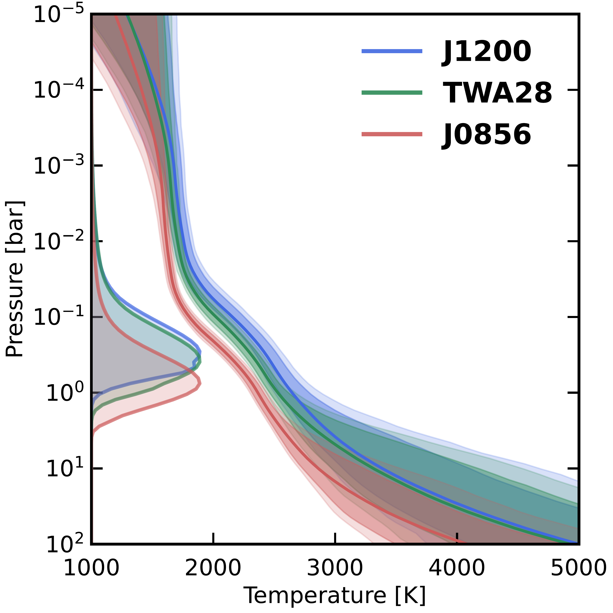
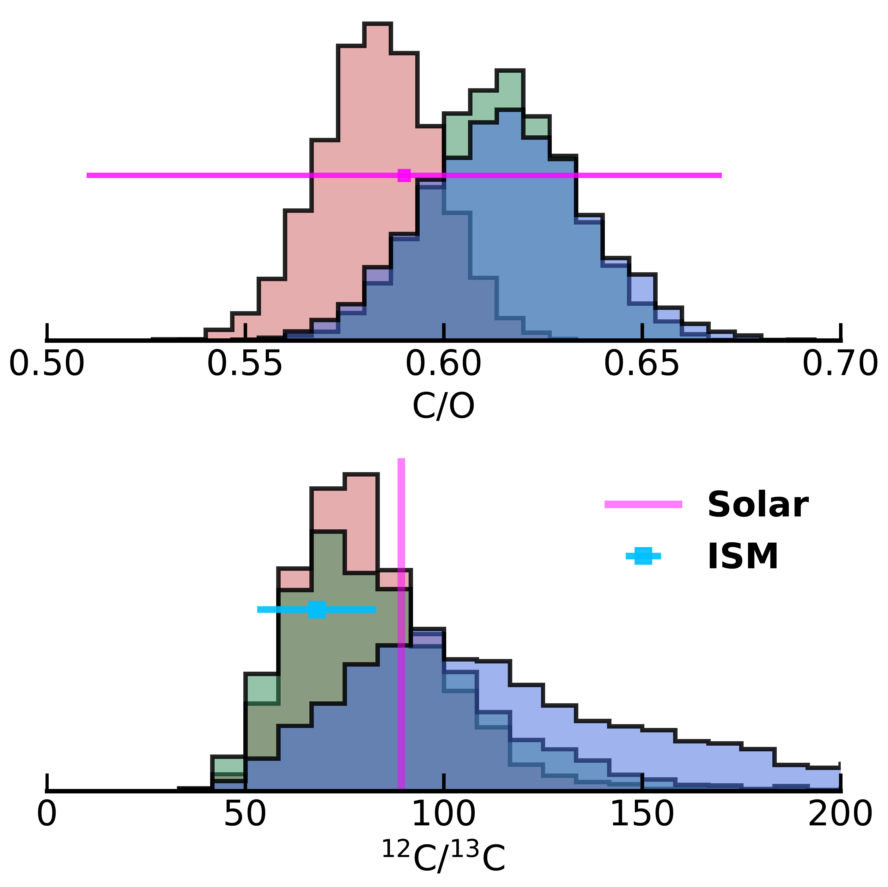

$\newcommand{\ensuremath}{}$
$\newcommand{\xspace}{}$
$\newcommand{\object}[1]{\texttt{#1}}$
$\newcommand{\farcs}{{.}''}$
$\newcommand{\farcm}{{.}'}$
$\newcommand{\arcsec}{''}$
$\newcommand{\arcmin}{'}$
$\newcommand{\ion}[2]{#1#2}$
$\newcommand{\textsc}[1]{\textrm{#1}}$
$\newcommand{\hl}[1]{\textrm{#1}}$
$\newcommand{\footnote}[1]{}$
$\newcommand$
$\newcommand{\myorcidid}{0000-0001-9282-9462}$
$\newcommand{\rsun}{R_{\odot}}$
$\newcommand{\teff}{T_{\rm eff}}$
$\newcommand{\logg}{\ensuremath{\log g}}$
$\newcommand{\Msun}{M_{\odot}}$
$\newcommand{\logl}{log(L/L_{\odot})}$
$\newcommand{\Mjup}{M_{\text{Jup}}}$
$\newcommand{\Rjup}{R_{\text{Jup}}}$
$\newcommand$
$\newcommand{\RGM}[1]{\textcolor{cyan}{#1}}$
$\newcommand{\twelveCO}{\textsuperscript{12}CO}$
$\newcommand{\thirteenCO}{\textsuperscript{13}CO}$
$\newcommand{\CeighteenO}{C\textsuperscript{18}O}$
$\newcommand{\eighteenO}{\textsuperscript{18}O}$
$\newcommand{\seventeenO}{\textsuperscript{17}O}$
$\newcommand{\isotope}[2]{\textsuperscript{#2}#1}$
$\newcommand{\ratio}[3]{\textsuperscript{#2}#1/\textsuperscript{#3}#1}$
$\newcommand{\Htwo}{H_2}$
$\newcommand{\pRT}{\texttt{petitRADTRANS}}$
$\newcommand{\micron}{\mum}$
$\newcommand{\vsini}{v\sin{i} }$
$\newcommand{\Teff}{T_{\text{eff}}}$
$\newcommand{\evidence}{\mathcal{Z} }$
$\newcommand{\Cratio}{\textsuperscript{12}C/\textsuperscript{13}C}$
$\newcommand{\Cratiosolar}{(\textsuperscript{12}C/\textsuperscript{13}C)_{\odot}}$
$\newcommand{\Cratioism}{(\textsuperscript{12}C/\textsuperscript{13}C)_{\rm ISM}}$
$\newcommand{\Oratiosolar}{(\textsuperscript{16}O/\textsuperscript{18}O)_{\odot}}$
$\newcommand{\Oratioism}{(\textsuperscript{16}O/\textsuperscript{18}O)_{\rm ISM}}$
$\newcommand{\water}{H_2O }$
$\newcommand{\CRIRES}{CRIRES^+}$
$\newcommand{\sixteenOwater}{H\textsubscript{2}\textsuperscript{16}O}$
$\newcommand{\eighteenOwater}{H\textsubscript{2}\textsuperscript{18}O}$
$\newcommand{\limbdarkening}{\varepsilon_{\rm limb}}$
$\newcommand{\Nphi}{N_{\phi}}$
$\newcommand{\arraystretch}{1.5}$
$\newcommand{\arraystretch}{1.5}$
$\newcommand{\arraystretch}{1.5}$
$\newcommand{\kms}{\ifmmode{\rm km\th s^{-1}}\else km\th s^{-1}\fi}$
$\newcommand{\th}{\thinspace}$
$\newcommand\hyper{@linkstart##1##2 $
$    }$
$\newcommand\hyper{@linkstart##1##2 $
$    }$

# The $^{12}$C/$^{13}$C ratios of three young brown dwarfs with CRIRES$^+$

<mark>Appeared on: 2024-07-11</mark> -  _Accepted for publication in A&A_

D. G. Picos, et al. -- incl., <mark>P. Mollière</mark>

**Abstract:** Young brown dwarfs exhibit atmospheric characteristics similar to those of super-Jupiters, providing a unique opportunity to study planetary atmospheres. Atmospheric retrievals of high-resolution spectra reveal detailed properties of these objects, with elemental and isotopic ratios offering insights into their formation history. The ESO SupJup Survey, utilising CRIRES $^+$ on the Very Large Telescope, aims to assess the role of $\Cratio$ as a formation tracer. We present observations of three young brown dwarfs: 2MASS J12003792-7845082, TWA 28, and 2MASS J08561384-1342242. Our goal is to constrain their chemical compositions, thermal profiles, surface gravities, spin rotations, and $\Cratio$ . We conducted atmospheric retrievals of CRIRES $^+$ K-band spectra, coupling the radiative transfer code \texttt{petitRADTRANS} with the Bayesian inference algorithm \texttt{MultiNest} . The retrievals provide a detailed characterisation of the atmospheres of the three objects. We report the volume mixing ratios of the main molecular and atomic species: $\sixteenOwater$ , $\twelveCO$ , HF, Na, Ca, and Ti, including the novel detection of hydrogen fluoride (HF) in the atmosphere of a brown dwarf. We determine $\Cratio$ values of $81^{+28}_{-19}$ and $79^{+20}_{-14}$ in the atmospheres of TWA 28 and J0856, respectively, with strong significance ( $>3\sigma$ ). We also report tentative evidence ( $\sim 2\sigma$ ) of $\thirteenCO$ in J1200, at $\Cratio$ = $114^{+69}_{-33}$ . Additionally, we detect $\eighteenOwater$ at moderate significance in J0856 (3.3 $\sigma$ ) and TWA 28 (2.1 $\sigma$ ). The retrieved thermal profiles are consistent with hot atmospheres ( $2300-2600$ K) with low surface gravities and slow spins, as expected for young objects. The measured carbon isotope ratios are consistent among the three objects and show no significant deviation from that of the local interstellar medium, suggesting a fragmentation-based formation mechanism similar to star formation. The tentative detection of $\eighteenOwater$ in two objects of our sample highlights the potential of high-resolution spectroscopy to probe additional isotope ratios, such as $\ratio{O}{16}{18}$ , in the atmospheres of brown dwarfs and super-Jupiters.

**Figure 6. -** Posterior distributions of the surface gravity and carbon-to-oxygen ratio relative to the solar value for each object. The contours of the 2D histogram represent the 1, 2, and 3$\sigma$ confidence intervals, with dashed lines indicating the median values. The Pearson correlation coefficient is shown in the top-right corner, where a value of $r=0$ indicates no correlation and $r=1$ indicates a perfect positive correlation. (*fig:bestfit_logg_FeH*)

**Figure 17. -** (a) Best-fit pressure-temperature profiles. The shaded regions indicate the 1-, 2-, and  3-sigma regions. On the right axis we overplot the integrated contribution function. (b) Posterior distributions for C/O (top) and $\Cratio$(bottom). The values for the solar C/O $=0.59\pm0.08$\citep{asplundChemicalMakeupSun2021}, and the isotope ratios for the Solar System, $89.3\pm0.2$\citep{meijaIsotopicCompositionsElements2016}, and the ISM, $\Cratio$ism = $68 \pm 16$\citep{milam1213Isotope2005}, are marked. (*fig:bestfit_PT*)

**Figure 3. -** Opacity sources included in the forward modelling. The opacities are shown for a temperature of 2400 K and at the retrieved mixing ratios of TWA 28 (see \Cref{tab:retrieval_results}). (*fig:opacity_sources*)

