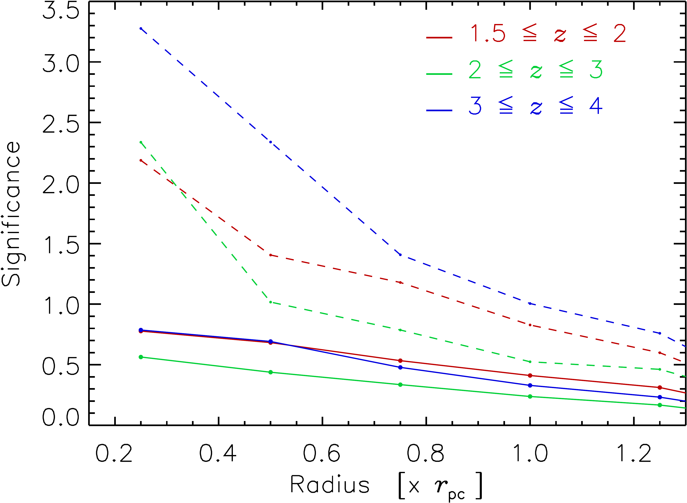
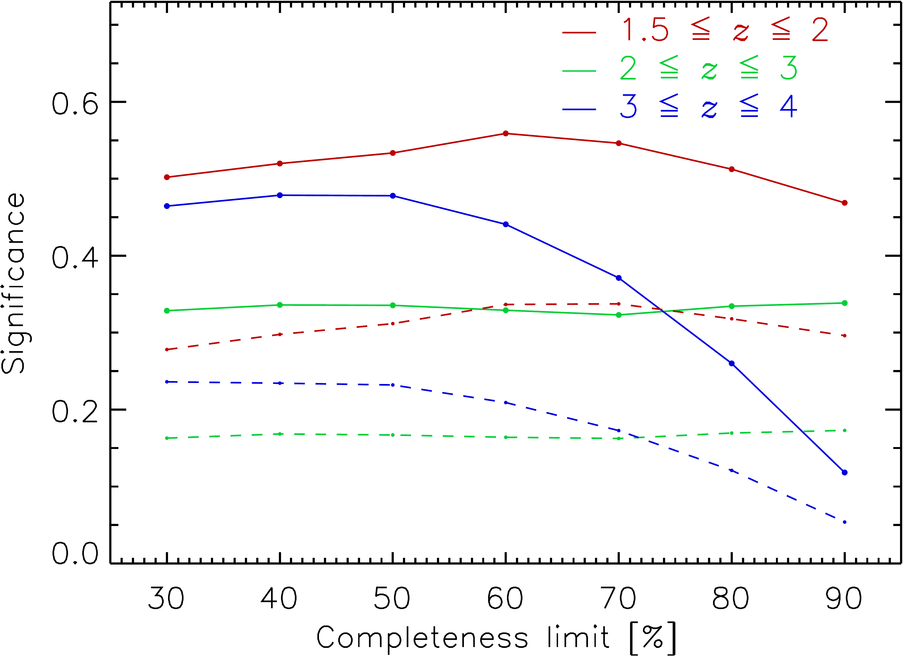

$\newcommand{\ensuremath}{}$
$\newcommand{\xspace}{}$
$\newcommand{\object}[1]{\texttt{#1}}$
$\newcommand{\farcs}{{.}''}$
$\newcommand{\farcm}{{.}'}$
$\newcommand{\arcsec}{''}$
$\newcommand{\arcmin}{'}$
$\newcommand{\ion}[2]{#1#2}$
$\newcommand{\textsc}[1]{\textrm{#1}}$
$\newcommand{\hl}[1]{\textrm{#1}}$
$\newcommand{\footnote}[1]{}$
$\newcommand{\orcid}[1]$

# $\Euclid$ preparation. Exploring the properties of proto-clusters in the Simulated   Euclid Wide Survey

<mark>Appeared on: 2024-07-30</mark> -  _Submitted to Astronomy and Astrophysics, 24 pages, 28 figures_

E. Collaboration, et al. -- incl., <mark>E. Bañados</mark>, <mark>K. Jahnke</mark>

**Abstract:** Galaxy proto-clusters are receiving an increased interest since most of the processes shaping the structure of clusters of galaxies and their galaxy population are happening at early stages of their formation.The Euclid Survey will provide a unique opportunity to discover a large number of proto-clusters over a large fraction of the sky ( 14 500 deg $^2$ ).In this paper, we explore the expected observational properties of proto-clusters in the Euclid Wide Survey by means of theoretical models and simulations.We provide an overview of the predicted proto-cluster extent, galaxy density profiles, mass-richness relations, abundance, and sky-filling as a function of redshift.Useful analytical approximations for the functions of these properties are provided.The focus is on the redshift range $z= 1.5$ to $4$ .We discuss in particular the density contrast with which proto-clusters can be observed against the background in the galaxy distribution if photometric galaxy redshifts are used as supplied by the ESA $\Euclid$ mission together with the ground-based photometric surveys.We show that the obtainable detection significance is sufficient to findlarge numbers of interesting proto-cluster candidates.For quantitative studies, additional spectroscopic follow-up is required to confirm the proto-clusters and establish their richness.

**Figure 13. -** ** Top:** Detection significance of proto-clusters as a function of aperture radius for three different redshift intervals.
The solid curves show the mean significance, while the dashed curves show the maxima.
A redshift interval of $\Delta_{z (50\%)}$ was used.
** Bottom:** Mean detection significance of proto-clusters as a function of the completeness limit, $\Delta{z (X\%)}$, in the range 30 to 90\% for three redshift intervals. The solid lines show the results for an aperture radius of 0.5 $r_{\rm pc}$ and dashed lines for 1 $r_{\rm pc}$.
 (*fig23*)

**Figure 22. -** Proto-clusters and their galaxies in a redshift slice around $z = 2$ with a redshift range according to the photometric redshift accuracy limits for 50\% completeness and $M_{\rm pc} \ge 10^{14}$\si{\solarmass}.
The dense core regions inside $r \le 0.5 r_{\rm pc}$ are shown by black circles and red dots for the galaxies, while the outer regions are shown in grey.
 (*fig32*)

**Figure 28. -** 
Examples of three proto-clusters for the categories 3 to 5. The category and the redshift of the proto-clusters is given in the legend of the Figure.
 (*fig52*)

