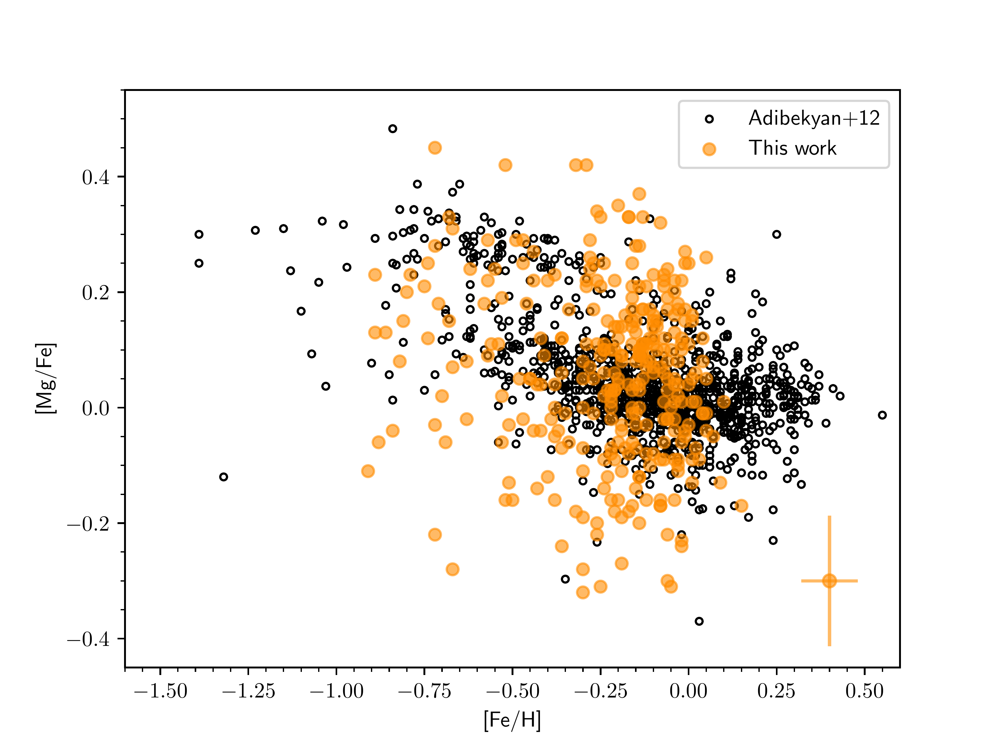
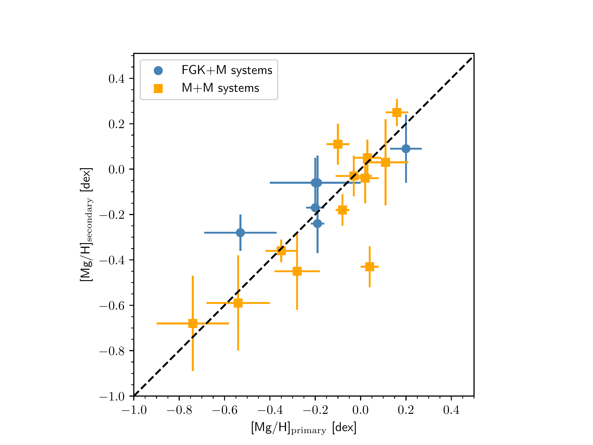
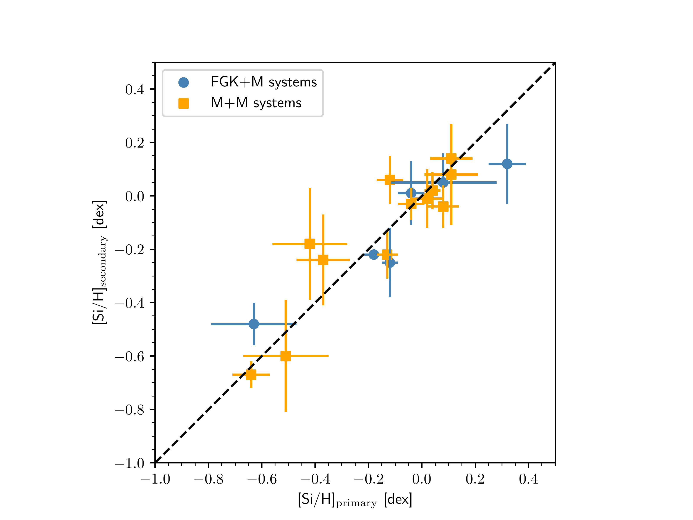
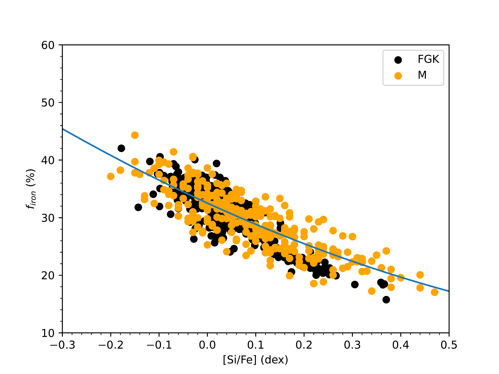
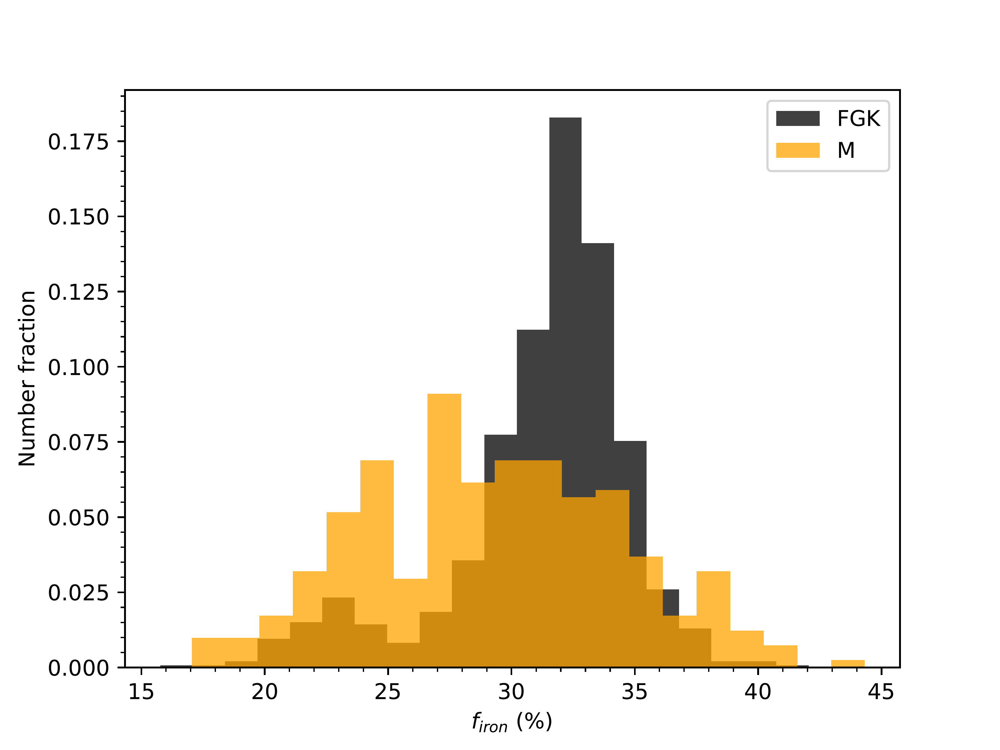

$\newcommand{\ensuremath}{}$
$\newcommand{\xspace}{}$
$\newcommand{\object}[1]{\texttt{#1}}$
$\newcommand{\farcs}{{.}''}$
$\newcommand{\farcm}{{.}'}$
$\newcommand{\arcsec}{''}$
$\newcommand{\arcmin}{'}$
$\newcommand{\ion}[2]{#1#2}$
$\newcommand{\textsc}[1]{\textrm{#1}}$
$\newcommand{\hl}[1]{\textrm{#1}}$
$\newcommand{\footnote}[1]{}$

# The CARMENES search for exoplanets around M dwarfs$\fnmsep$$\thanks{Table \ref{tab:sample} is only available in electronic form at the CDS via anonymous ftp to cdsarc.u-strasbg.fr (130.79.128.5) or via http://cdsweb.u-strasbg.fr/cgi-bin/qcat?J/A+A/.}$

<mark>Appeared on: 2024-07-30</mark> -  _11 Pages, 5 figures. Accepted for publication in A&A_

H. M. Tabernero, et al. -- incl., <mark>T. Henning</mark>

**Abstract:**            We present the abundances of magnesium (Mg) and silicon (Si) for 314 dwarf stars with spectral types in the interval K7.0-M5.5 (Teff range ~4200-3050 K) observed with the CARMENES high-resolution spectrograph at the 3.5 m telescope at the Calar Alto Observatory. Our analysis employs the BT-Settl model atmospheres, the radiative transfer code Turbospectrum, and a state-of-the-art selection of atomic and molecular data. These Mg and Si abundances are critical for understanding both the chemical evolution and assembly of the Milky Way and the formation and composition of rocky planets. Our chemical abundances show a line-to-line scatter at the level of 0.1 dex for all studied spectral types. The typical error bar of our chemical abundance measurements is +- 0.11 dex (Mg) and +- 0.16 dex (Si) for all spectral types based on the comparison of the results obtained for stellar components of multiple systems. The derived abundances are consistent with the galactic evolution trends and observed chemical abundance distribution of earlier FGK-type stars in the solar neighbourhood. Besides, our analysis provides compatible abundances for stars in multiple systems. In addition, we studied the abundances of different galactic stellar populations. In this paper, we also explore the relation of the Mg and Si abundances of stars with and without known planets.         

**Figure 1. -** [X/Fe] vs. [Fe/H] for both Mg (top panel) and Si (bottom panel). Our target stars are represented by orange circles while the black open circles correspond to the abundances derived by for 1 111 FGK stars calculated by \citet{adi12}.  The typical error bar for each abundance is displayed in the bottom right of each panel. (*fig:abundances*)

**Figure 2. -** Comparison in both [Mg/H](top panel) and [Si/H](bottom panel) between the components in FGK$+$M (blue) and M$+$M (orange) systems. (*fig:binary*)

**Figure 4. -** Top panel: [Si/Fe] vs. $f_{\rm iron}$. The target stars are in orange while the black points correspond to the $f_{\rm iron}$ values computed from the \citet{adi12} abundances. The fit through the M dwarf values is denoted with a blue line. Bottom panel: Histogram for the $f_{\rm iron}$ values of our sample. (*fig:firon1*)

