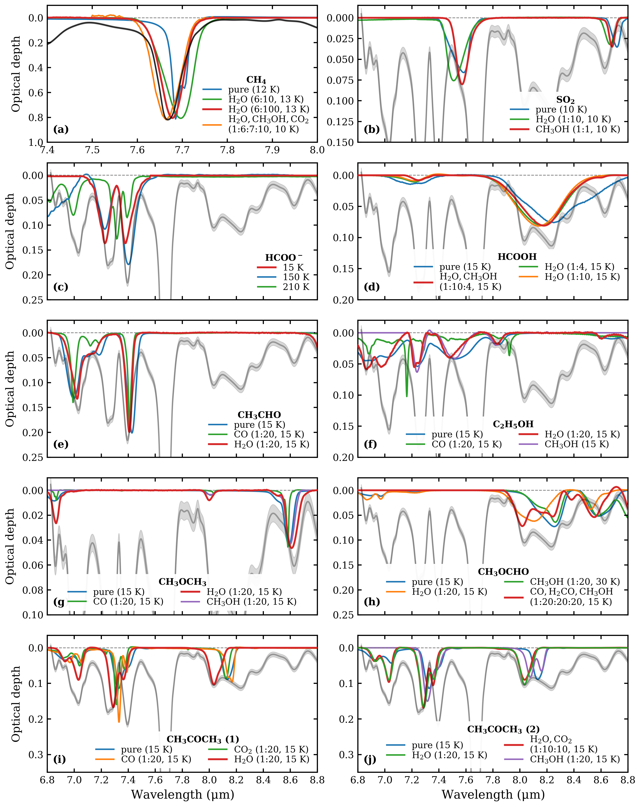

$\newcommand{\ensuremath}{}$
$\newcommand{\xspace}{}$
$\newcommand{\object}[1]{\texttt{#1}}$
$\newcommand{\farcs}{{.}''}$
$\newcommand{\farcm}{{.}'}$
$\newcommand{\arcsec}{''}$
$\newcommand{\arcmin}{'}$
$\newcommand{\ion}[2]{#1#2}$
$\newcommand{\textsc}[1]{\textrm{#1}}$
$\newcommand{\hl}[1]{\textrm{#1}}$
$\newcommand{\footnote}[1]{}$
$\newcommand{\stkout}[1]{\ifmmode\text{\sout{\ensuremath{#1}}}\else\sout{#1}\fi}$
$\newcommand{\edited}[2]{\ifthenelse{\isempty{#1}}{\textbf{#2}}{\ifthenelse{\isempty{#2}}{\textcolor{gray}{\stkout{#1}}}{\textcolor{gray}{\stkout{#1}} \textbf{#2}}}}$
$\newcommand{\highlight}[1]{\uline{#1}}$
$\newcommand{\replacedecimal}[2]{\ifthenelse{\isin{.}{#1}}{\text{\StrBefore{#1}{.}}\ensuremath{\overset{#2}{.}}\text{\StrBehind{#1}{.}}}{#1\ensuremath{^{#2}}}}$
$\newcommand{\hms}[3]{\ensuremath{#1\overset{\text{h}}{\phantom{.}}#2\overset{\text{m}}{\phantom{.}}\replacedecimal{#3}{\text{s}}}}$
$\newcommand{\dms}[3]{\ensuremath{#1\overset{\circ}{\phantom{.}}#2\overset{\prime}{\phantom{.}}\replacedecimal{#3}{\prime\prime}}}$
$\newcommand{\arraystretch}{1.6}$

# JOYS+: link between ice and gas of complex organic molecules

<mark>Appeared on: 2024-07-30</mark> -  _42 pages (22 main text, 20 appendix); 27 figures (12 in main text, 15 in appendix); 5 tables (2 in main text, 3 in appendix) Accepted for publication in A&A_

Y. Chen, et al. -- incl., <mark>H. Beuther</mark>, <mark>G. Perotti</mark>, <mark>T. Henning</mark>

**Abstract:** A rich inventory of complex organic molecules (COMs) has been observed in high abundances in the gas phase toward Class 0 protostars. These molecules are suggested to be formed in ices and sublimate in the warm inner envelope close to the protostar. However, only the most abundant COM, methanol ( $\ce{CH3OH}$ ), has been firmly detected in ices before the era of _James Webb_ Space Telescope (JWST). Now it is possible to detect the interstellar ices of other COMs and constrain their ice column densities quantitatively. We aim to determine the column densities of several oxygen-bearing COMs (O-COMs) in both gas and ice for two low-mass protostellar sources, NGC 1333 IRAS 2A (hereafter IRAS 2A) and B1-c, as case studies in our JWST Observations of Young protoStars (JOYS+) program. By comparing the column density ratios with respect to $\ce{CH3OH}$ between both phases measured in the same sources, we can probe into the evolution of COMs from ice to gas in the early stages of star formation. The column densities of COMs in gas and ice are derived by fitting the spectra observed by the Atacama Large Millimeter/submillimeter Array (ALMA) and the JWST/Mid-InfraRed Instrument-Medium Resolution Spectroscopy (MIRI-MRS), respectively. The gas-phase emission lines are fit using local thermal equilibrium (LTE) models, and the ice absorption bands are fit by matching the infrared spectra measured in laboratories. The column density ratios of four O-COMs ( $\ce{CH3CHO}$ , $\ce{C2H5OH}$ , $\ce{CH3OCH3}$ , and $\ce{CH3OCHO}$ ) with respect to $\ce{CH3OH}$ are compared between ice and gas in IRAS 2A and B1-c. We are able to fit the fingerprints range of COM ices between 6.8 and 8.8 $\mu m$ in the JWST/MIRI-MRS spectra of B1-c using similar components as recently used for NGC 1333 IRAS 2A. We claim detection of $\ce{CH4}$ , $\ce{OCN^-}$ , $\ce{HCOO^-}$ , $\ce{HCOOH}$ , $\ce{CH3CHO}$ , $\ce{C2H5OH}$ , $\ce{CH3OCH3}$ , $\ce{CH3OCHO}$ , and $\ce{CH3COCH3}$ in B1-c, and upper limits are estimated for $\ce{SO2}$ , $\ce{CH3COOH}$ , and $\ce{CH3CN}$ . The total abundance of O-COM ices is constrained to be 15 \% with respect to $\ce{H2O}$ ice, 80 \% of which is dominated by $\ce{CH3OH}$ . The comparison of O-COM ratios with respect to $\ce{CH3OH}$ between ice and gas shows two different cases. On one hand, the column density ratios of $\ce{CH3OCHO}$ and $\ce{CH3OCH3}$ match well between the two phases, which may be attributed to a direct inheritance from ice to gas or strong chemical links with $\ce{CH3OH}$ . On the other hand, the ice ratios of $\ce{CH3CHO}$ and $\ce{C2H5OH}$ with respect to $\ce{CH3OH}$ are higher than the gas ratios by 1--2 orders of magnitudes. This difference can be explained by the gas-phase reprocessing following sublimation, or different spatial distributions of COMs in the envelope, which is an observational effect since ALMA and JWST are tracing different components in a protostellar system. The firm detection of COM ices other than $\ce{CH3OH}$ is reported in another well-studied low-mass protostar, B1-c, following the recent detection in NGC 1333 IRAS 2A. The column density ratios of four O-COMs with respect to $\ce{CH3OH}$ show both similarities and differences between gas and ice. Although the straightforward explanations would be the direct inheritance from ice to gas and the gas-phase reprocessing, respectively, other possibilities such as different spatial distributions of molecules cannot be excluded.

**Figure 13. -** Comparison between the JWST/MIRI spectrum of B1-c (gray) and the lab spectra (colors) in the COMs fingerprints range of 6.8--8.8 $\mu$m. Each panel focuses on one species and shows the comparison between the observed B1-c spectrum and the lab spectra with different mixing constituents; except for panel (c) which shows the lab spectra of \ce{HCOO^-} under different temperatures. The observed spectrum along with the 3$\sigma$ level is shown in light gray; except for panel (a), which blows up the \ce{CH4} band at $\sim$7.7 $\mu$ and the observed spectrum is plotted in black for clarity. In each panel, the spectrum in blue corresponds to the pure ice, and the best-fit spectrum to the observations is highlighted with a thicker red line. Similar comparison but for lab spectra under different temperatures is shown in Figs. \ref{fig:obs_vs_lab_T_1} and \ref{fig:obs_vs_lab_T_2}. (*fig:obs_vs_lab_mix*)

**Figure 1. -** Panels (a)--(d) show the four steps to isolate the fingerprints range of COM ices between 6.8 and 8.8 $\mu$m from the original JWST/MIRI-MRS spectrum of B1-c: (a) fit a global continuum and convert the spectrum to optical depth scale; (b) subtract silicate features at $\sim$9.8 and 18 $\mu$m; (c) trace a local continuum in the 6.8--8.8 $\mu$m range to isolate the weak bands of COM ices from other strong features; (d) trace a baseline of the gas-phase lines in absorption to restore the band profiles of ices. Panel (e) shows the isolation of the \ce{CH3OH} ice band at 9.74 $\mu$m by tracing a local continuum. Orange shaded regions in panels (a) and (e) show the selected wavelength ranges for the polynomial fitting. (*fig:fitting_steps*)

**Figure 14. -** Same as Fig. \ref{fig:obs_vs_lab_mix} but for comparison among different temperatures. Here we take two species, \ce{CH3OCHO} and \ce{C2H5OH}, as examples; the remaining species (\ce{CH3CHO}, \ce{CH3OCH3}, and \ce{CH3COCH3}) are shown in Fig. \ref{fig:obs_vs_lab_T_2}. The left and right columns show the lab spectra of pure ices and ice mixtures, respectively. In the pure-ice panels, the spectra with crystalline features are highlighted in thicker red lines. The corresponding temperatures indicate the upper limit of crystallines. In the mixed-ice panels, the spectra with the lowest temperature (15 K) are highlighted in thicker blue lines; they are also the spectra used in the overall fitting. (*fig:obs_vs_lab_T_1*)

