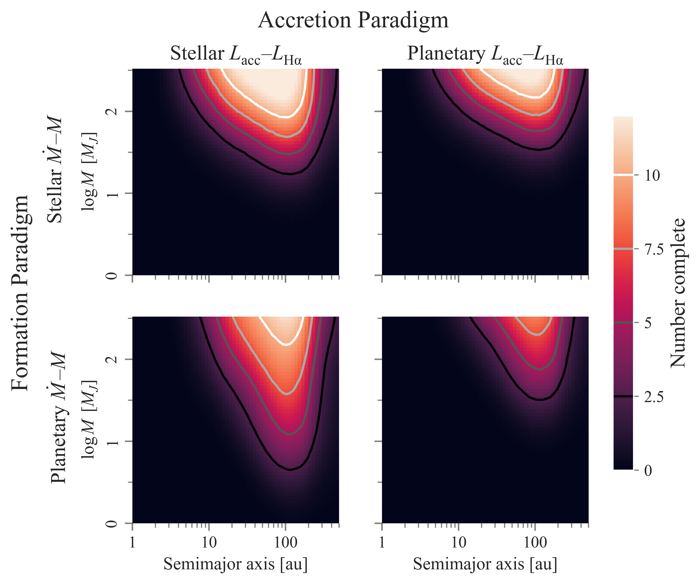
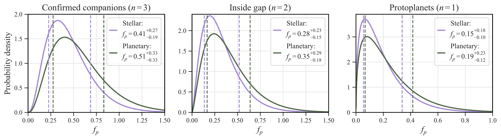

$\newcommand{\ensuremath}{}$
$\newcommand{\xspace}{}$
$\newcommand{\object}[1]{\texttt{#1}}$
$\newcommand{\farcs}{{.}''}$
$\newcommand{\farcm}{{.}'}$
$\newcommand{\arcsec}{''}$
$\newcommand{\arcmin}{'}$
$\newcommand{\ion}[2]{#1#2}$
$\newcommand{\textsc}[1]{\textrm{#1}}$
$\newcommand{\hl}[1]{\textrm{#1}}$
$\newcommand{\footnote}[1]{}$
$\newcommand{\vdag}{(v)^\dagger}$
$\newcommand$
$\newcommand$
$\newcommand{\Ha}{H\alpha\xspace}$
$\newcommand{\Lacc}{\ensuremath{L_{\mathrm{acc}}}\xspace}$
$\newcommand{\LHa}{\ensuremath{L_{\mathrm{H}\alpha}}\xspace}$
$\newcommand{\MMd}{\ensuremath{M\dot M}\xspace}$
$\newcommand{\MdtoM}{\ensuremath{\dot M\textrm{--}M}\xspace}$
$\newcommand{\LHatoLacc}{\ensuremath{L_{\mathrm{H}\alpha}\textrm{--}L_{\mathrm{acc}}}\xspace}$
$\newcommand{\cp}[1]{\textcolor{orange}{CP:  \textit{#1}}}$
$\newcommand{\kf}[1]{\textcolor{blue}{KF:  \textit{#1}}}$
$\newcommand{\MMdunits}{\ensuremath{M_J^2 \rm{yr}^{-1}}\xspace}$

# Accreting companion occurrence rates using a new method to compute emission-line survey sensitivity: application to the H$\alpha$ Giant Accreting Protoplanet Survey (GAPlanetS)

<mark>Appeared on: 2024-08-06</mark> -  _Submitted to ApJ. Comments welcome. 18 pages, 7 figures_

C. Plunkett, K. B. Follette, <mark>G.-D. Marleau</mark>, E. Nielsen

**Abstract:** A key scientific goal of exoplanet surveys is to characterize the underlying population of planets in the local galaxy. In particular, the properties of accreting _proto_ planets can inform the rates and physical processes of planet formation. We develop a novel method to compute sensitivity to protoplanets in emission-line direct-imaging surveys, enabling estimates of protoplanet population properties under various planetary accretion and formation theories. In this work, we specialize to the case of $\Ha$ and investigate three formation models governing the planetary-mass-to-mass-accretion-rate power law, and two accretion models that describe the scaling between total accretion luminosity and observable $\Ha$ line luminosity. We apply our method to the results of the Magellan Giant Accreting Protoplanet Survey (GAPlanetS) to place the first constraints on accreting companion occurrence rates in systems with transitional circumstellar disks. We compute the posterior probability for transitional disk systems to host an accreting companion ( $-8\leq\log \MMd[\MMdunits]\leq-2$ ) within 2 arcseconds ( $\sim200$ au). Across accretion models, we find consistent accreting companion rates, with median and one-sigma credible intervals of $0.15^{+0.18}_{-0.10}$ and $0.19^{+0.23}_{-0.12}$ . Our technique enables studying protoplanet populations under flexible assumptions about planet formation. This formalism provides the statistical underpinning necessary for protoplanet surveys to discriminate among formation and accretion theories for planets and brown dwarfs.

**Figure 3. -** Steps to estimate direct-imaging survey completeness to accreting companions. At each physical parameter set $(a,M)$, we simulate $10^4$ accreting companions. First, we sample mass accretion rates $\dot M$ using an assumed model for the $\MdtoM$ scaling. Step A shows the models in Section \ref{ssec:formpar}; the stellar model is in purple and the planetary in green. Next, we convert each $\MMd$ to $\Lacc$(Section \ref{ssec:gravinfall}). We then compute the observable $\LHa$ based on a model for the accretion scaling; Step B shows the two models in Section \ref{ssec:accpar}. We obtain the projected separation distribution by sampling companion orbital parameters as in Section \ref{ssec:orbits}; Step C shows one such distribution for an object at $a=100$ au. Finally, we compare the simulated companions to the survey star's contrast curve to estimate the detectable fraction. Step D shows two examples of 100 brown dwarfs $(a,M) = (100 \mathrm{au},  26 M_J)$ around PDS70; the left panel shows companions simulated using both "stellar" models, while the right uses both "planetary" models. We repeat across a grid in $(a.M)$ for each combination of models to obtain the entire completeness maps (Step E). (*fig:flowchart*)

**Figure 4. -** Completeness to accreting companions for the 14 stars surveyed by GAPlanetS as a function of semimajor axis [au] and mass $[M_J]$ for the four combinations of models. The color scale shows the depth of search, or the number of stars to which the survey is complete. The row dictates the $\MdtoM$ relation, with the top the stellar \citepalias{Betti2023} model and bottom the planetary \citepalias{Stamatellos2015} model. The column defines the $\LHa$toLacc scaling, with the left the stellar \citepalias{Alcala2017} and right the planetary \citepalias{Aoyama2021} scaling. Contours show completeness to 2.5, 5, 7.5, and 10 (out of 14) stars in the sample. (*fig:completeness*)

**Figure 6. -** Posteriors on accreting object occurrence rate around stars hosting transitional disks, $f_p$, for different subsets of the GAPlanetS detections. In all, we compare the stellar (purple) and planetary (green) accretion scaling relations. The legends give the median and one-sigma uncertainties (16$^{\textrm{th}}$ and 84$^{\textrm{th}}$ percentiles), also marked by dashed lines. _Left:_ posteriors on $f_p$ using the three confident detections. _Center:_ posteriors on the rate of accreting companions _inside_ disk gaps, excluding HD100453 B, which lies outside the gap. _Right:_ posteriors on the accreting _protoplanet_ rate, excluding the low-mass stars HD100453 B and HD142527 B. (*fig:posteriors_conf*)

