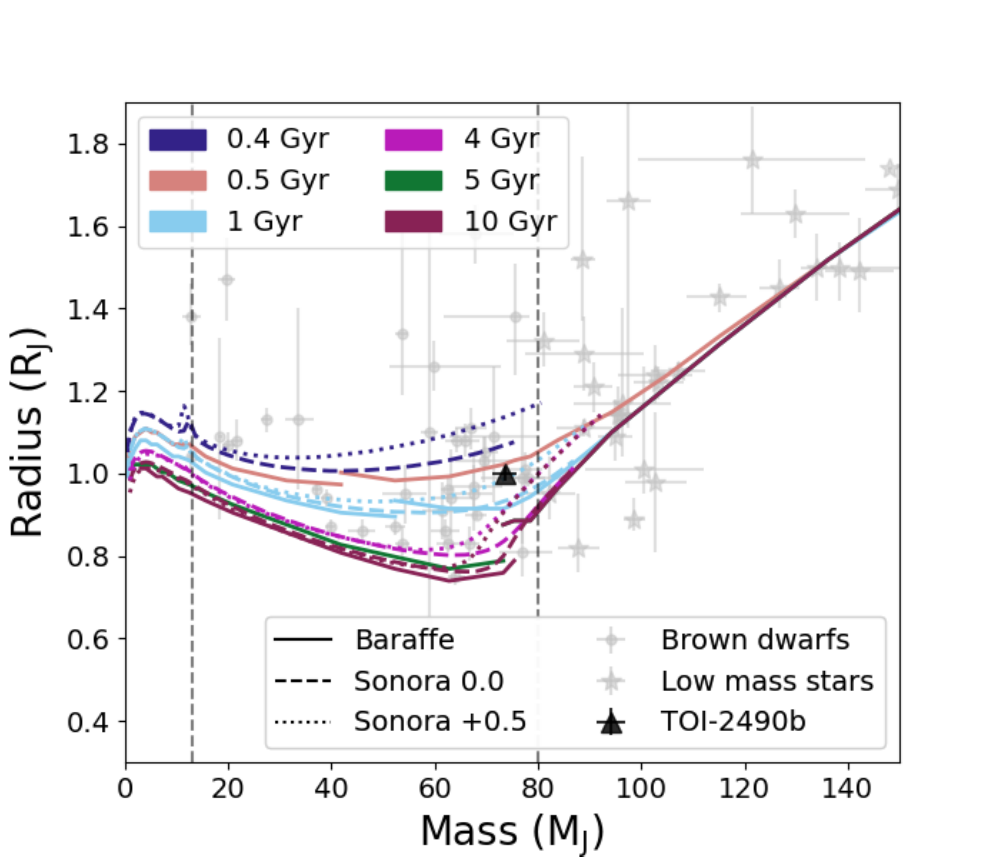
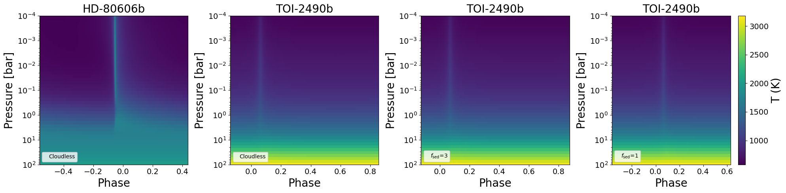

$\newcommand{\ensuremath}{}$
$\newcommand{\xspace}{}$
$\newcommand{\object}[1]{\texttt{#1}}$
$\newcommand{\farcs}{{.}''}$
$\newcommand{\farcm}{{.}'}$
$\newcommand{\arcsec}{''}$
$\newcommand{\arcmin}{'}$
$\newcommand{\ion}[2]{#1#2}$
$\newcommand{\textsc}[1]{\textrm{#1}}$
$\newcommand{\hl}[1]{\textrm{#1}}$
$\newcommand{\footnote}[1]{}$
$\newcommand{\mjup}{ M_{\rm J}\space}$
$\newcommand{\mjupnospace}{ M_{\rm J}}$
$\newcommand{\rjup}{ R_{\rm J}\space}$
$\newcommand{\rjupnospace}{ R_{\rm J}}$
$\newcommand{\msun}{ M_{\odot}\space}$
$\newcommand{\msunnospace}{ M_{\odot}}$
$\newcommand{\rsun}{ R_{\odot}\space}$
$\newcommand{\rsunnospace}{ R_{\odot}}$
$\newcommand{\lsun}{ L_{\odot}\space}$
$\newcommand{\tess}{{\it TESS\space}}$
$\newcommand{\tessnospace}{{\it TESS}}$
$\newcommand{\gaia}{{\it Gaia\space}}$
$\newcommand{\gaianospace}{{\it Gaia}}$
$\newcommand{\ngts}{{NGTS\space}}$
$\newcommand{\ngtsnospace}{{NGTS}}$
$\newcommand{\feros}{{FEROS\space}}$
$\newcommand{\ferosnospace}{{FEROS}}$
$\newcommand{\LSO}{La Silla Observatory\space}$
$\newcommand{\PAR}{Paranal Observatory\space}$
$\newcommand{\teff}{{T_{\rm eff}\space}}$
$\newcommand{\teffnospace}{{T_{\rm eff}}}$
$\newcommand{\logg}{{\log g\space}}$
$\newcommand{\loggnospace}{{\log g}}$
$\newcommand{\vsini}{{v\sin{i}\space}}$
$\newcommand{\vsininospace}{{v\sin{i}}}$
$\newcommand{\msini}{{M\sin{i}\space}}$
$\newcommand{\msininospace}{{M\sin{i}}}$
$\newcommand{\feh}{[Fe/H]\space}$
$\newcommand{\fehnospace}{[Fe/H]}$
$\newcommand{\systemt}{{\rm TOI-2490b\space}}$
$\newcommand{\systemtnospace}{{\rm TOI-2490b}}$
$\newcommand{\systemA}{{\rm TOI-2490\space}}$
$\newcommand{\systemAnospace}{{\rm TOI-2490}}$
$\newcommand{\fsed}{f_\mathrm{sed}\space}$
$\newcommand{\fsednospace}{f_\mathrm{sed}}$
$\newcommand{\thebibliography}{\DeclareRobustCommand{\VAN}[3]{##3}\VANthebibliography}$

# TOI-2490b- The most eccentric brown dwarf transiting in the brown dwarf desert

<mark>Appeared on: 2024-08-09</mark> -  _Accepted for publication in MNRAS, 18 pages, 14 figures_

B. A. Henderson, et al. -- incl., <mark>T. Henning</mark>, <mark>T. Trifonov</mark>

**Abstract:** We report the discovery of the most eccentric transiting brown dwarf  in the brown dwarf desert, $\systemtnospace$ . The brown dwarf desert is the lack of brown dwarfs around main sequence stars within $\sim3$ AU and is thought to be caused by differences in formation mechanisms between a star and planet. To date, only $\sim40$ transiting brown dwarfs have been confirmed. $\systemt$ is a $73.6\pm2.4$ $\mjupnospace$ , $1.00\pm0.02$ $\rjup$ brown dwarf orbiting a $1.004_{-0.022}^{+0.031}$ $\msunnospace$ , $1.105_{-0.012}^{+0.012}$ $\rsun$ sun-like star on a 60.33 d orbit with an eccentricity of $0.77989\pm0.00049$ . The discovery was detected within $\tess$ sectors 5 (30 minute cadence) and 32 (2 minute and 20 second cadence). It was then confirmed with 31 radial velocity measurements with $\feros$ by the WINE collaboration and  photometric observations with the Next Generation Transit Survey. Stellar modelling of the host star estimates an age of $\sim8$ Gyr, which is supported by estimations from kinematics likely placing the object within the thin disc. However, this is not consistent with model brown dwarf isochrones for the system age suggesting an inflated radius. Only one other transiting brown dwarf with an eccentricity higher than 0.6 is currently known in the brown dwarf desert. Demographic studies of brown dwarfs have suggested such high eccentricity is indicative of stellar formation mechanisms.

**Figure 12. -** The mass-radius plot for all known transiting brown dwarfs and low mass stars from 12 to 150 $\mjup$nospace, excluding RIK-72b  ([David, et. al 2019](https://ui.adsabs.harvard.edu/abs/2019ApJ...872..161D))  and 2MASS J05352184–0546085 from [Stassun, Mathieu and Valenti (2006)](https://ui.adsabs.harvard.edu/abs/2006Natur.440..311S) due to their youth and therefore large radii. Grey circles are brown dwarfs, whereas grey stars are low mass stars. The dashed vertical lines highlight the 13 and 80 $\mjup$ borders for the brown dwarf regime. $\systemt$ is the black triangle. Model isochrones are also plotted: solid lines are the [Baraffe, et. al (2003)](https://ui.adsabs.harvard.edu/abs/2003A&A...402..701B), [Baraffe, et. al (2015)](https://ui.adsabs.harvard.edu/abs/2015A&A...577A..42B) iscochrones for 0.5 (pink), 1 (light blue), 5 (green) and 10 (dark mauve) Gyr. The breaks in these isochrones are where we switch to the updated [Baraffe, et. al (2015)](https://ui.adsabs.harvard.edu/abs/2015A&A...577A..42B) iscochrones from [Baraffe, et. al (2003)](https://ui.adsabs.harvard.edu/abs/2003A&A...402..701B). The dashed and dotted isochrones show the marley21 Sonora Bobcat models for $\feh$ of 0.0 dex and +0.5 dex respectively. These are plotted for 0.4 (dark blue), 1 (light blue), 4 (bright purple) and 10 (dark mauve) Gyr. All objects can be seen in Table \ref{appendix:tables} along with their sources. This table has been updated from grieves21 and [ and Henderson (2024)](https://ui.adsabs.harvard.edu/abs/2024MNRAS.tmp..603H).  (*fig:massrad*)

**Figure 13. -** Models generated using egp+ showing how the temperature of the atmosphere of $\systemt$ is predicted to change across 3 orbits at different pressure levels. Panels 2, 3 and 4 show the different $f_{sed}$ values tested. The first panel shows the cloud free model of HD 80606b ([Mayorga, et. al (2021)](https://ui.adsabs.harvard.edu/abs/2021ApJ...915...41M)) for comparison. (*fig:pt_hd*)

**Figure 1. -** DSS image showing $\systemA$(green) with other nearby objects. North and East are shown on the figure in the top left corner as well as a 0.5 arcmin position angle (PA) arrow for scale. (*fig:dss*)

