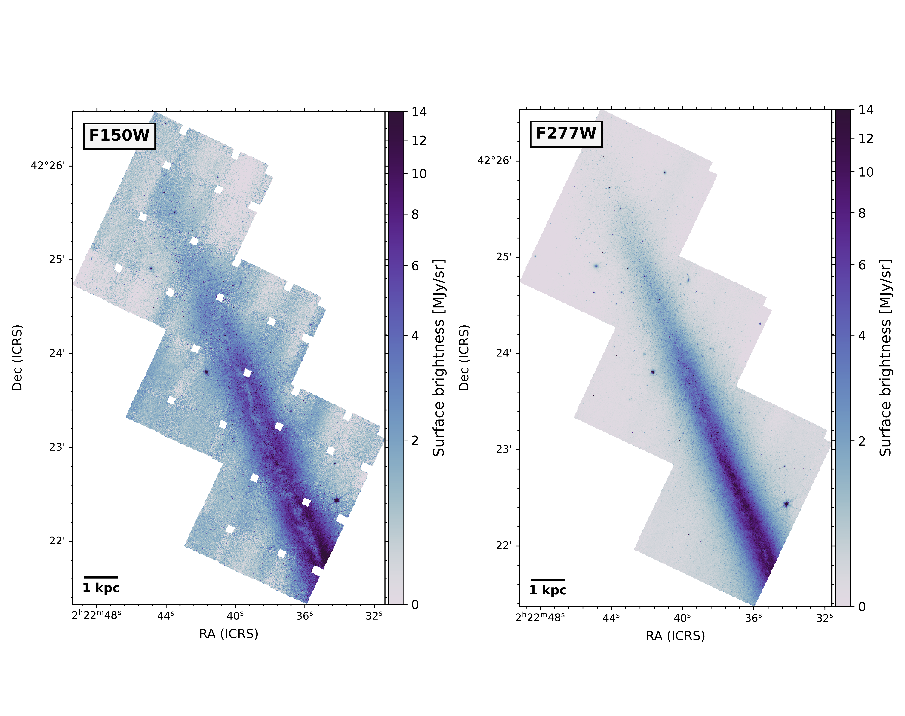

$\newcommand{\ensuremath}{}$
$\newcommand{\xspace}{}$
$\newcommand{\object}[1]{\texttt{#1}}$
$\newcommand{\farcs}{{.}''}$
$\newcommand{\farcm}{{.}'}$
$\newcommand{\arcsec}{''}$
$\newcommand{\arcmin}{'}$
$\newcommand{\ion}[2]{#1#2}$
$\newcommand{\textsc}[1]{\textrm{#1}}$
$\newcommand{\hl}[1]{\textrm{#1}}$
$\newcommand{\footnote}[1]{}$
$\newcommand{\tfill}{\textbf{!fill!}\xspace}$
$\newcommand{\ssm}{7.7~\mum\xspace}$
$\newcommand{\astrodendro}{{\sc astrodendro}\xspace}$
$\newcommand{\mjysr}{MJy~sr^{-1}\xspace}$
$\newcommand{\orcid}[1]{\href{https://orcid.org/#1}{\includegraphics[width=10pt]{figures/orcid-ID.png}}}$

# JWST MIRI and NIRCam observations of NGC 891 and its circumgalactic medium

<mark>Appeared on: 2024-08-16</mark> -  _Accepted for publication in Astronomy & Astrophysics; 16 pages, 8 figures_

J. Chastenet, et al. -- incl., <mark>F. Walter</mark>

**Abstract:** We present new JWST observations of the nearby, prototypical edge-on, spiral galaxy NGC 891.The northern half of the disk was observed with NIRCam in its F150W and F277W filters. Absorption is clearly visible in the mid-plane of the F150W image, along with vertical dusty plumes that closely resemble the ones seen in the optical.A ${\sim }10 \times 3 {\rm kpc}^2$ area of the lower circumgalactic medium (CGM) was mapped with MIRI F770W at 12 pc scales. Thanks to the sensitivity and resolution of JWST, we detect dust emission out to $\sim 4$ kpc from the disk, in the form of filaments, arcs, and super-bubbles. Some of these filaments can be traced back to regions with recent star formation activity, suggesting that feedback-driven galactic winds play an important role in regulating baryonic cycling.The presence of dust at these altitudes raises questions about the transport mechanisms at play and suggests that small dust grains are able to survive for several tens of million years after having been ejected by galactic winds in the disk-halo interface. We lay out several scenarios that could explain this emission: dust grains may be shielded in the outer layers of cool dense clouds expelled from the galaxy disk, and/or the emission comes from the mixing layers around these cool clumps where material from the hot gas is able to cool down and mix with these cool cloudlets.This first set of data and upcoming spectroscopy will be very helpful to understand the survival of dust grains in energetic environments, and their contribution to recycling baryonic material in the mid-plane of galaxies.

**Figure 5. -** _Top left:_ NIRCam F150W data, at native $\sim 0.05"$ resolution. The mid-plane shows conspicuous absorption. The background in that band shows large discrepancies, due to the difficulty to correct for both large structure stripes and offsets between the individual dithers. The small squares are gaps in the dither-pattern coverage.
    _Top right:_ NIRCam F277W data, at native $\sim 0.092"$ resolution. Some absorption is visible in the mid-plane, and the image shows a much smoother background than for the F150W mosaic.
    _Bottom:_ MIRI F770W data, at native $\sim 0.25"$ resolution, with radial distance indicators at 1, 2, 5, and 10 kpc from the mid-plane. The mid-IR image shows many filamentary structures as far out as $\sim 4$ kpc. (*fig:finalimages*)

**Figure 7. -** Multi-colour image with red: F277W, green: F150W, and blue: V-band, showing the coverage where all data overlap (the V-band and F277W images were adjusted to show the same spatial coverage, including dither gaps), and individual images shown in insets on the right. The NIRCam data was convolved to a $0.2"$ Gaussian PSF.
    We indicate galactocentric radii $r$ at 3 and 7 kpc.
    Conspicuous dark features show dusty filaments seen in extinction perpendicular to the disk. We can also notice the presence of star clusters, some obscured by dust, and some are not. (*fig:RGB*)

**Figure 1. -** _Top:_ NIRCam vertical profiles shown with symbols, in light blue for F150W and dark blue for F277W. We also show the fit from [Fraternali, Sancisi and Kamphuis (2011)]() using IRAC data (black line) and two fits from the radiative transfer models of \citet[][]{Xilouris1998}. In all cases, we average the vertical profiles over galactocentric radii $2.5 {\rm kpc}\leq r \leq 9 {\rm kpc}$, so that the radial coverage is the same.
    _Bottom:_ Emission profiles across the disk at $r \sim 8 $kpc showing the NIRCam data, and three optical bands. The images have all been normalised to the average values at $z = 1 $kpc, due to different units, for an easier comparison.
    The upturn at 1.2 kpc in F150W is an artefact due to one of the dither offsets mentioned in the text. (*fig:NIRCamVP*)

