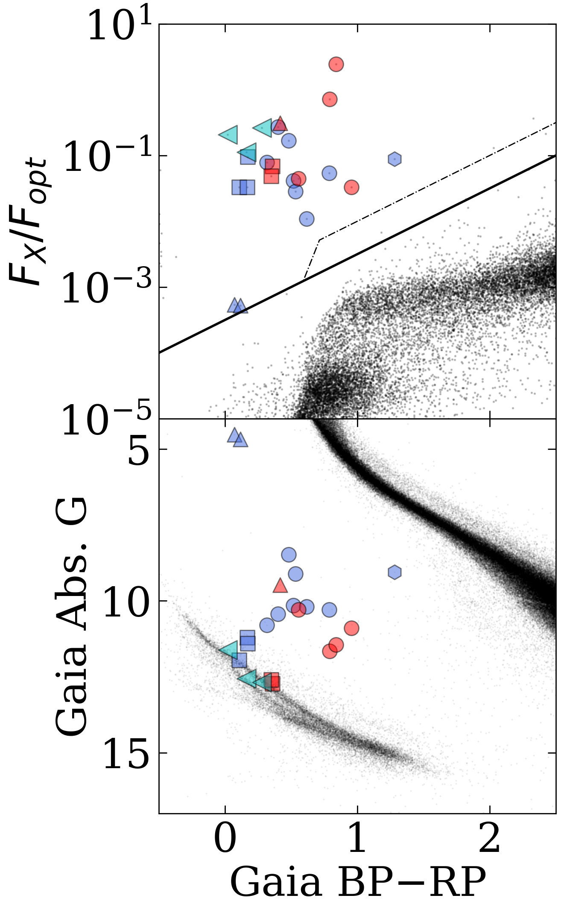
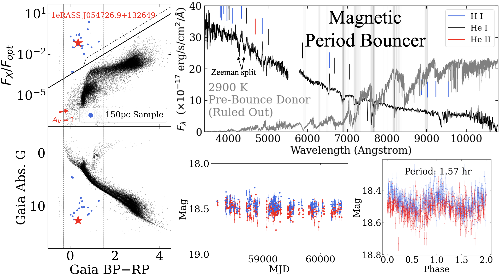
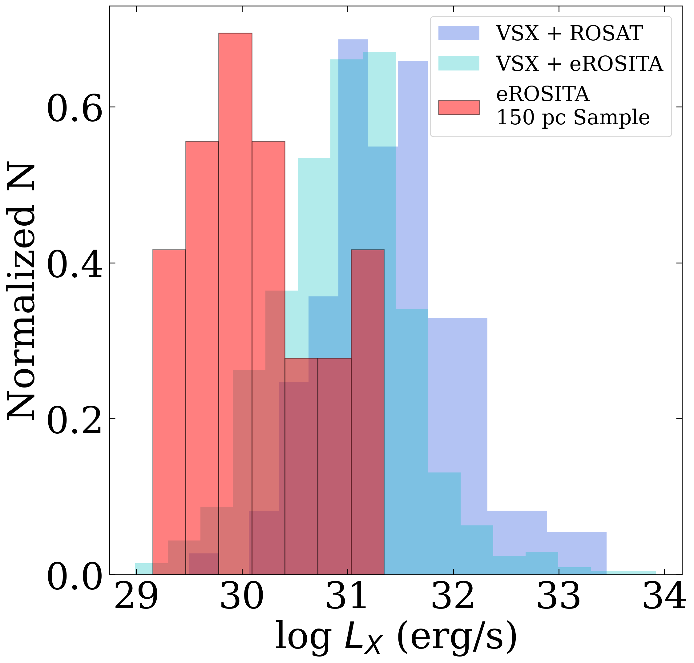

$\newcommand{\ensuremath}{}$
$\newcommand{\xspace}{}$
$\newcommand{\object}[1]{\texttt{#1}}$
$\newcommand{\farcs}{{.}''}$
$\newcommand{\farcm}{{.}'}$
$\newcommand{\arcsec}{''}$
$\newcommand{\arcmin}{'}$
$\newcommand{\ion}[2]{#1#2}$
$\newcommand{\textsc}[1]{\textrm{#1}}$
$\newcommand{\hl}[1]{\textrm{#1}}$
$\newcommand{\footnote}[1]{}$
$\newcommand{\vdag}{(v)^\dagger}$
$\newcommand$
$\newcommand$

# Cataclysmic Variables and AM CVn Binaries in SRG/eROSITA + _Gaia_: Volume Limited Samples, X-ray Luminosity Functions, and Space Densities

<mark>Appeared on: 2024-08-30</mark> -  _Submitted to PASP, comments welcome_

A. C. Rodriguez, et al. -- incl., <mark>K. El-Badry</mark>

**Abstract:** We present volume-limited samples of cataclysmic variables (CVs) and AM CVn binaries jointly selected from SRG/eROSITA eRASS1 and _Gaia_ DR3 using an X-ray + optical color-color diagram (the "X-ray Main Sequence"). This tool identifies all CV subtypes, including magnetic and low-accretion rate systems, in contrast to most previous surveys. We find 23 CVs, 3 of which are AM CVns, out to 150 pc in the Western Galactic Hemisphere. Our 150 pc sample is spectroscopically verified and complete down to $L_X = 1.3\times 10^{29} \;\textrm{erg s}^{-1}$ in the 0.2--2.3 keV band, and we also present CV candidates out to 300 pc and 1000 pc. We discovered two previously unknown systems in our 150 pc sample: the third nearest AM CVn and a magnetic period bouncer. We find the mean $L_X$ of CVs to be $\langle L_X \rangle \approx 4.6\times 10^{30} \;\textrm{erg s}^{-1}$ , in contrast to previous surveys which yielded $\langle L_X \rangle \sim 10^{31}-10^{32} \;\textrm{erg s}^{-1}$ .  We construct X-ray luminosity functions that, for the first time, flatten out at $L_X\sim 10^{30} \;\textrm{erg s}^{-1}$ . We find average number, mass, and luminosity densities of $\rho_\textrm{N, CV} = (3.7 \pm 0.7) \times 10^{-6} \textrm{pc}^{-3}$ , $\rho_M = (5.0 \pm 1.0) \times 10^{-5} M_\odot^{-1}$ , and $\rho_{L_X} = (2.3 \pm 0.4) \times 10^{26} \textrm{erg s}^{-1}M_\odot^{-1}$ , respectively, in the solar neighborhood. Our uniform selection method also allows us to place meaningful estimates on the space density of AM CVns, $\rho_\textrm{N, AM CVn} = (5.5 \pm 3.7) \times 10^{-7} \textrm{pc}^{-3}$ . Magnetic CVs and period bouncers make up $35\%$ and $25\%$ of our sample, respectively. This work, through a novel discovery technique, shows that the observed number densities of CVs and AM CVns, as well as the fraction of period bouncers, are still in tension with population synthesis estimates.

**Figure 8. -** Our 150 pc sample in the X-ray Main Sequence (upper left, with all systems in our 150 pc crossmatch in black), _Gaia_ HR diagram (lower left, with the 100 pc _Gaia_ catalog in black), and in the $P_\textrm{orb}$--$L_X$ parameter space (right, with the VSX + eROSITA CV sample in gray). Theoretical $L_X$ values are plotted as a function of period, using donor mass loss estimates from the CV evolutionary tracks ("standard" in gray and "optimal" in black) of [Pala, Gänsicke and Townsley (2017)](),  "He WD progenitor"/"evolved CV progenitor" AM CVn tracks of [Wong and Bildsten (2021)]()/[Sarkar, Ge and Tout (2023)]() and Equation 1. Accretion efficiencies in the range of $\eta \approx 0.02-0.3$(dashed and solid tracks) best fit the data, which could be confirmed through X-ray spectral analyses that likely depend on CV subclass. Observations of trends in these parameter spaces by CV subclass are presented in Table \ref{tab:all}. (*fig:all*)

**Figure 11. -** 1eRASS J054726.9+132649 is a newly-discovered magnetic period bouncer, selected thanks to the X-ray Main Sequence (upper left). It is located near the WD track (bottom left), and shows no outbursts in six years of data (bottom center), indicative of low mass transfer rates. ZTF optical photometry ($r$-band in red, $g$-band in blue) reveals a 1.57 hr orbital period (bottom right). The optical spectrum (upper right) shows that a 2900 K donor star predicted by CV evolutionary tracks (see Figure \ref{fig:pb_proof}) at this orbital period is not seen, thus confirming this system as a period bouncer. Balmer emission lines show clear Zeeman splitting (particularly H$\beta$ and H$\gamma$), which reveal the magnetic nature of the WD.  (*fig:pb*)

**Figure 2. -** Observed $L_X$ distributions of CVs. $L_X$ distributions of primarily optically-identified systems that have eROSITA (cyan) and ROSAT (blue) X-ray counterparts suggest that CVs have $\langle L_X\rangle \sim 10^{31-32}\textrm{erg s}^{-1}$. Our 150 pc volume limited sample of systems selected using the X-ray Main Sequence (red) instead reveals that $\langle L_X \rangle \sim 10^{30}\textrm{erg s}^{-1}$. (*fig:lum_dist*)

