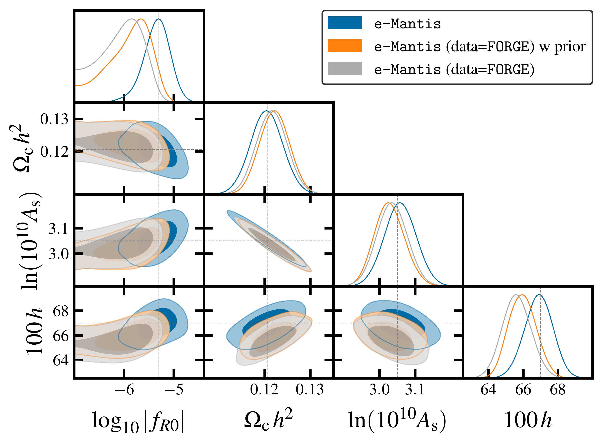

$\newcommand{\ensuremath}{}$
$\newcommand{\xspace}{}$
$\newcommand{\object}[1]{\texttt{#1}}$
$\newcommand{\farcs}{{.}''}$
$\newcommand{\farcm}{{.}'}$
$\newcommand{\arcsec}{''}$
$\newcommand{\arcmin}{'}$
$\newcommand{\ion}[2]{#1#2}$
$\newcommand{\textsc}[1]{\textrm{#1}}$
$\newcommand{\hl}[1]{\textrm{#1}}$
$\newcommand{\footnote}[1]{}$
$\newcommand{\bfpsi}{\bm\psi}$
$\newcommand{\bfell}{\bm\ell}$
$\newcommand{\bfn}{\bm n}$
$\newcommand{\bfth}{\bm\theta}$
$\newcommand{\bfz}{\bm z}$
$\newcommand{\bfs}{\bm s}$
$\newcommand{\bfv}{\bm v}$
$\newcommand{\bfx}{\bm x}$
$\newcommand{\bfk}{\bm k}$
$\newcommand{\bfp}{\bm p}$
$\newcommand{\bfq}{\bm q}$
$\newcommand{\bfr}{\bm r}$
$\newcommand{\bfu}{\bm u}$
$\newcommand{\bfw}{\bm w}$
$\newcommand{\bfy}{\bm y}$
$\newcommand{\bfPhi}{\bm\Phi}$
$\newcommand{\bfM}{\bm M}$
$\newcommand{\bfF}{\bm F}$
$\newcommand{\fnl}{f_{\rm NL}}$
$\newcommand{\gnl}{g_{\rm NL}}$
$\newcommand{\tdu}{\widetilde{u}}$
$\newcommand{\tdPhi}{\widetilde{\Phi}}$
$\newcommand{\tdG}{\widetilde{G}}$
$\newcommand{\tdP}{\widetilde{P}}$
$\newcommand{\tdR}{\widetilde{R}}$
$\newcommand{\threextwo}{\text{3\times2pt}}$
$\newcommand{\GCsp}{\text{GC}\ensuremath{_\mathrm{sp}}}$
$\newcommand{\GCph}{\text{GC}\ensuremath{_\mathrm{ph}}}$
$\newcommand{\XCph}{\text{XC}\ensuremath{_\mathrm{ph}}}$
$\newcommand{\Omegam}{\ensuremath{\Omega_{\mathrm{m}}}}$
$\newcommand{\Omegab}{\ensuremath{\Omega_{\mathrm{b}}}}$
$\newcommand{\Omegac}{\ensuremath{\Omega_{\mathrm{c}}}}$
$\newcommand{\Omeganu}{\ensuremath{\Omega_{\nu}}}$
$\newcommand{\OmegaDE}{\ensuremath{\Omega_{\mathrm{DE}}}}$
$\newcommand{\ns}{n_{\mathrm{s}}}$
$\newcommand{\lcdm}{\ensuremath{\Lambda\mathrm{CDM}}}$
$\newcommand{\logfr}{\ensuremath{\logten|f_{R0}|}}$
$\newcommand{\fr}{\ensuremath{|f_{R0}|}}$
$\newcommand{\sg}{\ensuremath{\sigma_{8}}}$
$\newcommand{\de}{\mathrm{d}}$
$\newcommand{\arepo}{\texttt{Arepo}}$
$\newcommand{\mgarepo}{\texttt{MG-AREPO}}$
$\newcommand{\ecosmog}{\texttt{ECOSMOG}}$
$\newcommand{\forge}{\texttt{FORGE}}$
$\newcommand{\react}{\texttt{ReACT}}$
$\newcommand{\emantis}{\texttt{e-Mantis}}$
$\newcommand{\ramses}{\texttt{RAMSES}}$
$\newcommand{\halofit}{\texttt{halofit}}$
$\newcommand{\montepython}{\texttt{MontePython}}$
$\newcommand{\bcemu}{\texttt{BCemu}}$
$\newcommand{\eetwo}{\texttt{EuclidEmulator2}}$
$\newcommand{\bacco}{\texttt{Bacco}}$
$\newcommand{\hmcode}{\texttt{HMCode2020}}$
$\newcommand{\fofrfitting}{\texttt{fitting}}$
$\newcommand{\dustgrain}{\texttt{DUSTGRAIN}}$
$\newcommand{\elephant}{\texttt{ELEPHANT}}$
$\newcommand{\cosmopower}{\texttt{Cosmopower}}$
$\newcommand{\mggadget}{\texttt{MG-Gadget}}$
$\newcommand{\orcid}[1]$

# $\Euclid$ preparation

<mark>Appeared on: 2024-09-06</mark> -  _24 pages, 16 figures, submitted on behalf of the Euclid Collaboration_

E. Collaboration, et al. -- incl., <mark>K. Jahnke</mark>

**Abstract:** We study the constraint on $f(R)$ gravity that can be obtained by photometric primary probes of the $\Euclid$ mission. Our focus is the dependence of the constraint on the theoretical modelling of the nonlinear matter power spectrum. In the Hu--Sawicki $f(R)$ gravity model, we consider four different predictions for the ratio between the power spectrum in $f(R)$ and that in $\lcdm$ : a fitting formula, the halo model reaction approach, $\react$ and two emulators based on dark matter only $_ N_$ -body simulations, $\forge$ and $\emantis$ . These predictions are added to the $\montepython$ implementation to predict the angular power spectra for weak lensing (WL), photometric galaxy clustering and their cross-correlation. By running Markov Chain Monte Carlo, we compare constraints on parameters and investigate the bias of the recovered $f(R)$ parameter if the data are created by a different model. For the pessimistic setting of WL, one dimensional bias for the $f(R)$ parameter, $\logfr$ , is found to be $0.5 \sigma$ when $\forge$ is used to create the synthetic data with $\logfr =-5.301$ and fitted by $\emantis$ . The impact of baryonic physics on WL is studied by using a baryonification emulator $\bcemu$ . For the optimistic setting, the $f(R)$ parameter and two main baryon parameters are well constrained despite the degeneracies among these parameters. However, the difference in the nonlinear dark matter prediction can be compensated by the adjustment of baryon parameters, and the one-dimensional marginalised constraint on $\logfr$ is biased. This bias can be avoided in the pessimistic setting at the expense of weaker constraints. For the pessimistic setting, using the $\lcdm$ synthetic data for WL, we obtain the prior-independent upper limit of $\logfr < -5.6$ . Finally, we implement a method to include theoretical errors to avoid the bias due to inaccuracies in the nonlinear matter power spectrum prediction.

**Figure 13. -** Constraints on parameters from the WL optimistic setting with baryons. We show the case where $\emantis$  is used to create both the data and fitting and the case where $\forge$  is used to create the data and it is fitted by $\emantis$ . We also include the case where we impose a Gaussian prior on $\logten M_{\rm c}$ with the width of 0.2 in the case of $\forge$  fiducial data.
  _Left panel_: Constraints on baryon parameters. _Right panel_: Constraints on cosmological parameters. (*fig:optbar*)

**Figure 12. -** The effect of $\logfr$, two baryonic parameters $\logten M_{\rm c}$ and $\theta_{\rm ej}$, and $h$ on the WL angular power spectrum in bin 10. The dotted lines show predictions of $\emantis$  with varying these parameters individually. The plot shows the ratio to the $\lcdm$  power spectrum. The plot includes the prediction of $\forge$  and $\emantis$  with the fiducial parameters and the $\emantis$  prediction using the best-fit values
  ($\logfr=-5.765, 100 h= 65.736, \logten(M_{\rm c})=12.999$)
with the data created by $\forge$ . We can see that the $\emantis$  prediction can fit the $\forge$  by adjusting these parameters. We note that the cosmological parameters for the $\lcdm$  power spectrum $C_{\ell}^{$\lcdm$}$ is fixed to be the fiducial ones when we vary $100  h$.  (*fig:baryoneffect*)

**Figure 4. -** Bias due to different nonlinear modelling. The synthetic data are created by $\emantis$  and fitted by two different models in WL pessimistic case without baryons.  (*fig:biasemantis*)

