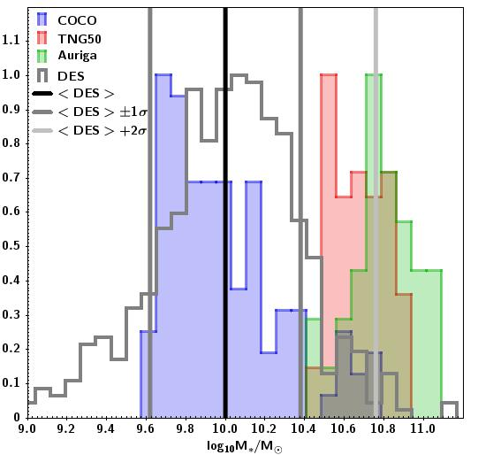

$\newcommand{\ensuremath}{}$
$\newcommand{\xspace}{}$
$\newcommand{\object}[1]{\texttt{#1}}$
$\newcommand{\farcs}{{.}''}$
$\newcommand{\farcm}{{.}'}$
$\newcommand{\arcsec}{''}$
$\newcommand{\arcmin}{'}$
$\newcommand{\ion}[2]{#1#2}$
$\newcommand{\textsc}[1]{\textrm{#1}}$
$\newcommand{\hl}[1]{\textrm{#1}}$
$\newcommand{\footnote}[1]{}$
$\newcommand{\apc}[1]{ \textcolor{purple}{\textbf{APC:} #1}}$
$\newcommand{\apcedit}[1]{\textbf{#1}}$

# Extragalactic Stellar Tidal Streams: Observations meet Simulation

<mark>Appeared on: 2024-09-06</mark> -  _18 pages, 17 figures_

J. Miro-Carretero, et al. -- incl., <mark>A. Pillepich</mark>

**Abstract:** According to the well established hierarchical framework for galaxy evolution, galaxies grow through mergers with other galaxies and the $\Lambda$ CDM cosmological model predicts that the stellar halos of galaxies are rich in remnants from minor mergers. The _Stellar Streams Legacy Survey_ has provided a first release of a catalogue with a statistically significant sample of stellar streams in the Local Universe that can be used to study minor mergers and test the cosmological models. The main objective is to compare the results of the observations of stellar tidal streams with the predictions of state-of-the-art cosmological simulations regarding the formation of stellar streams up to a redshift z < 0.02, according to the $\Lambda$ CDM model. We use the predictions of the cosmological simulations _Copernicus Complexio, TNG50 of the IllustrisTNG project and Auriga_ to generate 225 mock-images of nearby halos at a distance of 70 Mpc, and search for stellar streams. We compare the obtained stream frequency and characteristics with those obtained from the _Stellar Streams Legacy Survey_ . We find  good agreement between the results of analysing real images from the _Dark Energy Survey_ and mock-images from cosmological simulations. We obtained predictions for the detection rate of stellar streams to a surface brightness limit of 35 mag arcsec $^{-2}$ The cosmological simulations predict that for a surface brightness limit of 32 mag arcsec $^{-2}$ a frequency of almost 70 \% in the detection of streams around galaxies can be achieved.

**Figure 2. -** Histogram of
  $\log_{10} {M_\star}$
  for the observed (grey) and simulated galaxy samples (blue, red and green for COCO, IllustrisTNG50 and Auriga, respectively).
  The _black vertical line_ shows the average of the DES sample ($\log_{10} (M_{\star} / \mathrm{M_{\odot}} = 10.00$) and the _dark grey vertical lines_ the
  $\pm$ 1$\sigma$ range around that average, [$9.62, 10.38 $] . The _light grey vertical line_ shows the average of the DES sample $+2\sigma = 10.76$.
  The maximum value of each histogram has been re-scaled to 1 for this comparison (*fig-stellarmassCOCODES*)

**Figure 5. -** Distribution of host stellar mass in the DES sample and in the the COCO simulations within the selected stellar mass range. (*fig-histogramstelllarmass*)

**Figure 6. -** Detection rate curves for the COCO, IllustrisTNG50 and Auriga cosmological simulations and the detection rate observed for the DES sample (_black square_ indicates the dispersion in surface brightness limit of the DES sample and the dispersion in the detection rate according to a binomial distribution, see \citet{miro-carretero2024}). The percentage of the streams detected by visual inspection is plotted versus the surface brightness limit at which such detection was possible. The bars indicate the Poisson confidence interval. (*fig-comparisondesonlyetectioncurve*)

