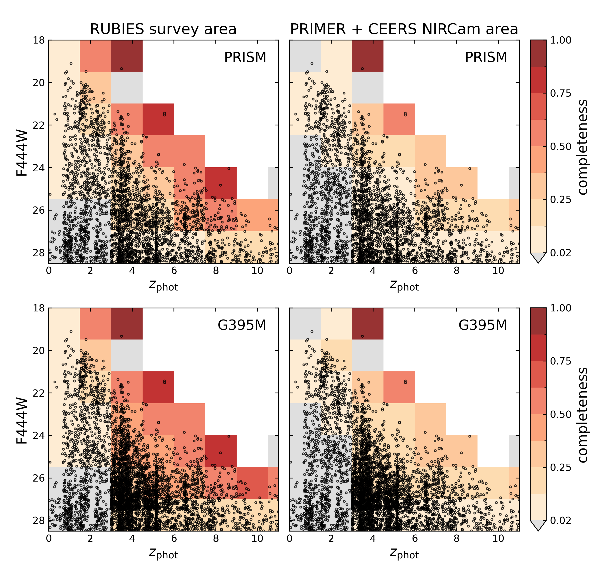
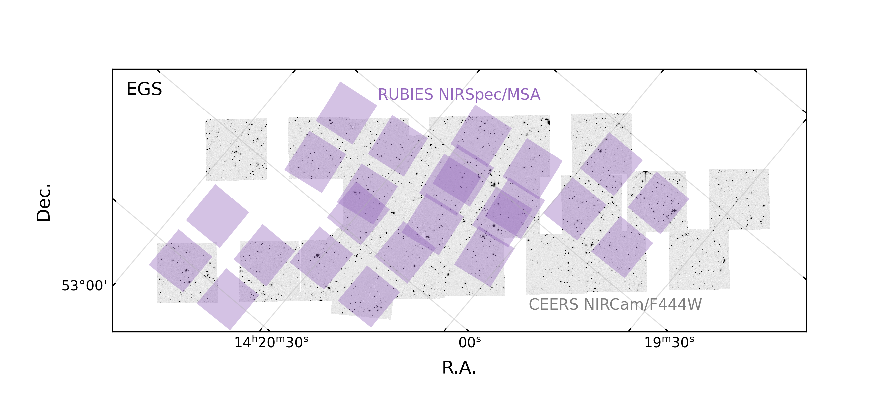

$\newcommand{\ensuremath}{}$
$\newcommand{\xspace}{}$
$\newcommand{\object}[1]{\texttt{#1}}$
$\newcommand{\farcs}{{.}''}$
$\newcommand{\farcm}{{.}'}$
$\newcommand{\arcsec}{''}$
$\newcommand{\arcmin}{'}$
$\newcommand{\ion}[2]{#1#2}$
$\newcommand{\textsc}[1]{\textrm{#1}}$
$\newcommand{\hl}[1]{\textrm{#1}}$
$\newcommand{\footnote}[1]{}$
$\newcommand{\kms}{\rm km s^{-1}}$
$\newcommand{\Msun}{\rm M_\odot}$
$\newcommand{\zphot}{z_{\rm phot}}$
$\newcommand{\zspec}{z_{\rm prism}}$
$\newcommand{\re}{r_{\rm e}}$
$\newcommand{\rt}{r_{\rm t}}$
$\newcommand{\va}{v_{\rm a}}$
$\newcommand{\vc}{v_{\rm circ}}$
$\newcommand{\vdisp}{\sigma_0}$
$\newcommand{\Mdyn}{M_{\rm dyn}}$
$\newcommand{\Mgas}{M_{\rm gas}}$
$\newcommand{\Mbar}{M_{\rm bar}}$
$\newcommand{\micron}{\rm \mu m}$
$\newcommand{\Oiii}{[O {\sc iii}]\xspace}$
$\newcommand{\Nii}{[N {\sc ii}]\xspace}$
$\newcommand{\Hb}{{\rm H}\beta\xspace}$
$\newcommand{\Ha}{{\rm H}\alpha\xspace}$
$\newcommand{\AG}[1]{{\bf \color{violet}{#1} }}$

# RUBIES: a complete census of the bright and red distant Universe with JWST/NIRSpec  

<mark>Appeared on: 2024-09-11</mark> -  _21 pages, 16 figures; submitted to A&A_

<mark>A. d. Graaff</mark>, et al. -- incl., <mark>H.-W. Rix</mark>

**Abstract:** We present the $*Red Unknowns: Bright Infrared Extragalactic Survey*$ (RUBIES), providing JWST/NIRSpec spectroscopy of red sources selected across $\sim150$ arcmin $^2$ from public JWST/NIRCam imaging in the UDS and EGS fields. RUBIES novel observing strategy offers a well-quantified selection function: the survey is optimised to reach high ( $>70\%$ ) spectroscopic completeness for bright and red ( $\mathrm{F150W-F444W}>2$ ) sources that are very rare. To place these rare sources in context, we simultaneously observe a reference sample of the $2<z<7$ galaxy population, sampling sources at a rate that is inversely proportional to their number density in the 3D parameter space of F444W magnitude, $\mathrm{F150W-F444W}$ colour, and photometric redshift. In total, RUBIES observes $\sim3000$ targets across $1<z_{\rm phot}<10$ with both the PRISM and G395M dispersers, and $\sim1500$ targets at $z_\mathrm{phot}>3$ using only the G395M disperser. The RUBIES data reveal a highly diverse population of red sources that span a broad redshift range ( $z_\mathrm{spec}\sim1-9$ ), with photometric redshift scatter and outlier fraction that are 3 times higher than for similarly bright sources that are less red. This diversity is not apparent from the photometric spectral energy distributions (SEDs). Only spectroscopy reveals that the SEDs encompass a mixture of galaxies with dust-obscured star formation, extreme line emission, a lack of star formation indicating early quenching, and luminous active galactic nuclei. As a first demonstration of our broader selection function we compare the stellar masses and rest-frame $U-V$ colours of the red sources and our reference sample: red sources are typically more massive ( $M_*\sim10^{10-11.5} \Msun$ ) across all redshifts. However, we also find that the most massive systems span a wide range in $U-V$ colour. We describe our data reduction procedure and data quality, and publicly release the reduced RUBIES data and vetted spectroscopic redshifts of the first half of the survey through the DAWN JWST Archive.

**Figure 1. -** Distribution of photometric redshifts and F444W magnitudes of RUBIES targets for the PRISM (top) and G395M (bottom) observations. Colour coding shows the spectroscopic completeness in each bin: on the left this is computed as the fraction of targets in the RUBIES NIRSpec footprint that are observed. On the right this is calculated as the fraction of observed targets from the full parent catalogue (i.e. the total PRIMER and CEERS area, approximately double the area covered by RUBIES). The RUBIES selection function achieves high ($>50\%$) spectroscopic targeting completeness for bright, high-redshift sources, even reaching $>70\%$ in the extremes of the parameter space.  (*fig:zmag_completeness*)

**Figure 5. -** RUBIES footprint of 18 NIRSpec/MSA pointings in the UDS and EGS fields. Purple pointings correspond to the first half of observations in January-March 2024 and form the focus of the current data release. Background images show the NIRCam F444W image mosaics, primarily constructed from public imaging of the CEERS and PRIMER surveys. For the UDS we also show the outline of the PRIMER MIRI imaging footprint in pink. (*fig:footprint*)

**Figure 11. -** Redshift and wavelength offset between the observed $\Oiii$$\lambda 5008$ emission lines measured from the PRISM and G395M spectra. Taking the G395M spectrum as `truth', we find a systematic offset of $\Delta z\sim 0.0044$ or $\sim0.25$ detector pixel for the PRISM spectrum, which does not appear to depend significantly on wavelength (grey solid lines show the running median). The scatter can be partially explained by the larger uncertainty for fainter emission lines. In addition, the intrashutter position of the source (i.e. the spatial offset in the dispersion direction) also introduces wavelength offsets of up to 1 pixel, if the source is point-like and located at the edge of the shutter. In practice, high-redshift sources are (moderately) spatially extended, resulting in smaller offsets. We indeed find a correlation between the source position in the slit and the wavelength offset. (*fig:wave_offset*)

