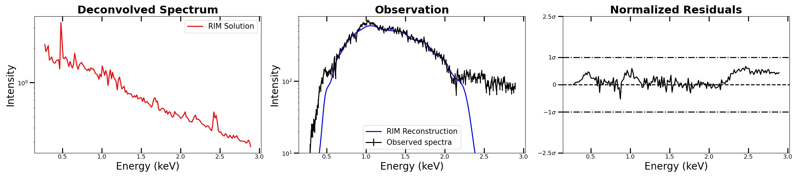

$\newcommand{\ensuremath}{}$
$\newcommand{\xspace}{}$
$\newcommand{\object}[1]{\texttt{#1}}$
$\newcommand{\farcs}{{.}''}$
$\newcommand{\farcm}{{.}'}$
$\newcommand{\arcsec}{''}$
$\newcommand{\arcmin}{'}$
$\newcommand{\ion}[2]{#1#2}$
$\newcommand{\textsc}[1]{\textrm{#1}}$
$\newcommand{\hl}[1]{\textrm{#1}}$
$\newcommand{\footnote}[1]{}$
$\newcommand$

# Deconvolving X-ray Galaxy Cluster Spectra Using a Recurrent Inference Machine

<mark>Appeared on: 2024-09-18</mark> -  _Submitted to AJ_

C. L. Rhea, et al. -- incl., <mark>M. Prunier</mark>

**Abstract:** Recent advances in machine learning algorithms have unlocked new insights in observational astronomy by allowing astronomers to probe new frontiers. In this article, we present a methodology to disentangle the intrinsic X-ray spectrum of galaxy clusters from the instrumental response function. Employing state-of-the-art modeling software and data mining techniques of the Chandra data archive, we construct a set of 100,000 mock Chandra spectra. We train a recurrent inference machine (RIM) to take in the instrumental response and mock observation and output the intrinsic X-ray spectrum. The RIM can recover the mock intrinsic spectrum below the 1- $\sigma$ error threshold; moreover, the RIM reconstruction of the mock observations are indistinguishable from the observations themselves. To further test the algorithm, we deconvolve extracted spectra from the central regions of the galaxy group NGC 1550, known to have a rich X-ray spectrum, and the massive galaxy clusters Abell 1795.  Despite the RIM reconstructions consistently remaining below the 1- $\sigma$ noise level, the recovered intrinsic spectra did not align with modeled expectations. This discrepancy is likely attributable to the RIM's method of implicitly encoding prior information within the neural network. This approach holds promise for unlocking new possibilities in accurate spectral reconstructions and advancing our understanding of  complex X-ray cosmic phenomena.

**Figure 2. -** In this figure we compare the RIM solution for both ObIDs (ObsID 3186 and ObsID 3187 in red) and the model taken from literature values (green) for NGC 1550. The later was obtained by estimating the thermodynamic properties of the cluster from the convolved observed spectrum in Kolokythas2020 and then creating a mock spectrum using in \texttt{SOXS}. (*fig:modelComparison*)

**Figure 8. -** Results of the RIM on the massive galaxy cluster Abell 1795. In the left panels, we show the RIM solution (i.e. the result of the deconvolution process) for ObsID 5289 (red). The middle panel shows the observed spectrum after background subtraction (black) and the RIM reconstruction (blue). The RIM reconstruction results from passing the RIM solution through the forward model developed in equation \ref{eqn:spec_mat}. The right panel shows the residual between the observed spectrum and the RIM reconstruction normalized to the noise level of the observation. (*fig:realObs5289*)

**Figure 1. -** Schematic view of the RIM. Nodes in dark gray are treated as inputs to the RIM. Note that we separate the hidden layers before applying the RIM and combine them after applying the RIM. The teal box represents the RIM itself. (*fig:RIM*)

