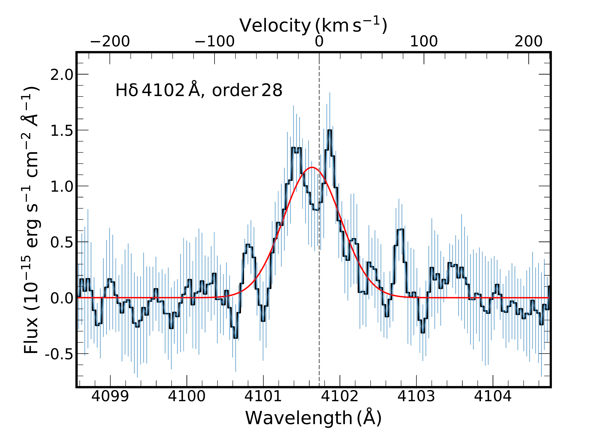
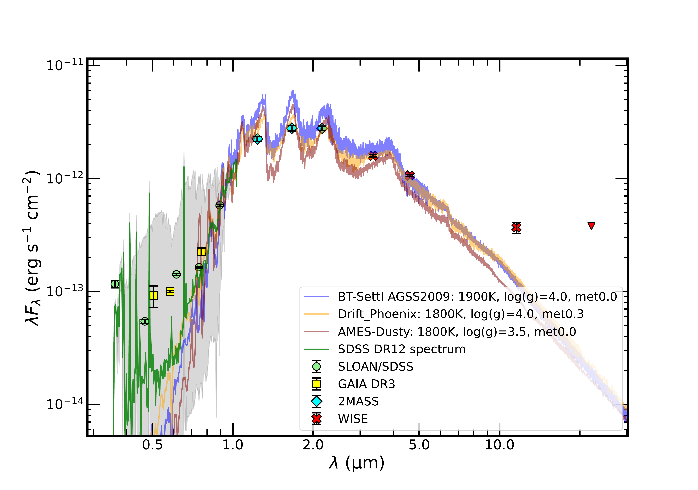

$\newcommand{\ensuremath}{}$
$\newcommand{\xspace}{}$
$\newcommand{\object}[1]{\texttt{#1}}$
$\newcommand{\farcs}{{.}''}$
$\newcommand{\farcm}{{.}'}$
$\newcommand{\arcsec}{''}$
$\newcommand{\arcmin}{'}$
$\newcommand{\ion}[2]{#1#2}$
$\newcommand{\textsc}[1]{\textrm{#1}}$
$\newcommand{\hl}[1]{\textrm{#1}}$
$\newcommand{\footnote}[1]{}$
$\newcommand{\mj}{\ensuremath{M_\mathrm{Jup}}\xspace}$
$\newcommand{\rj}{\ensuremath{R_\mathrm{Jup}}\xspace}$
$\newcommand{\mjyr}{\ensuremath{M_\mathrm{Jup} \mathrm{yr^{-1}}}\xspace}$
$\newcommand{\Msyr}{\ensuremath{M_\odot \mathrm{yr^{-1}}}\xspace}$
$\newcommand{\lsun}{\ensuremath{L_\odot}\xspace}$
$\newcommand{\msun}{\ensuremath{M_\odot}\xspace}$
$\newcommand{\rsun}{\ensuremath{R_\odot}\xspace}$
$\newcommand{\Mp}{\ensuremath{M_{\mathrm{p}}}\xspace}$
$\newcommand{\Rp}{\ensuremath{R_{\mathrm{p}}}\xspace}$
$\newcommand{\Mstar}{\ensuremath{M_\star}\xspace}$
$\newcommand{\Rstar}{\ensuremath{R_\star}\xspace}$
$\newcommand{\Teff}{\ensuremath{T_{\mathrm{eff}}}\xspace}$
$\newcommand{\Ha}{\ensuremath{\mathrm{H}\alpha}\xspace}$
$\newcommand{\Hb}{\ensuremath{\mathrm{H}\beta}\xspace}$
$\newcommand{\Hg}{\ensuremath{\mathrm{H}\gamma}\xspace}$
$\newcommand{\Lbol}{\ensuremath{L_{\mathrm{bol}}}\xspace}$
$\newcommand{\Lacc}{\ensuremath{L_{\mathrm{acc}}}\xspace}$
$\newcommand{\mdot}{\ensuremath{\dot{M}_{\mathrm{acc}}}\xspace}$
$\newcommand{\logm}{\ensuremath{\mathrm{log}(\mdot/\mjyr)}\xspace}$
$\newcommand{\Lline}{\ensuremath{L_{\mathrm{line}}}\xspace}$
$\newcommand{\logla}{\ensuremath{\mathrm{log}(\Lacc/\lsun)}\xspace}$
$\newcommand{\logll}{\ensuremath{\mathrm{log}(\Lline/\lsun)}\xspace}$
$\newcommand{\Hi}{H~\textsc{i}\xspace}$
$\newcommand{\Hei}{He~\textsc{i}\xspace}$
$\newcommand{\ff}{\ensuremath{f_{f}}\xspace}$
$\newcommand{\lamrest}{\ensuremath{\lambda_\mathrm{rest, air}}\xspace}$
$\newcommand{\lamobs}{\ensuremath{\lambda_\mathrm{observed}}\xspace}$
$\newcommand{\Wten}{\ensuremath{W_{10}}\xspace}$
$\newcommand{\kms}{\ensuremath{\mathrm{km s}^{-1}}\xspace}$
$\newcommand{\flux}{\ensuremath{\mathrm{erg s^{-1} cm^{-2} Å^{-1}}}\xspace}$
$\newcommand{\fluxinteg}{\ensuremath{\mathrm{erg s^{-1} cm^{-2}}}\xspace}$
$\newcommand{\masyr}{\ensuremath{\mathrm{mas yr^{-1}}}\xspace}$
$\newcommand{\cmcube}{\ensuremath{\mathrm{cm}^{-3}}\xspace}$
$\newcommand{\col}{\textcolor{magenta}}$
$\newcommand{\arraystretch}{1.2}$
$\newcommand{\arraystretch}{1.3}$
$\newcommand{\arraystretch}{1.2}$

# Exoplanet accretion monitoring spectroscopic survey (ENTROPY)

<mark>Appeared on: 2024-09-19</mark> -  _Accepted for publication at A&A on 2024-09-11. 15 pages, 9 figures, 7 tables_

G. Viswanath, et al. -- incl., <mark>G.-D. Marleau</mark>

**Abstract:** Accretion among planetary mass companions is a poorly understood phenomenon, due to the lack of both observational and theoretical studies. Detection of emission lines from accreting gas giants facilitate detailed investigations into this process. This work presents a detailed analysis of Balmer lines from one of the few known young, planetary-mass objects with observed emission, the isolated L2 $\gamma$ dwarf 2MASS J11151597+1937266 with a mass between 7 and 21 $\mj$ and an age of 5--45 Myr, located at $45\pm2$ pc. We obtained the first high-resolution ( $R\sim50,000$ ) spectrum of the target with VLT/UVES, an echelle spectrograph operating in the near-UV to visible wavelengths (3200--6800 Å). We report several resolved $\Hi$ (H3--H6) and $\Hei$ emission lines ( $\lambda5875.6$ ) in the spectrum. Based on the asymmetric line profiles of $\Ha$ and $\Hb$ , 10 \% width of $\Ha$ ( $199\pm1$  $\kms$ ), tentative $\Hei$  $\lambda6678$ emission and indications of a disk from MIR excess, we confirm ongoing accretion at this object. Using the _Gaia_ update of the parallax, we revise its temperature to $1816\pm63$ K and radius to $1.5\pm0.1$ $\rj$ . Analysis of observed $\Hi$ profiles using 1D planet-surface shock model implies a pre-shock gas velocity of $v_0=120^{+80}_{-40}$  $\kms$ and a pre-shock density of $\log(n_0/\mathrm{cm}^{-3})=14^{+0}_{-5}$ . The pre-shock velocity points to a mass of $\Mp=6^{+8}_{-4} \mj$ for the target. Combining the $\Hi$ line luminosities and planetary $\Lline$ -- $\Lacc$ scaling relations, we derive a mass accretion rate of $\mdot$ $=1.4^{+2.8}_{-0.9}\times10^{-8}$  $\mjyr$ . The line-emitting area predicted from planet-surface shock model is very small ( $\sim0.03\%$ ), and points to a shock at the base of a magnetospherically induced funnel. The $\Ha$ profile exhibits much stronger flux than predicted by the model that best fits the rest of the $\Hi$ profiles, indicating that another mechanism than shock emission contributes to the $\Ha$ emission. Comparison of line fluxes and mass accretion rates from archival moderate-resolution SDSS spectra indicate variable accretion at 2MASS J11151597+1937266.

**Figure 2. -** Line profiles of (upper panel) H$\gamma$ in order 34, (middle panel) H$\gamma$ in order 35, and (lower panel) H$\delta$ in order 28 detected in the UVES spectrum for 2M1115 in the Blue arm. The flux uncertainties are shown as vertical error bars and represent the weighted standard deviation among the four observations. Velocity is set with respect to the rest-frame wavelength (in air) of the respective lines. (*fig2*)

**Figure 5. -** Least-$\chi^2$ fits to the SED of 2M1115 with DRIFT-PHOENIX, BT-Settl-AGSS2009 and AMES-Dusty atmospheric models. The overall best fit with the minimum $\chi^2$
    corresponds to DRIFT-PHOENIX model at $\Teff=1800\pm50$ K, log(\textsl{g})$=4.0\pm0.25$ and metallicity$=0.3\pm0.15$. The SDSS DR12 spectrum for 2M1115 is also shown, along with its flux uncertainty (grey shaded region). Note that the flux in the WISE $W4$ band is a 2$\sigma$ upper limit, denoted by the red downward-pointing arrow, and is not included in the fitting process. The unWISE catalogue (\citealp{lang16}; see \url{https://unwise.me/photsearch/}) however reports a W4 detection consistent with this upper limit. (*apfig5*)

**Figure 1. -** Line profiles of $\Ha$ in the RedU arm (top panel), and $\Hb$ in the RedL arm (bottom panel) of the UVES spectrum of 2M1115. NC, BC indicate narrow component and broad component, respectively, of the total Gaussian fit to the profile. The flux uncertainties are shown as vertical error bars and represent the weighted standard deviation among the four observations. Velocity is set with respect to the rest-frame wavelength (in air) of the respective lines. (*fig1*)

