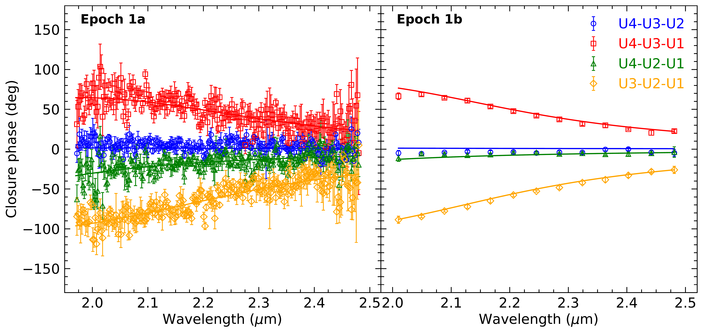

$\newcommand{\ensuremath}{}$
$\newcommand{\xspace}{}$
$\newcommand{\object}[1]{\texttt{#1}}$
$\newcommand{\farcs}{{.}''}$
$\newcommand{\farcm}{{.}'}$
$\newcommand{\arcsec}{''}$
$\newcommand{\arcmin}{'}$
$\newcommand{\ion}[2]{#1#2}$
$\newcommand{\textsc}[1]{\textrm{#1}}$
$\newcommand{\hl}[1]{\textrm{#1}}$
$\newcommand{\footnote}[1]{}$
$\newcommand{\vdag}{(v)^\dagger}$
$\newcommand$
$\newcommand$
$\newcommand{\ra}[4]{{#1}^{\rm h}{#2}^{\rm m}{#3}\fs{#4}}$
$\newcommand{\dec}[4]{{#1}\arcdeg{#2}\arcmin{#3}\farcs{#4}}$
$\newcommand{\rashort}[3]{{#1}^{\rm h}{#2}^{\rm m}{#3}^{\rm s}}$
$\newcommand{\decshort}[3]{{#1}\arcdeg{#2}\arcmin{#3}\arcsec}$
$\newcommand$
$\newcommand$
$\newcommand$
$\newcommand$
$\newcommand$
$\newcommand$
$\newcommand$
$\newcommand$
$\newcommand$
$\newcommand$
$\newcommand$
$\newcommand$
$\newcommand$
$\newcommand$
$\newcommand$
$\newcommand$
$\newcommand$
$\newcommand$
$\newcommand$
$\newcommand$
$\newcommand$
$\newcommand$
$\newcommand$
$\newcommand$
$\newcommand$
$\newcommand$
$\newcommand$
$\newcommand$

# Observations of microlensed images with dual-field interferometry: on-sky demonstration and prospects

<mark>Appeared on: 2024-09-20</mark> -  _submitted to AAS Journals_

P. Mróz, et al. -- incl., <mark>P. Garcia</mark>, <mark>L. Kreidberg</mark>, <mark>J. Sauter</mark>

**Abstract:** Interferometric observations of gravitational microlensing events offer an opportunity for precise, efficient, and direct mass and distance measurements of lensing objects, especially those of isolated neutron stars and black holes. However, such observations were previously possible for only a handful of extremely bright events. The recent development of a dual-field interferometer, GRAVITY Wide, has made it possible to reach out to significantly fainter objects, and increase the pool of microlensing events amenable to interferometric observations by two orders of magnitude. Here, we present the first successful observation of a microlensing event with GRAVITY Wide and the resolution of microlensed images in the event OGLE-2023-BLG-0061/KMT-2023-BLG-0496. We measure the angular Einstein radius of the lens with a sub-percent precision, $\thetaE = 1.280 \pm 0.009$ mas. Combined with the microlensing parallax detected from the event light curve, the mass and distance to the lens are found to be $0.472 \pm 0.012 M_{\odot}$ and $1.81 \pm 0.05$ kpc, respectively. We present the procedure for the selection of targets for interferometric observations, and discuss possible systematic effects affecting GRAVITY Wide data. This detection demonstrates the capabilities of the new instrument and it opens up completely new possibilities for the follow-up of microlensing events, and future routine discoveries of isolated neutron stars and black holes.

**Figure 1. -** Cumulative distribution of the expected $K$-band peak magnitudes of events detected by the OGLE EWS in 2023 (blue line). For comparison, the red line shows the cumulative distribution of the $K$-band magnitudes of the brightest star within $30"$ of the event (fringe-tracking star). Only events with $\tE \geq 50$ day and an adaptive-optics guide star brighter than $G=14$ are plotted. (*fig:stats*)

**Figure 3. -** Constraints on the microlensing parallax derived from different photometric data sets (blue -- OGLE, red -- KMTC, orange -- KMTS, green -- KMTA) and all light curve data (black contours). The dotted and dashed lines mark constraints from the two epochs of VLTI data, respectively. (*fig:parallaxes*)

**Figure 6. -** Closure phase data for the VLTI epoch 1. Color solid lines mark the best-fit binary-star model. (*fig:cp1*)

