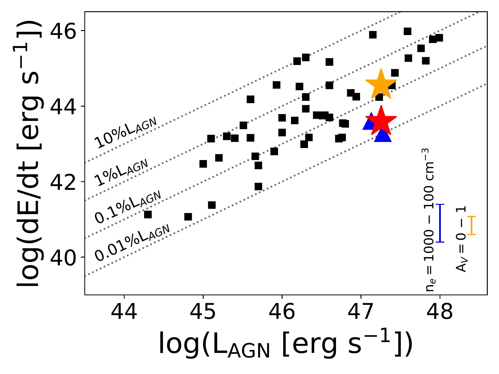

$\newcommand{\ensuremath}{}$
$\newcommand{\xspace}{}$
$\newcommand{\object}[1]{\texttt{#1}}$
$\newcommand{\farcs}{{.}''}$
$\newcommand{\farcm}{{.}'}$
$\newcommand{\arcsec}{''}$
$\newcommand{\arcmin}{'}$
$\newcommand{\ion}[2]{#1#2}$
$\newcommand{\textsc}[1]{\textrm{#1}}$
$\newcommand{\hl}[1]{\textrm{#1}}$
$\newcommand{\footnote}[1]{}$
$\newcommand{\ftm}{J1007+2115}$
$\newcommand{\vdag}{(v)^\dagger}$
$\newcommand$
$\newcommand$
$\newcommand{\xh}{<\chi_{H I}>}$
$\newcommand{\TQ}{t_{Q}}$
$\newcommand{\paa}{{Pa\alpha}}$
$\newcommand{\pab}{{Pa\beta}}$
$\newcommand{\av}{{A_{V}}}$
$\newcommand{\ebv}{E(B-V)}$
$\newcommand{\siv}{[S~{\sc iv}] 10.51 \mum}$
$\newcommand{\oiiitext}{[O~{\sc iii}]}$
$\newcommand{\sivtext}{[S~{\sc iv}]}$
$\newcommand{\lya}{Ly\alpha}$
$\newcommand{\cii}{[C~{\sc ii}] 158 \mum}$
$\newcommand{\ciitext}{[C~{\sc ii}]}$
$\newcommand{\mum}{\ifmmode{\rm \mu m}\else{\mum}\fi}$
$\newcommand{\vdisp}{\vdisp}$
$\newcommand{\wba}{W_{80}}$
$\newcommand{\vwu}{{v_{50}}}$
$\newcommand{\vjiu}{{v_{90}}}$
$\newcommand{\vyi}{{v_{10}}}$
$\newcommand{\vbasi}{{v_{84}}}$
$\newcommand{\vyiliu}{{v_{16}}}$
$\newcommand{\flux}{erg cm^{-2} s^{-1}}$
$\newcommand{\fsb}{erg cm^{-2} s^{-1} }$
$\newcommand{\spi}{{\it Spitzer}}$
$\newcommand{\her}{{\it Herschel}}$
$\newcommand{\oi}{\hbox{[O {\scriptsize I}]}}$
$\newcommand{\oii}{{[O {\scriptsize II}]}}$
$\newcommand{\oiii}{{[O {\scriptsize III}] \lambda5007}}$
$\newcommand{\oiiiab}{{[O {\scriptsize III}] \lambda\lambda4959,5007}}$
$\newcommand{\oiiib}{{[O {\scriptsize III}] \lambda4959}}$
$\newcommand{\nv}{\hbox{N {\scriptsize V}}}$
$\newcommand{\civ}{\hbox{C {\scriptsize IV} \lambda1549}}$
$\newcommand{\nev}{\hbox{[Ne {\scriptsize V}]}}$
$\newcommand{\nii}{\hbox{[N {\scriptsize II}]}}$
$\newcommand{\sii}{\hbox{[S {\scriptsize II}]}}$
$\newcommand{\ha}{\hbox{H\alpha}}$
$\newcommand{\hb}{\hbox{H\beta}}$
$\newcommand{\hg}{\hbox{H\gamma}}$
$\newcommand{\hd}{\hbox{H\delta}}$
$\newcommand{\mgii}{\hbox{Mg {\scriptsize II}}}$
$\newcommand{\feii}{\hbox{Fe {\scriptsize II}}}$
$\newcommand{\red}[1]{\textcolor{red}{#1}}$
$\newcommand{\blue}[1]{\textcolor{blue}{#1}}$
$\newcommand{\kms}{km s^{-1}}$
$\newcommand{\msun}{M_{\odot}}$
$\newcommand{\msunyr}{{M_{\sun} yr^{-1}}}$
$\newcommand{\lsun}{\ensuremath{\mathrm{L}_{\odot}}}$
$\newcommand{\eden}{cm^{-3}}$
$\newcommand{\momfluxsfr}{\dot{P}_{SFR} }$
$\newcommand{\momfluxagn}{\dot{P}_{QSO} }$
$\newcommand{\momfluxout}{\dot{P}_{outflow} }$
$\newcommand{\momfluxratio}{\frac{\dot{P}_{outflow}}{\dot{P}_{AGN}}}$
$\newcommand{\msigma}{M_{\bullet}-\sigma~}$
$\newcommand{\ergs}{erg s^{-1}}$
$\newcommand{\ergscm}{erg s^{-1} cm^{-2}}$
$\newcommand{\myr}{M_\odot~yr^{-1}}$
$\newcommand{\loghn}{log(\nii/\ha) }$
$\newcommand{\logohb}{log(\oiii/\hb) }$
$\newcommand$
$\newcommand$
$\newcommand$
$\newcommand$
$\newcommand$
$\newcommand$

# Fast Outflow in the Host Galaxy of the Luminous $z=7.5$ Quasar J1007$+$2115

<mark>Appeared on: 2024-09-23</mark> - 

W. Liu (刘伟哲), et al. -- incl., <mark>E. Bañados</mark>, <mark>J. Wolf</mark>

**Abstract:** James Webb Space Telescope opens a new window to directly probe luminous quasars powered by billion solar mass black holes in the epoch of reionization and their co-evolution with massive galaxies with unprecedented details. In this paper, we report the first results from the deep NIRSpec integral field spectroscopy study of a quasar at $z = 7.5$ . We obtain a bolometric luminosity of $\sim1.8\times10^{47}$ $\ergs$ and a black hole mass of ${$\sim$0.7--2.5$\times10^{9}$}$ $\msun$ based on $\hb$ emission line from the quasar spectrum. We discover $\sim$ 2 kpc scale, highly blueshifted ( $\sim-$ 870 $\kms$ ) and broad ( $\sim$ 1400 $\kms$ ) $\oiiitext$ line emission after the quasar PSF has been subtracted. Such line emission most likely originates from a fast, quasar-driven outflow, the earliest one on galactic-scale known so far. The dynamical properties of this outflow fall within the typical ranges of quasar-driven outflows at lower redshift, and the outflow may be fast enough to reach the circumgalactic medium. Combining both the extended and nuclear outflow together, the mass outflow rate, ${$\sim$300 \msunyr, is $\sim$60\%--380\%}$ of the star formation rate of the quasar host galaxy, suggesting that the outflow may expel a significant amount of gas from the inner region of the galaxy. The kinetic energy outflow rate, ${$\sim$3.6$\times10^{44}$ erg s$^{-1}$}$ , is ${$\sim$0.2\%}$ of the quasar bolometric luminosity, which is comparable to the minimum value required for negative feedback based on simulation predictions. The dynamical timescale of the extended outflow is $\sim$ 1.7 Myr, consistent with the typical quasar lifetime in this era.

**Figure 3. -** Quasar spectrum extracted from the $r=0$\farcs$25$ aperture centered on the brightest spaxel of the IFU data cube. **Top:** Data (black) and best-fit quasar continuum (orange), iron emission (cyan) and overall emission line model (blue). The individual Balmer and $\oiiitext$ emission line components are shown in red and green, respectively. The locations of major emission lines at the systemic velocity are indicated by the vertical dotted lines. The residual from the best-fit is shown in the dotted, light gray line. The spectral windows adopted for quasar pseudo-continuum fit are marked in thick gray bars. **Bottom:** Zoom-in view of the emission line-only spectrum for the $\hb$ and $\oiiitext$ region. The color coding is the same as the top panel. (*fig:fig0*)

**Figure 5. -** Flux, velocity dispersion $\sigma$, and velocity $\vwu$ maps of the $\oi$ii-emitting gas in J1007$+$2115, after the quasar PSF has been subtracted. The spatial scales are in unit of kpc. The location of the quasar is indicated by the black cross. {As stated in Sec. \ref{sec:41}, only spaxels with peak flux density above 2$\sigma$ and passing visual inspection are kept and shown in these figures.} (*fig:fig3*)

**Figure 6. -** Maximum outflow velocity (left), mass outflow rate (middle) and kinetic energy outflow rate (right) as a function of bolometric AGN luminosity for the extended outflow in our object J1007$+$2115 (red star) in comparison with the outflows discovered in two $z\sim6.8$ quasars (blue triangles) from [Marshall, Perna and Willott (2023)]() and other AGN-driven outflows at $z<4$ compiled by [Fiore, Feruglio and Shankar (2017)](). In the middle and right panels, for J1007$+$2115, we also show the total rates for both the nuclear and extended outflows combined (orange star). For the $z\sim6.8$ quasars, we only quote the $\oiiitext$ emission line based results for consistency. For our object and the $z\sim6.8$ quasars, the error bars are not shown when the sizes of them are smaller than the symbol sizes. For sources from [Fiore, Feruglio and Shankar (2017)](), no formal errors were reported for individual objects. {The uncertainties caused by electron density ($n_{e}= $1000 -- 100 cm$^{-3}$) and extinction ($A_V = $0 -- 1) are indicated by the blue and orange bars at the bottom right corners of the middle and right panels.} (*fig:outflow*)

