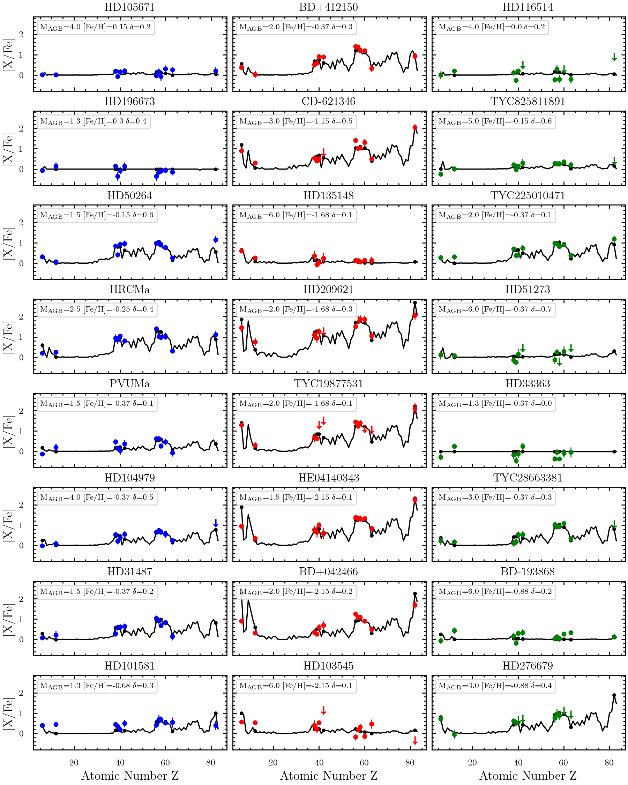

$\newcommand{\ensuremath}{}$
$\newcommand{\xspace}{}$
$\newcommand{\object}[1]{\texttt{#1}}$
$\newcommand{\farcs}{{.}''}$
$\newcommand{\farcm}{{.}'}$
$\newcommand{\arcsec}{''}$
$\newcommand{\arcmin}{'}$
$\newcommand{\ion}[2]{#1#2}$
$\newcommand{\textsc}[1]{\textrm{#1}}$
$\newcommand{\hl}[1]{\textrm{#1}}$
$\newcommand{\footnote}[1]{}$

# S-Process Nucleosynthesis in Chemically Peculiar Binaries

<mark>Appeared on: 2024-09-26</mark> -  _30 pages, 14 figures, 7 tables_

<mark>A. Dimoff</mark>, et al.

**Abstract:** Around half of the heavy elements in the universe are formed through the slow neutron capture (s-) process, which takes place in thermally pulsing asymptotic giant branch (AGB) stars with masses $1-6\;M_{\odot}$ . The nucleosynthetic imprint of the s-process can be studied by observing the material on the surface of binary barium (Ba), carbon (C), CH, and carbon-enhanced metal-poor (CEMP) stars. We study the s-process by observing the luminous components of binary systems polluted by a previous AGB companion. Our radial velocity (RV) monitoring program establishes an ongoing collection of binary stars exhibiting enrichment in s-process material for the study of elemental abundances, production of s-process material, and binary mass transfer. From high resolution optical spectra, we measure radial velocities (RVs) for $350$ stars and derive stellar parameters for $\sim150$ stars using ATHOS. For a sub-sample of $24$ chemically interesting stars we refine our atmospheric parameters using ionization and excitation balance with the Xiru program. We use the MOOG code to compute one-dimensional local thermodynamic equilibrium (1D-LTE) abundances of carbon, magnesium, s-process elements (Sr, Y, Zr, Mo, Ba, La, Ce, Nd, Pb), and Eu to investigate neutron capture events and stellar chemical composition. We estimate dynamical stellar masses via orbital optimization using Markov chain Monte Carlo techniques in the ELC program, and we compare our results with low-mass AGB models in the FUll-Network Repository of Updated Isotopic Tables \& Yields (FRUITY) database. In our abundance sub-sample, we find enhancements in s-process material in spectroscopic binaries, a signature of AGB mass transfer. We add the element Mo to the abundance patterns, and for 12 stars we add Pb detections or upper limits, as these are not known in the literature. Computed abundances are in general agreement with the literature. Comparing our abundances to dilution-modified FRUITY yields, we find correlations in s-process enrichment and AGB mass, supported by dynamical modeling from RVs. From our high-resolution observations, we expand heavy element abundance patterns and highlight binarity in our chemically interesting systems. We find trends in s-process element enhancement from AGB stars, and agreements in theoretical and dynamically modelled masses. We investigate evolutionary stages for a small sub-set of our stars.

**Figure 10. -** Abundances for our sample of stars by element. Blue squares are Ba stars, red circles are carbon-enhanced (CEMP-s/-no or CH) stars, and green x's are "other" or unclassified stars. Inverted arrows are upper limits on the abundance of [X/Fe] (*fig:abund_grid*)

**Figure 12. -** FRUITY models compared to computed abundances for our high-quality abundance sample, organized by decreasing metallicity. Blue data points correspond to Ba stars, red to C-enriched stars, and green to "other" stars. Inverted triangles in the plots are upper limits from our abundance computations. FRUITY model data is shown in black. (*fig:FRUITY_compare*)

**Figure 3. -** TOP: Kiel diagram of our estimated stellar parameters from ATHOS and Xiru, with ATHOS operational limits as the dashed grey box. Open circles are parameters estimated by Xiru. Blue data points are known Ba stars, red are carbon enhanced stars, and green are "other" stars. Floating error bars are for Xiru (black) and ATHOS (green). Cool giants are in the upper right, and warm dwarfs are in the lower left. BOTTOM: Metallicity vs temperature for our this sub-sample, with ATHOS operational limits as the dashed grey box. Colors are the same as the top panel. (*fig:Kiel_Diag*)

