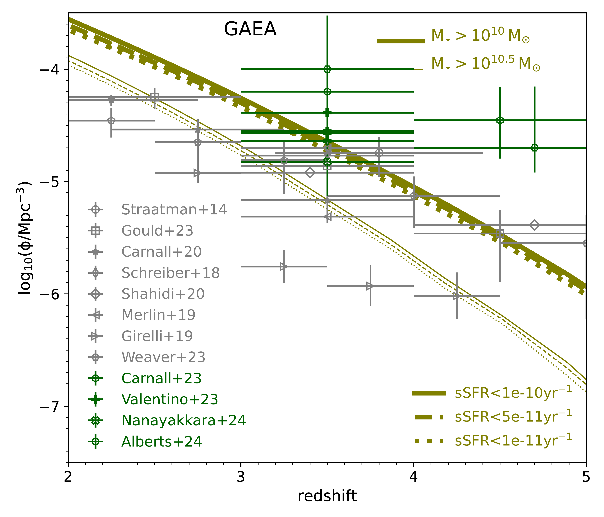
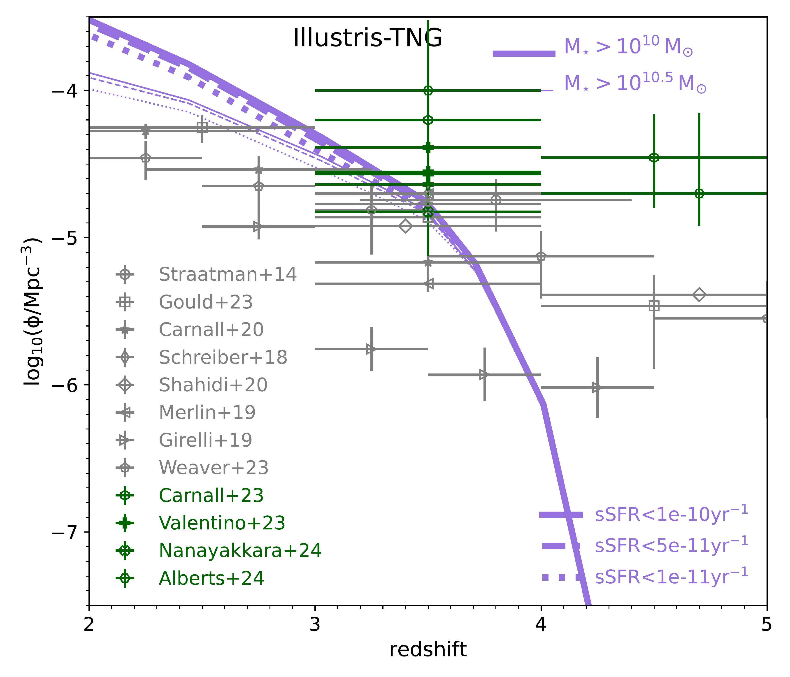

$\newcommand{\ensuremath}{}$
$\newcommand{\xspace}{}$
$\newcommand{\object}[1]{\texttt{#1}}$
$\newcommand{\farcs}{{.}''}$
$\newcommand{\farcm}{{.}'}$
$\newcommand{\arcsec}{''}$
$\newcommand{\arcmin}{'}$
$\newcommand{\ion}[2]{#1#2}$
$\newcommand{\textsc}[1]{\textrm{#1}}$
$\newcommand{\hl}[1]{\textrm{#1}}$
$\newcommand{\footnote}[1]{}$
$\newcommand{\crate}{\dot M_{\rm cool}}$
$\newcommand{\eagle}{{\sc eagle}}$
$\newcommand{\surfs}{{\sc surfs}}$
$\newcommand{\shark}{{\sc Shark}}$

# The diverse star formation histories of early  massive, quenched galaxies in modern galaxy formation simulations

<mark>Appeared on: 2024-09-26</mark> -  _Submitted for publication in MNRAS. 32 pages (21 of main body and 11 of appendices). Comments welcome!_

C. d. P. Lagos, et al. -- incl., <mark>A. d. Graaff</mark>, <mark>L. Xie</mark>

**Abstract:** We present a comprehensive study of the star formation histories of massive-quenched galaxies at $z=3$ in $3$ semi-analytic models ( $\shark$ , ${\sc GAEA}$ , ${\sc Galform}$ ) and $3$ cosmological hydrodynamical simulations ( ${\sc Eagle}$ , ${\sc Illustris-TNG}$ , ${\sc Simba}$ ). We study the predicted number density and stellar mass function of massive-quenched galaxies, their formation and quenching timescales and star-formation properties of their progenitors. Predictions are disparate in all these diagnostics, for instance: (i) some simulations reproduce the observed number density of very massive-quenched galaxies ( $>10^{11} \rm M_{\odot}$ ) but underpredict the high density of intermediate-mass ones, while others fit well the lower masses but underpredict the higher ones; (ii) In most simulations, except for ${\sc GAEA}$ and $\eagle$ , most massive-quenched galaxies had starburst periods, with the most intense ones happening at $4<z<5$ ; however, only in $\shark$ and ${\sc Illustris-TNG}$ we do find a large number of progenitors with star formation rates $>300\rm   M_{\odot} yr^{-1}$ ; (iii) quenching timescales are in the range $\approx 20-150$ Myr depending on the simulation; among other differences. These disparate predictions can be tied to the adopted Active Galactic Nuclei (AGN) feedback model. For instance, the explicit black-hole (BH) mass dependence to trigger the "radio mode" in ${\sc Illustris-TNG}$ and ${\sc Simba}$ makes it difficult to produce quenched galaxies with intermediate stellar masses, also leading to higher baryon collapse efficiencies ( $\approx 15-30$ \% ); while the strong bolometric luminosity dependence of the AGN outflow rate in ${\sc GAEA}$ leads to BHs of modest mass quenching galaxies. Current observations are unable to distinguish between these different predictions due to the small sample sizes. However, these predictions are testable with current facilities and upcoming observations, allowing a "true physics experiment’’ to be carried out.

**Figure 13. -** _ Top-left panel:_ maximum SFR achieved by the $z=3$ passive, massive galaxies (at any point of their history) as a function of the $z=3$ stellar mass in each of the $6$ simulations, as labelled. Lines with shaded regions show the medians and the $16^{\rm th}-84^{\rm th}$ percentile ranges, respectively. We use adaptive bins to ensure a reasonable number of galaxies per bin.
_ Top-right panel:_ as in the top-left panel but for the lookback time at which SFR$_{\rm max}$ happens. Here we show with horizontal lines three different redshifts, as labelled (noting that the cosmologies of the simulations are not exactly the same, but similar enough to use these lines as guidance). _ Bottom-left panel:_ Distance to the main sequence (i.e. $\rm log_{10}(sSFR/sSFR_{\rm MS})$; see \S \ref{definitions}), defined at the point of the maximum SFR of the $z=3$ massive-quenched galaxies as a function of the $z=3$ stellar mass. The dashed line shows the point at which galaxies are at $0.25$ dex above the main sequence. _ Bottom-right panel:_ As in the bottom-left panel but for the distance to main sequence in units of the width of the main sequence (measured as the standard deviation of the SFR-stellar mass relation at the point of the maximum SFR; see dotted lines in Fig. \ref{mainseq}). The dashed line shows the point at which galaxies are $1\sigma$ above the main sequence. (*sfr_scaling*)

**Figure 11. -** Number density of passive massive galaxies selected based on two stellar mass thresholds, $M_{\star}>10^{10} \rm M_{\odot}$(thick lines) and $M_{\star}>10^{10.5} \rm M_{\odot}$(thin lines) and three sSFR thresholds, $<10^{-10} \rm yr^{-1}$(solid lines), $<5\times 10^{-11} \rm yr^{-1}$(dashed lines) and $<10^{-11} \rm yr^{-1}$(dotted lines), as labelled, between $2\le z\le 5$. This is shown for the $6$ simulations being analysed; the SAMs: $\shark${\sc GAEA}, and {\sc Galform}; and the hydrodynamical simulations: {\sc Eagle}, {\sc Illustris-TNG}, and {\sc Simba}, as labelled in each panel. Masses and SFRs are measured as described in \S \ref{definitions}.
For the redshift bins with $0$ passive galaxies, we use an arbitrary low number density of $10^{-9} \rm cMpc^{-3}$. Observational estimates are also shown: in grey symbols (pre-JWST results) are from [Straatman, et. al (2014)](), [Schreiber, et. al (2018)](), [Merlin, et. al (2019)](), [Girelli, Bolzonella and Cimatti (2019)](), [Carnall, et. al (2020)](), [Weaver, et. al (2023)](), [Gould, et. al (2023)](), and green symbols (JWST results) are from [Nanayakkara, et. al (2024)](), [Carnall, et. al (2023)](), [Valentino, et. al (2023)](), [Alberts, et. al (2023)](), as labelled in each panel. (*num_densities*)

**Figure 2. -** _ Top panel:_ Stellar mass function of galaxies at $z=3$ selected to have a $\rm sSFR < 10^{-10} \rm yr^{-1}$ in the $6$ different simulations analysed, as labelled. We show Poisson errorbars with shaded regions to demonstrate that the differences between simulations are significant.
Observations from [Weaver, et. al (2023)]() for passive galaxies are shown in symbols for redshifts around $z=3$. The latter sample was selected using colour-colour selection (see text for details).
The vertical dotted line marks the approximate stellar mass above which observational estimates of the SMF are reliable according to [Weaver, et. al (2023)]().
_ Bottom panel:_ as in the top panel but after convolving stellar masses with Gaussian-distributed errors with a width of $0.25$ dex. (*SMFz3*)

