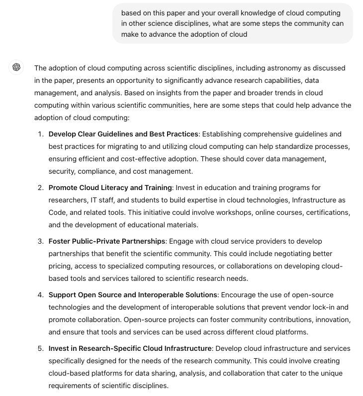
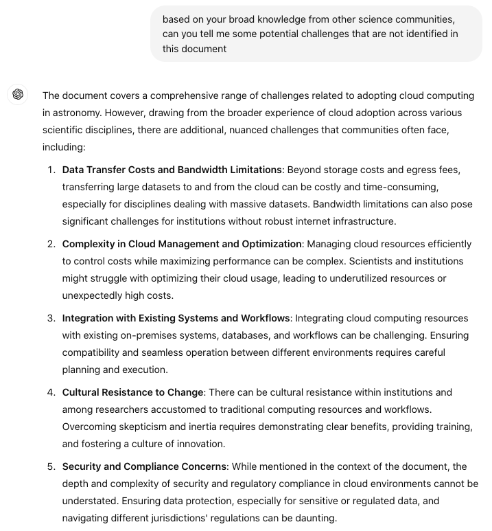

$\newcommand{\ensuremath}{}$
$\newcommand{\xspace}{}$
$\newcommand{\object}[1]{\texttt{#1}}$
$\newcommand{\farcs}{{.}''}$
$\newcommand{\farcm}{{.}'}$
$\newcommand{\arcsec}{''}$
$\newcommand{\arcmin}{'}$
$\newcommand{\ion}[2]{#1#2}$
$\newcommand{\textsc}[1]{\textrm{#1}}$
$\newcommand{\hl}[1]{\textrm{#1}}$
$\newcommand{\footnote}[1]{}$
$\newcommand{\red}{\textcolor{red}}$
$\newcommand{\orange}{\textcolor{orange}}$
$\newcommand{\green}{\textcolor{OliveGreen}}$
$\newcommand{\XXX}{{~\red{XXX}~}}$
$\newcommand{\code}[1]{\texttt{\detokenize{#1}}}$
$\newcommand{\prompt}[1]{\texttt{\detokenize{#1}}}$
$\newcommand{\orcit}[1]{\protect\href{https://orcid.org/#1}{\protect\includegraphics[width=8pt]{orcid.png}}}$
$\newcommand$
$\newcommand$
$\newcommand{\thebibliography}{\DeclareRobustCommand{\VAN}[3]{##3}\VANthebibliography}$

# What is the Role of Large Language Models in the Evolution of Astronomy Research?

 <mark>Appeared on: 2024-10-01</mark> _Paper submitted to RASTI. We share our experience, ethical and legal concerns (5.3), and recommendations for individuals and journals (6.). We welcome feedback_

<mark>M. Fouesneau</mark>, et al. -- incl., <mark>U. Chadayammuri</mark>, <mark>M. Demianenko</mark>, <mark>A. Dumont</mark>, <mark>K. A. Kahle</mark>, <mark>N. Pulatova</mark>, <mark>B. Rajpoot</mark>, <mark>R. Seeburger</mark>, <mark>D. Semenov</mark>

**Abstract:** ChatGPT and other state-of-the-art large language models (LLMs) are rapidly transforming multiple fields, offering powerful tools for a wide range of applications. These models, commonly trained on vast datasets, exhibit human-like text generation capabilities, making them useful for research tasks such as ideation, literature review, coding, drafting, and outreach. We conducted a study involving 13 astronomers at different career stages and research fields to explore LLM applications across diverse tasks over several months and to evaluate their performance in research-related activities. This work was accompanied by an anonymous survey assessing participants' experiences and attitudes towards LLMs. We provide a detailed analysis of the tasks attempted and the survey answers, along with specific output examples. Our findings highlight both the potential and limitations of LLMs in supporting research while also addressing general and research-specific ethical considerations. We conclude with a series of recommendations, emphasizing the need for researchers to complement LLMs with critical thinking and domain expertise, ensuring these tools serve as aids rather than substitutes for rigorous scientific inquiry.

**Figure 2. -** ChatGPT-4 on summarizing \citet{smith}, a US decadal white paper on cloud technologies in science. The chatbot could draw on general knowledge about cloud computing from other scientific disciplines to recommend steps to advance cloud adoption. It also identified challenges not mentioned in the paper (Fig. \ref{fig:dec4}). (*fig:dec3*)

**Figure 3. -** ChatGPT-4 on summarizing \citet{smith}, a US decadal white paper on cloud technologies in science. The chatbot could draw on general knowledge about cloud computing from other scientific disciplines to recommend steps to advance cloud adoption (Fig. \ref{fig:dec3}). It also identified challenges not mentioned in the paper. (*fig:dec4*)

**Figure 5. -** GitHub Copilot could generate accurate documentation with variable typing for an example of a Python function. LLMs can unload the burden of tedious tasks, here documentation, leading to a higher quality standard for source codes. (*fig:docs*)

