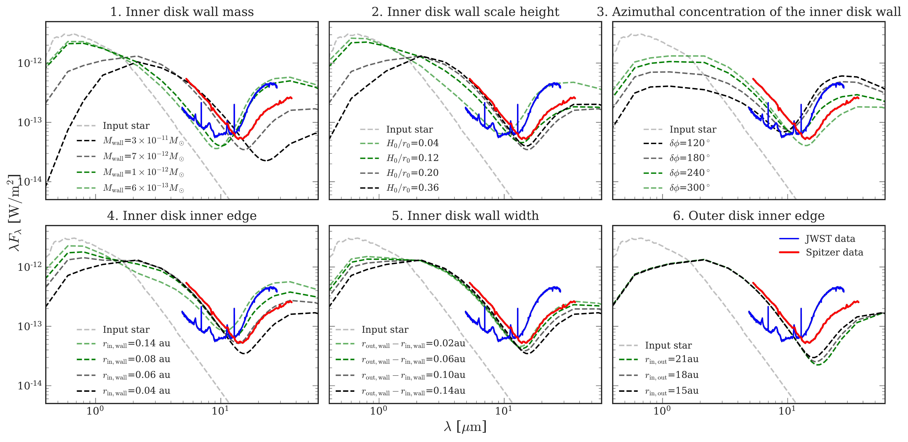

$\newcommand{\ensuremath}{}$
$\newcommand{\xspace}{}$
$\newcommand{\object}[1]{\texttt{#1}}$
$\newcommand{\farcs}{{.}''}$
$\newcommand{\farcm}{{.}'}$
$\newcommand{\arcsec}{''}$
$\newcommand{\arcmin}{'}$
$\newcommand{\ion}[2]{#1#2}$
$\newcommand{\textsc}[1]{\textrm{#1}}$
$\newcommand{\hl}[1]{\textrm{#1}}$
$\newcommand{\footnote}[1]{}$
$\newcommand{\vdag}{(v)^\dagger}$
$\newcommand$
$\newcommand$
$\newcommand{\ilaria}[1]$
$\newcommand{\cyxie}[1]$
$\newcommand{\uat}[2]{\href{http://vocabs.ands.org.au/repository/api/lda/aas/the-unified-astronomy-thesaurus/current/resource.html?uri=http://astrothesaurus.org/uat/#1}{#2  (#1)}}$
$\newcommand{\affilLPL}{\affiliation{Lunar and Planetary Laboratory, The University of Arizona, Tucson, AZ 85721, USA; \url{cyxie@arizona.edu}}}$

# JWST captures a sudden stellar outburst and inner disk wall destruction

<mark>Appeared on: 2024-10-02</mark> -  _16 pages, 7 figures, submitted to ApJ_

C. Xie, et al.

**Abstract:** We present JWST/MIRI observations of T Cha, a highly variable ( $\Delta V \sim$ 3-5 mag) accreting Sun-like star surrounded by a disk with a large ( $\sim 15$ au) dust gap. We find that the JWST mid-infrared spectrum is signiticantly different from the $_ Spitzer_$ spectrum obtained 17 years before, where the emission at short wavelengths ( $5-10 \mu m$ ) has decreased by $\sim 2/3$ while at longer wavelengths ( $15-25 \mu m$ ) it increased by up to a factor of $\sim 3$ . This ‘seesaw’ behavior is contemporary with a fairly constant higher optical emission captured by the All Sky Automated Survey. By analyzing and modelling both SEDs, we propose that JWST caught the star during an outburst that destructed the asymmetric inner disk wall responsible for the high optical variability and lower $15-25$ micron emission during the $_ Spitzer_$ time. The dust mass lost during this outburst is estimated to be comparable ( $\sim 1/5$ ) to the upper limit of the total micron-sized dust mass in the inner disk of T Cha now. Monitoring this system during possible future outbursts and more observations of its quiescent state will reveal if the inner disk can be replenished or will continue to be depleted and vanish.

**Figure 1. -** Optical and mid-IR light curves of T Cha. The lines and shaded area indicates the date when some of the photometric points we analyzed in this paper were taken. Blue shaded areas indicates the period when T Cha has less variable but brighter optical emission. The `LCOGT and Andicam' is from [Walter, Brown and France (2018)]().
     (*fig:Photometry*)

**Figure 3. -** Overview of the SED of T Cha. The grey dased line is 5600 K stellar photosphere emission. The red and blue solid lines are _ Spitzer_/IRS SED and JWST MIRI/MRS spectra, respectively. The two strong lines in the JWST spectrum are [ArII] and [NeII], and the broad features are PAH features, which are discussed in [Bajaj, Pascucci and Gorti (2024)](). The photometric points in optical bands are from [Alcala, Covino and Franchini (1993)](), [Walter, Brown and France (2018)]() and AAVSO, and the IR photometric points are from various papers (see Table \ref{app:tab:ref}). We highlight some points in blue to indicate they are taken contemporary with the JWST observation (see the blue shaded region next to the JWST line in Fig \ref{fig:Photometry}). The near and mid-IR points connected with dotted lines indicate one contemporary observation at JHKLM bands  ([Alcala, Covino and Franchini 1993]()) .
     (*fig:Overview*)

**Figure 7. -** SED changes with each single parameter. When changing one parameter, other parameters are kept fixed as shown in Table \ref{app:tab:Start}. In Panel 3 the optically thick part is between the star and the observer to illustrate how the maximum optical extinction vary with $\delta \phi$. Notice that the initial parameters set here are not exactly the same as our fitted model for _ Spitzer_.
     (*app:fig:single*)

