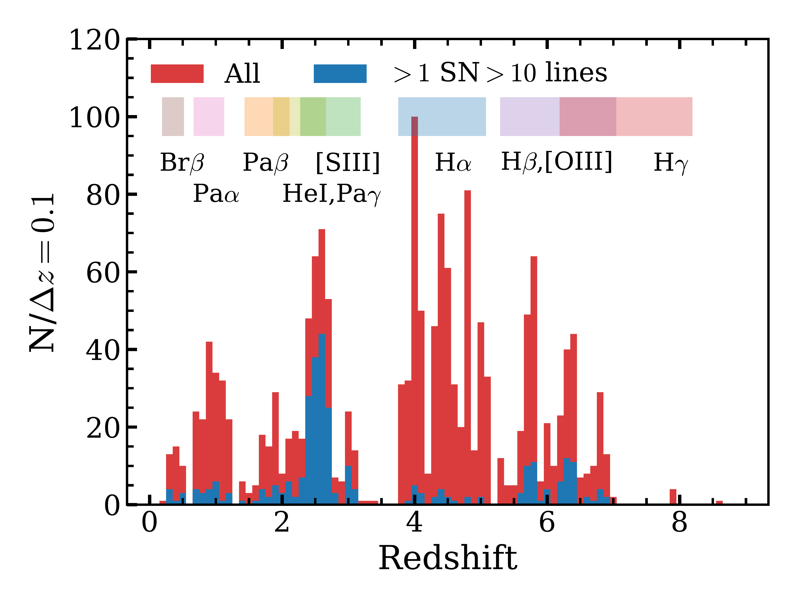

$\newcommand{\ensuremath}{}$
$\newcommand{\xspace}{}$
$\newcommand{\object}[1]{\texttt{#1}}$
$\newcommand{\farcs}{{.}''}$
$\newcommand{\farcm}{{.}'}$
$\newcommand{\arcsec}{''}$
$\newcommand{\arcmin}{'}$
$\newcommand{\ion}[2]{#1#2}$
$\newcommand{\textsc}[1]{\textrm{#1}}$
$\newcommand{\hl}[1]{\textrm{#1}}$
$\newcommand{\footnote}[1]{}$
$\newcommand{\xiion}{\xi_{\rm{ion}}}$
$\newcommand{\halpha}{H\ensuremath{\alpha}}$
$\newcommand{\hbeta}{H\ensuremath{\beta}}$
$\newcommand{\mstar}{\ensuremath{\log(M_{\rm{\star}}/M_{\rm{\odot}})}}$
$\newcommand{\orcidauthor}[3]{\author{\href{http://orcid.org/#1}{#2^{#3}}}}$

# $\vspace{-0.8cm}$All the Little Things in Abell 2744: $>1000$ Gravitationally Lensed Dwarf Galaxies at $\MakeLowercase{z}=0-9$ from JWST NIRCam Grism Spectroscopy$\vspace{-1.6cm}$

<mark>Appeared on: 2024-10-04</mark> -  _Submitted to the Open Journal of Astrophysics. Figs. 6 and 10 illustrate the quality of the spectra and imaging, while Fig. 12 summarizes the yield of the survey. Comments warmly welcomed and greatly appreciated. The ALT DR1 catalog is available at this https URL_

R. P. Naidu, et al. -- incl., <mark>A. d. Graaff</mark>

**Abstract:** Dwarf galaxies hold the key to crucial frontiers of astrophysics, however, their faintness renders spectroscopy challenging. Here we present the JWST Cycle 2 survey, All the Little Things (ALT, PID 3516), which is designed to seek late-forming Pop III stars and the drivers of reionization at $z\sim6$ - $7$ . ALT has acquired the deepest NIRCam grism spectroscopy yet (7-27 hr), at JWST's most sensitive wavelengths (3-4 $\mu$ m), covering the powerful lensing cluster Abell 2744. Over the same 30 arcmin $^{2}$ , ALT's ultra-deep F070W+F090W imaging ( $\sim30$ mag, 5 $\sigma$ ) enables selection of very faint sources at $z>6$ . We demonstrate the success of ALT's novel "butterfly" mosaic to solve spectral confusion and contamination, and introduce the "Allegro" method for emission line identification. By collecting spectra for every source in the field of view, ALT has measured precise ( $\mathcal{R}\sim1600$ ) redshifts for 1630 sources at $z=0.2$ - $8.5$ . This includes one of the largest samples of distant dwarf galaxies: [ 1015, 475, 50 ] sources less massive than the SMC, Fornax, and Sculptor with $\log(M_{*}/M_{\rm{\odot}})<$ [ 8.5, 7.5, 6.5 ] . We showcase ALT's discovery space with: (i) spatially resolved spectra of lensed clumps in galaxies as faint as $M_{\rm{UV}}\sim-15$ ; (ii) large-scale clustering -- overdensities at $z$ = [ 2.50, 2.58, 3.97, 4.30, 5.66, 5.77, 6.33 ] hosting massive galaxies with striking Balmer breaks; (iii) small-scale clustering -- a system of satellites around a Milky Way analog at $z\sim6$ ; (iv) spectroscopically confirmed multiple images that help constrain the lensing model underlying all science in this legacy field; (v) sensitive star-formation maps based on dust-insensitive tracers such as Pa $\alpha$ ; (vi) direct spectroscopic discovery of rare sources such as AGN with ionized outflows. These results provide a powerful proof of concept for how grism surveys maximize the potential of strong lensing fields.

**Figure 4. -** **Illustration of how the mosaic design facilitates the analysis of the grism data**. **Left**: ALT field of view in the two rolls (solid and dashed black line) on top of the same background F356W image as in Figure $\ref{fig:RADEC}$. Blue circles show the galaxies for which the ALT data measured a spectroscopic redshift. The three shaded regions highlight the stripes observed twice (either twice with module A, or once with each module, or twice with module B, from left to right respectively). We highlight the positions of four example objects with red squares. **Right:** NIRCam false colour stamps (based on F115W/F200W/F356W imaging) and 2D grism emission-line spectra for the four objects highlighted in the left panel. The grism spectra span $\approx15$ nm in the observed frame. For objects 1 and 4, we show 2D spectra separated by Roll 1 vs. Roll 2, while for objects 2 and 3 we separate Module A vs. Module B. These spectra illustrate how observations of the same source across different rolls and modules helps in disentangling contamination and confusion. (*fig:rolls*)

**Figure 3. -** **The ** The ALT survey footprint around the Abell 2744 lensing cluster**.** Top: Maximum on sky field of view of the ALT NIRCam WFSS data (red lines; at the undeviated wavelength, $\lambda=3.95 \mu$m) illustrated on top of a background F356W image (combining ALT and UNCOVER data). The dashed purple line shows the minimum field of view at 3.15 $\mu$m. Contours highlight the increasing magnification closer to the three main cores of the cluster (at $z=6$ from the model by \citealt{Furtak23}). The center of the footprint is at $\alpha=$0:14:18.0, $\delta=-$30:22:47.3 (J2000). Bottom, left: Wavelength dependence of the spectroscopic data and the total field of view (along the main axis of the mosaic, it is constant along the minor axis). Our data are most sensitive in the deep stripes and around 3.8 $\mu$m. Bottom, right: Spatial variation of the sensitivity of the grism data, shown at a wavelength of 3.8 $\mu$m. The deep stripes and mosaic pattern, as well as the difference in sensitivity between module A and B data can clearly be seen. One can also notice the slight decrease in sensitivity near bright objects. (*fig:RADEC*)

**Figure 1. -** ** Spectroscopic redshift distribution of the emission-line galaxies in ALT DR1.** The red histogram shows all redshifts, while the blue histogram show the galaxies for which more than one line is detected above S/N $>10$. This illustrates that the majority of pairs are HeI+Pa$\gamma$ at $z\sim2.5$ and the [OIII] doublet at $z\sim6$ and that the vast majority of H$\alpha$ emitters are single-line emitters in our data. We highlight the redshift ranges at which the primary lines are covered in the F356W grism spectra.  (*fig:redshifts*)

