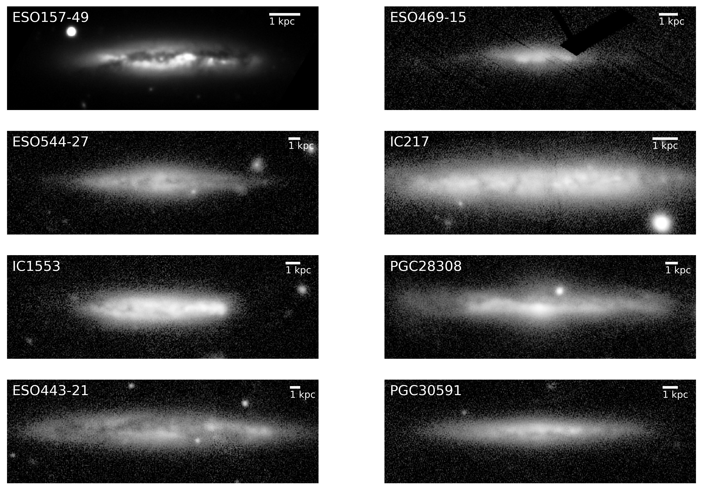

$\newcommand{\ensuremath}{}$
$\newcommand{\xspace}{}$
$\newcommand{\object}[1]{\texttt{#1}}$
$\newcommand{\farcs}{{.}''}$
$\newcommand{\farcm}{{.}'}$
$\newcommand{\arcsec}{''}$
$\newcommand{\arcmin}{'}$
$\newcommand{\ion}[2]{#1#2}$
$\newcommand{\textsc}[1]{\textrm{#1}}$
$\newcommand{\hl}[1]{\textrm{#1}}$
$\newcommand{\footnote}[1]{}$
$\newcommand{\thebibliography}{\DeclareRobustCommand{\VAN}[3]{##3}\VANthebibliography}$
$\newcommand\fp{#1}$

# Relatively young thick discs in low-mass star-forming late-type galaxies

<mark>Appeared on: 2024-10-10</mark> -  _20 pages, 9 figures, submitted to A&A_

N. Sattler, et al. -- incl., <mark>N. Neumayer</mark>

**Abstract:** We aim to trace the evolution of eight edge-on star-forming disc galaxies through the analysis of stellar population properties of their thin and thick discs. These galaxies have relatively low stellar masses (4 $\times$ 10 $^9$ to 6 $\times$ 10 $^{10}$  $M_{\odot}$ ). We use Multi-Unit Spectroscopic Explorer (MUSE) observations and full-spectrum fitting to produce spatially resolved maps of ages, metallicities and [ Mg/Fe ] -abundances and extract the star formation histories of stellar discs. Our maps show thick discs that are on average older, more metal-poor and more [ Mg/Fe ] -enhanced than thin discs.  However, age differences between thin and thick discs are small (around 2 Gyr) and the thick discs are younger than previously observed in more massive and more quiescent galaxies. Both thin and thick discs show mostly sub-solar metallicities, and the vertical metallicity gradient is milder than previously observed in similar studies. [ Mg/Fe ] differences between thick and thin discs are not sharp.  The star formation histories of thick discs extend down to recent times, although most of the mass in young stars was formed in thin discs. Our findings show thick discs that are different from old quiescent thick discs previously observed in galaxies of different morphologies and/or different masses.  We propose that thick discs in these galaxies did not form quickly at high redshift, but slowly in an extended time.  Also, the thin discs formed slowly, however, a larger mass fraction was created at very recent times.

**Figure 3. -** Light-weighted age (left), metallicity (middle) and [Mg/Fe]-abundance (right) maps for the full sample. For the galaxies with distinct morphological thick and thin discs, grey dashed lines mark the regions above and below which the thick disc dominates the vertical surface-brightness profiles. (*fig:lw_maps*)

**Figure 4. -** Star formation histories in terms of mass fraction per age with evenly spaced age bins every 0.5 Gyr. Uncertainties from Monte Carlo simulations are shown by the shaded areas.
    The left column shows the star formation histories for the full covered regions of the galaxies, while the middle and right columns show the thick and thin disc respectively for the five out of the eight galaxies containing two well-defined disc components (they share the same y-axis with the left column). The additional separate panels on the lower right corner show the star formation histories of the metal-poor regions for ESO 157-49 and IC 1553. (*fig:SFH_maps*)

**Figure 1. -** _g_-band images of the full sample. The image of ESO 157-49 is taken from the Dark Energy Survey DR2
     ([Morganson, Gruendl and Menanteau 2018](), [Abbott, Adamów and Aguena 2021]()) , while the other images are from Pan-STARRS1
     ([Chambers, Magnier and Metcalfe 2016](), [Magnier, Chambers and Flewelling 2020](), [Waters, Magnier and Price 2020](), [Magnier, Sweeney and Chambers 2020](), [Magnier, Schlafly and Finkbeiner 2020](), [Flewelling, Magnier and Chambers 2020]()) . (*fig:g_band*)

