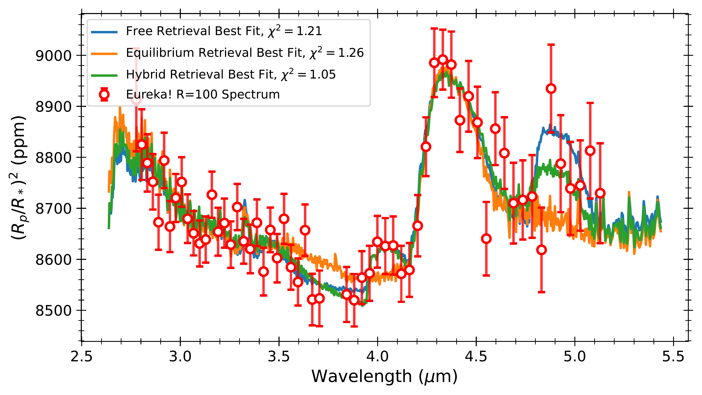
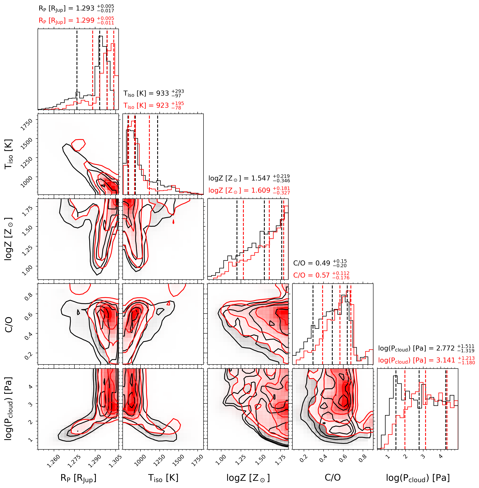

$\newcommand{\ensuremath}{}$
$\newcommand{\xspace}{}$
$\newcommand{\object}[1]{\texttt{#1}}$
$\newcommand{\farcs}{{.}''}$
$\newcommand{\farcm}{{.}'}$
$\newcommand{\arcsec}{''}$
$\newcommand{\arcmin}{'}$
$\newcommand{\ion}[2]{#1#2}$
$\newcommand{\textsc}[1]{\textrm{#1}}$
$\newcommand{\hl}[1]{\textrm{#1}}$
$\newcommand{\footnote}[1]{}$
$\newcommand{\Rsun}{R_{\odot}}$
$\newcommand{\Msun}{M_{\odot}}$
$\newcommand{\Rjup}{R_{\mathrm{J}}}$
$\newcommand{\Mjup}{M_{\mathrm{J}}}$
$\newcommand{\Rp}{R_{\mathrm{P}}}$
$\newcommand{\Mp}{M_{\mathrm{P}}}$
$\newcommand{\Rs}{R_{\mathrm{*}}}$
$\newcommand{\Ms}{R_{\mathrm{*}}}$
$\newcommand{\Teq}{T_{\mathrm{eq}}}$
$\newcommand{\Teff}{T_{\mathrm{eff}}}$
$\newcommand{◦ee}{^{\circ}}$
$\newcommand{\obliquity}{|\lambda|}$

# BOWIE-ALIGN: JWST reveals hints of planetesimal accretion and complex sulphur chemistry in the atmosphere of the misaligned hot Jupiter WASP-15b

<mark>Appeared on: 2024-10-11</mark> -  _24 pages, 23 figures, 6 tables. Submitted to MNRAS_

J. Kirk, et al. -- incl., <mark>E.-M. Ahrer</mark>, <mark>P. Molliere</mark>

**Abstract:** We present a transmission spectrum of the misaligned hot Jupiter WASP-15b from 2.8--5.2 microns observed with JWST's NIRSpec/G395H grating. Our high signal to noise data, which has negligible red noise, reveals significant absorption by $H_2$ O ( $4.2\sigma$ ) and $CO_2$ ( $8.9\sigma$ ). From independent data reduction and atmospheric retrieval approaches, we infer that WASP-15b's atmospheric metallicity is super-solar ( $\gtrsim 15\times$ solar) and its C/O is consistent with solar, that together imply planetesimal accretion. Our GCM simulations for WASP-15b suggest that the C/O we measure at the limb is likely representative of the entire photosphere due to the mostly uniform spatial distribution of $\ch{H2O}$ , $\ch{CO2}$ and CO. We additionally see evidence for absorption by $SO_2$ and absorption at 4.9 $\micron$ , for which the current leading candidate is OCS, albeit with several caveats. If confirmed, this would be the first detection of OCS in an exoplanet atmosphere and point towards complex photochemistry of sulphur-bearing species in the upper atmosphere. These are the first observations from the BOWIE-ALIGN survey which is using JWST's NIRSpec/G395H instrument to compare the atmospheric compositions of aligned/low-obliquity and misaligned/high-obliquity hot Jupiters around F stars above the Kraft break. The goal of our survey is to determine whether the atmospheric composition differs across two populations of planets that have likely undergone different migration histories (disc versus disc-free) as evidenced by their obliquities (aligned versus misaligned).

**Figure 7. -** Best-fitting models from our \texttt{petitRADTRANS} free chemistry (blue), equilibrium chemistry (orange), and hybrid chemistry (equilibrium chemistry plus free S-bearing species, green) retrievals, fitted to the \texttt{Tiberius}$R=100$ reduction (top panel) and \texttt{Eureka!}$R=100$ reduction (bottom panel). (*fig:prt_best_fit_models*)

**Figure 20. -** The corner plot and best-fit models from our 1D chemical equilibrium atmosphere retrievals with \texttt{PLATON} run on the $R=100$ spectra, after excluding the unphysically high metallicity solutions. The black contours correspond to the \texttt{Tiberius} retrieval and the red contours to the \texttt{Eureka!} retrieval. The vertical dashed lines indicate the 16th, 50th (median) and 84th percentiles, which are also given in the axes titles. (*fig:PLATON_corner_lowZ*)

**Figure 4. -** WASP-15b's transmission spectrum. Top panel: the comparison between the spectra obtained with \texttt{Tiberius}(black) and \texttt{Eureka!}(red) at $R=100$. The \texttt{Eureka!} spectrum has been offset by -38 ppm to match the median transit depth of \texttt{Tiberius}. Middle panel: The spectrum at $R=100$(black) and $R=400$(gray squares), both obtained with \texttt{Tiberius}. Bottom panel: The spectrum at $R=100$(red) and $R=400$(light red squares), both obtained with \texttt{Eureka!}. (*fig:trans_spec_R100_R400_comparison*)

