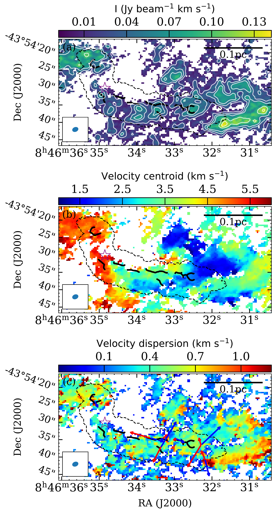
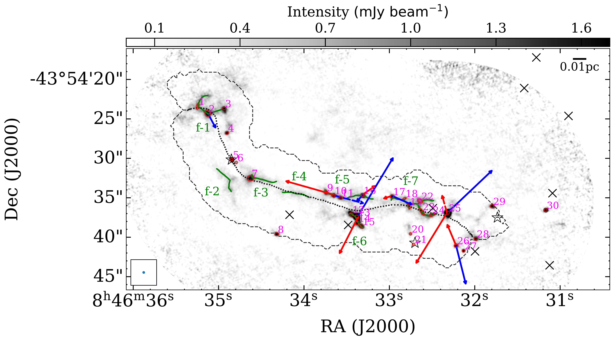

$\newcommand{\ensuremath}{}$
$\newcommand{\xspace}{}$
$\newcommand{\object}[1]{\texttt{#1}}$
$\newcommand{\farcs}{{.}''}$
$\newcommand{\farcm}{{.}'}$
$\newcommand{\arcsec}{''}$
$\newcommand{\arcmin}{'}$
$\newcommand{\ion}[2]{#1#2}$
$\newcommand{\textsc}[1]{\textrm{#1}}$
$\newcommand{\hl}[1]{\textrm{#1}}$
$\newcommand{\footnote}[1]{}$
$\newcommand{\vdag}{(v)^\dagger}$
$\newcommand$
$\newcommand$
$\newcommand{\arcm}{\hbox{^\prime}}$
$\newcommand{\etal}{{\rm et al.}\thinspace}$
$\newcommand{\eg}{{\it e.g. }}$
$\newcommand{\etc}{{\it etc. }}$
$\newcommand{\ie}{{\it i.e. }}$
$\newcommand{\cf}{{\it c.f. }}$
$\newcommand{◦ee}{\hbox{^\circ}}$
$\newcommand{\NHH}{\ensuremath{N_{\mathrm{H_{2}}}}}$
$\newcommand{\s}{\ensuremath{\mbox{~s}}}$
$\newcommand{\ps}{\ensuremath{\s^{-1}}}$
$\newcommand{\cm}{\ensuremath{\mbox{~cm}}}$
$\newcommand{\pcmsq}{\ensuremath{\cm^{-2}}}$
$\newcommand{\pcmcu}{\ensuremath{\cm^{-3}}}$
$\newcommand{\km}{\ensuremath{\mbox{~km}}}$
$\newcommand{\erg}{\ensuremath{\mbox{~erg}}}$
$\newcommand{\ergps}{\ensuremath{\erg \ps}}$
$\newcommand{\mJy}{\ensuremath{\mbox{~mJy}}}$
$\newcommand{\ML}{\ensuremath{\mbox{\Msol/\LBsol}}}$
$\newcommand{\Hi}{H\textsc{i}}$
$\newcommand{\Hii}{H\textsc{ii}}$
$\newcommand{\Ha}{\ensuremath{\mathrm{H\alpha}}}$
$\newcommand{\nh}{\ensuremath{\mathrm{n}_\mathrm{H}}}$
$\newcommand{\Mdot}{\ensuremath{\dot{\mathrm{M}}}}$
$\newcommand{\thco}{^{13}CO}$
$\newcommand{\twco}{^{12}CO}$
$\newcommand{\etco}{C^{18}O}$
$\newcommand{\vel}{km s^{-1}}$
$\newcommand{\filAname}{G350.5-N}$
$\newcommand{\filBname}{G350.5-S}$
$\newcommand{\imcoor}{\alpha_{2000}=17^{\mathrm{h}}18^{\mathrm{m}}13\fs84, \delta_{2000}=-36◦28\arcmin21\farcs5}$
$\newcommand{\her}{Herschel}$
$\newcommand{\mline}{M_{\rm line}}$
$\newcommand{\msun}{M_{\odot}}$
$\newcommand{\lsun}{L_{\odot}}$
$\newcommand{\um}{\mum}$
$\newcommand{\cmcm}{cm^{-2}}$
$\newcommand{\egcite}{\citep[e.g.,][]}$
$\newcommand{\lmsun}{M_{\odot}~pc^{-1}}$
$\newcommand{\chiiioh}{CH_3OH}$
$\newcommand{\hciiin}{HC_3N}$
$\newcommand{\hcop}{HCO^{+}}$
$\newcommand{\htcop}{H^{13}CO^{+}}$
$\newcommand{\halpha}{H40_{\alpha}}$
$\newcommand{\chthocho}{CH_3OCHO}$
$\newcommand{\chthcho}{CH_3CHO}$
$\newcommand{\chthoh}{CH_3OH}$
$\newcommand{\chii}{H/UC-H\textsc{ii}}$
$\newcommand{\uchii}{UC-H\textsc{ii}}$
$\newcommand{\hchii}{HC-H\textsc{ii}}$
$\newcommand{\hii}{H\textsc{ii}}$
$\newcommand{\CHMC}{s-cHMC}$
$\newcommand{\PCHMC}{w-cHMC}$
$\newcommand{\filname}{G34}$
$\newcommand{\mdotyr}{M_{\odot}~yr^{-1}}$
$\newcommand{\tred}{\textcolor{red}}$
$\newcommand{\tblue}{\textcolor{blue}}$
$\newcommand{\orcidauthorHL}{0000-0003-3343-9645}$
$\newcommand{\mgt}{\color{magenta}}$
$\newcommand\aj{{\rm{AJ}}}$
$\newcommand\araa{{\rm{ARA\&A}}}$
$\newcommand\apj{{\rm{ApJ}}}$
$\newcommand\icarus{{\rm{Icarus}}}$
$\newcommand\apjs{{\rm{ApJS}}}$
$\newcommand\apjl{{\rm{ApJL}}}$
$\newcommand\apss{{\rm{Ap\&SS}}}$
$\newcommand\aap{{\rm{A\&A}}}$
$\newcommand\aapr{{\rm{A\&AR}}}$
$\newcommand\aaps{{\rm{A\&AS}}}$
$\newcommand\baas{{\rm{BAAS}}}$
$\newcommand\memras{{\rm{MmRAS}}}$
$\newcommand\mnras{{\rm{MNRAS}}}$
$\newcommand\pasp{{\rm{PASP}}}$
$\newcommand\prl{{\rm{Phys. Rev. Lett.}}}$
$\newcommand\jqsrt{{\rm{Journal of Quantitative Spectroscopy and Radiative$
$Transfer}}}$
$\newcommand\actaa{{\rm{Acta Astronomica}}}$

# $\bf$ The ALMA-QUARKS Survey: Fibers' role in star formation unveiled in an intermediate-mass protocluster region of the Vela D cloud

<mark>Appeared on: 2024-10-22</mark> -  _19 pages, 10 figures, 4 tables, accepted by ApJ_

D. Yang, et al. -- incl., <mark>S. Li</mark>

**Abstract:** In this paper, we present a detailed analysis of the IRS 17 filament within the intermediate-mass protocluster IRAS 08448-4343 (of $\sim 10^3$ $\lsun$ ), using ALMA data from the ATOMS 3-mm and QUARKS 1.3-mm surveys. The IRS 17 filament, which spans $\sim$ 54000 au ( $0.26 \rm pc$ ) in length and $\sim$ 4000 au ( $0.02 \rm pc$ ) in width, exhibits a complex, multi-component velocity field, and harbours hierarchical substructures. These substructures include three bundles of seven velocity-coherent fibers, and 29 dense ( $n\sim 10^8 \rm cm^{-3}$ ) condensations.The fibers have a median length of $\sim 4500 \rm au$ and a median width of $\sim 1400 \rm au$ . Among these fibers, four are identified as "fertile", each hosting at least three dense condensations, which are regarded as the "seeds" of star formation. While the detected cores are randomly spaced within the IRS 17 filament based on the 3-mm dust continuum image, periodic spacing ( $\sim1600 \rm au$ ) of condensations is observed in the fertile fibers according to the 1.3-mm dust map, consistent with the predictions of linear isothermal cylinder fragmentation models.These findings underscore the crucial role of fibers in star formation and suggest a hierarchical fragmentation process that extends from the filament to the fibers, and ultimately, to the smallest-scale condensations.

**Figure 2. -** 3-mm dust continuum image of the IRS 17 protocluster region from the ATOMS survey. The black solid and dotted lines respectively indicate the footprint and skeleton of the IRS 17 filament obtained with the _ getsf_ algorithm on the 3-mm dust continuum data. The yellow  overlapping circles represent the FoV of the QUARKS survey and the red ellipses represent 10 dense cores within the IRS 17 filament footprint, which were identified by [Liu, Liu and Evans (2021)]().  (*fig:band3:con*)

**Figure 3. -** Moment maps of $\htcop$  from the ATOMS survey. The velocity range of $\htcop$  emission is set to [1, 6]$\rm km s^{-1}$, which correspond to the velocity channels with a signal-to-noise ratio above 3 $rms$ in the average spectrum over the entire region. The $rms$ defined as the standard deviation within 50 channels free of  line emission ($\sim0.01 \rm Jy beam^{-1}$). The black dashed and solid lines represent the IRS 17 filament footprint and fibers, respectively. The ATOMS beam
    and 0.1 pc scale-bar are shown in left bottom and top right, respectively. (a) Integrated intensity (Moment 0) map. The white contour levels start at 3 $rms$($\sim\rm 0.01 Jy beam km s^{-1}$), and following as [6, 9, 12, 15]$rms$. (b) Velocity centroid (Moment 1) map. (c) Velocity dispersion (Moment 2) map. The solid and dashed arrows represent the outflows identified either from CO (2--1) or SiO (5--4), respectively (see Fig. \ref{fig:outflow}) (*fig:h13co:moment*)

**Figure 6. -** 1.3-mm dust continuum image from the QUARKS survey. The black dotted line shows the skeleton of the IRS 17 filament, and green solid lines represent the dense fibers. Red ellipses show the condensations identified by the _ getsf_ and SExtractor algorithm. The black stars and crosses are the YSO Class I/0 objects and IRAC point-like sources as candidate YSOs  ([Strafella, Elia and Campeggio 2010](), [Strafella, Lorenzetti and Giannini 2015]()) , respectively. The solid and dashed arrows represent the outflows identified either from CO (2--1) or SiO (5--4), respectively (see Fig. \ref{fig:outflow}). The synthesized beam size and the scale-bar are shown in left bottom and top right, respectively. (*fig:bad6*)

