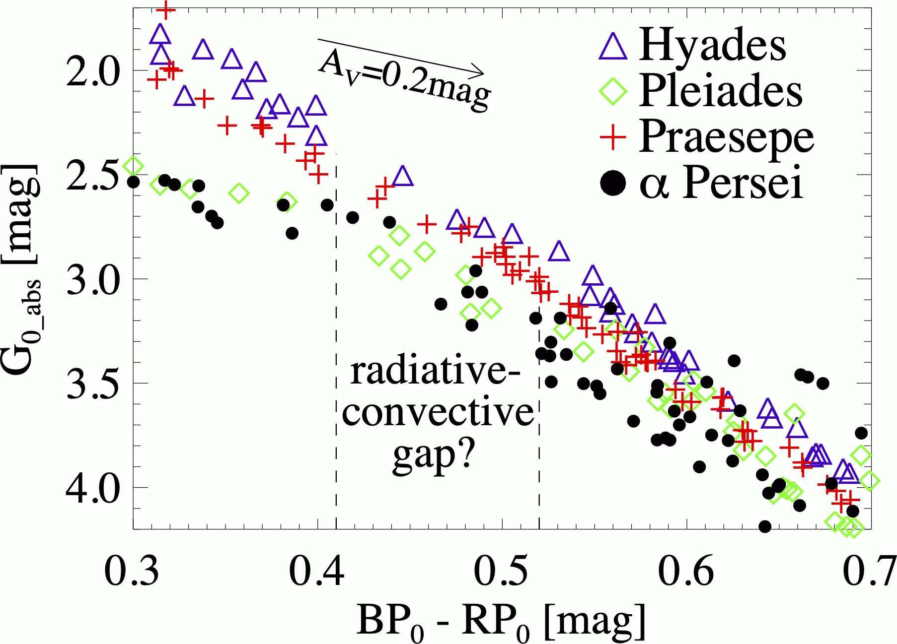
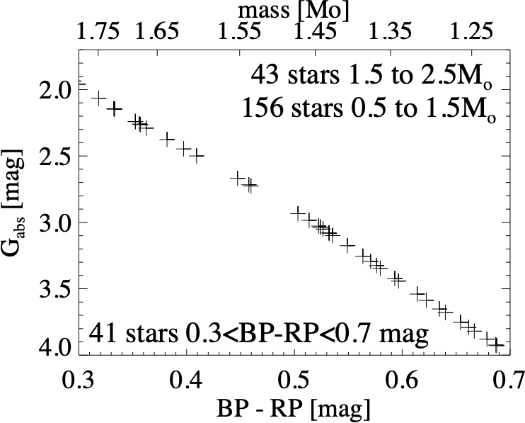
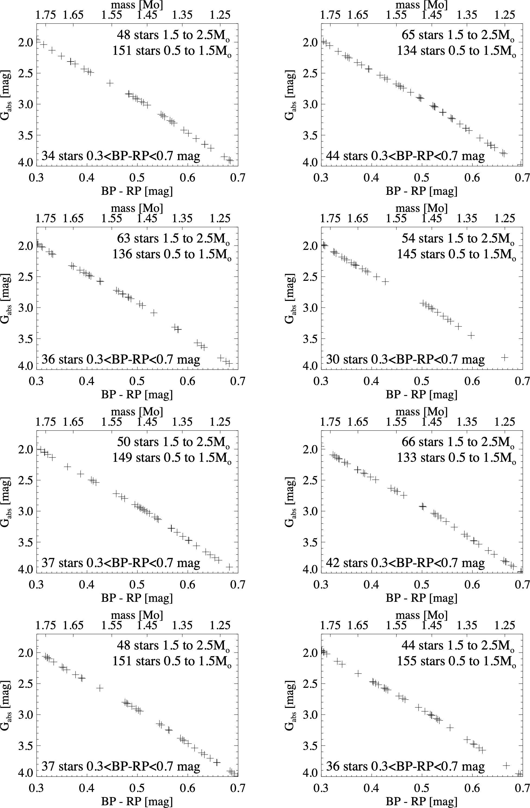
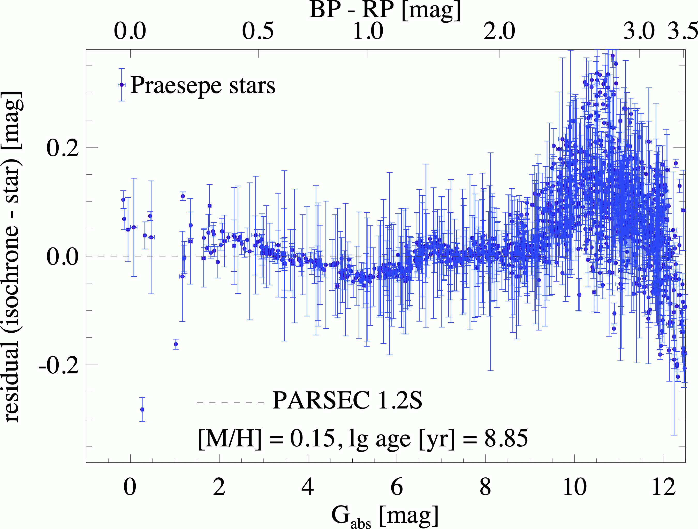

$\newcommand{\ensuremath}{}$
$\newcommand{\xspace}{}$
$\newcommand{\object}[1]{\texttt{#1}}$
$\newcommand{\farcs}{{.}''}$
$\newcommand{\farcm}{{.}'}$
$\newcommand{\arcsec}{''}$
$\newcommand{\arcmin}{'}$
$\newcommand{\ion}[2]{#1#2}$
$\newcommand{\textsc}[1]{\textrm{#1}}$
$\newcommand{\hl}[1]{\textrm{#1}}$
$\newcommand{\footnote}[1]{}$
$\newcommand{\vdag}{(v)^\dagger}$
$\newcommand$
$\newcommand$

# The radiative-convective gap: fact or fiction?

<mark>Appeared on: 2024-10-23</mark> -  _Accepted for publication in AJ, 10 pages, 6 figures, Tables 1, 2, and 6 will be published in their entirety in machine-readable format (mrt)_

<mark>W. Brandner</mark>, A. Sorg, S. Röser, E. Schilbach

**Abstract:** Gaia characterizes the stellar populations of nearby open clusters with unprecedented precision.We investigate the Böhm-Vitense gap, which has been found as a prominent feature in the stellar sequence of open clusters.Using PARSEC isochrone fitting, we derive astrophysical parameters for more than 1100 stars in Praesepe, identify more than 1100 bona fide single stars in the $\alpha$ Persei (Melotte 20) open cluster, and confirm their approximate match in terms of age ( $\approx$ 710 Myr and $\approx$ 45 Myr) and metallicity ( [ M/H ] $\approx$ +0.15 dex and $\approx$ +0.13 dex) to the Hyades and Pleiades, respectively. By merging data of the cluster pairs, we improve number statistics.We do not find a clear gap in the combined observational G $_{\rm abs}$ vs. BP-RP color-magnitude diagram (CMD) in the stellar mass range corresponding to the location of the Böhm-Vitense gap. We reproduce gaps in simulated Hyades-type CMDs randomly drawn from an initial mass function.There is no strong evidence for a discontinuity originating in the transition from radiative to convective energy transport in the stellar photosphere. We conclude that the observed gaps in the stellar sequences of open clusters could be explained by small number statistics and the uneven mass-color relation at the transition from spectral type A to F.

**Figure 4. -** Left: Color-magnitude diagram of the Hyades, Praesepe, Pleiades, and $\alpha$ Persei clusters for $0.3\le$$BP_0$-$RP_0 \le 0.7$ mag. Stars in Praesepe fill-in the gap in the Hyades stellar sequence. Similarly, the combined Praesepe and $\alpha$ Persei sequence does not exhibit a pronounced gap. (*fig:RadConGap*)

**Figure 5. -** Instances of Monte Carlo-generated synthetic color-magnitude diagrams of a Hyades-type cluster. The random drawing from an initial mass function combined with small number statistics, and the uneven relation between stellar mass and BP-RP color can result in gaps in the sequence.
 (*fig:SimCMD*)

**Figure 1. -** The minimum distance in color-magnitude space of stars on the single star sequence in Praesepe from the best fitting PARSEC isochrone.
 (*fig:PraeCMDres*)

