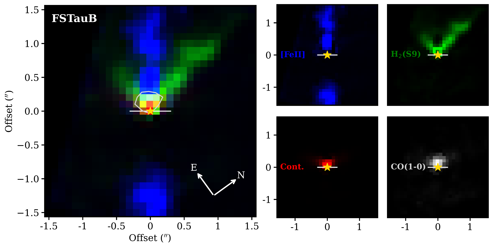
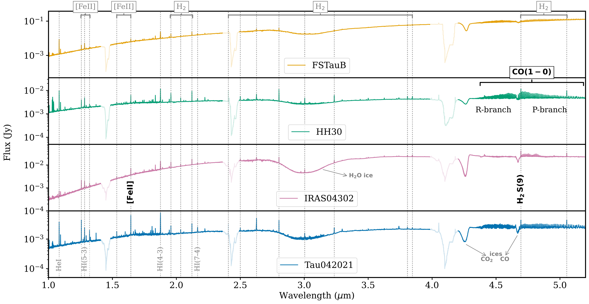

$\newcommand{\ensuremath}{}$
$\newcommand{\xspace}{}$
$\newcommand{\object}[1]{\texttt{#1}}$
$\newcommand{\farcs}{{.}''}$
$\newcommand{\farcm}{{.}'}$
$\newcommand{\arcsec}{''}$
$\newcommand{\arcmin}{'}$
$\newcommand{\ion}[2]{#1#2}$
$\newcommand{\textsc}[1]{\textrm{#1}}$
$\newcommand{\hl}[1]{\textrm{#1}}$
$\newcommand{\footnote}[1]{}$
$\newcommand{\actaa}{Acta Astron.}$
$\newcommand{\araa}{Annu. Rev. Astron. Astrophys.}$
$\newcommand{\areps}{Annu. Rev. Earth Planet. Sci.}$
$\newcommand{\aar}{Astron. Astrophys. Rev.}$
$\newcommand{\ab}{Astrobiology}$
$\newcommand{\aj}{Astron. J.}$
$\newcommand{\ac}{Astron. Comput.}$
$\newcommand{\apart}{Astropart. Phys.}$
$\newcommand{\apj}{Astrophys. J.}$
$\newcommand{\apjl}{Astrophys. J. Lett.}$
$\newcommand{\apjs}{Astrophys. J. Suppl. Ser.}$
$\newcommand{\ao}{Appl. Opt.}$
$\newcommand{\apss}{Astrophys. Space Sci.}$
$\newcommand{\aap}{Astron. Astrophys.}$
$\newcommand{\aapr}{Astron. Astrophys. Rev.}$
$\newcommand{\aaps}{Astron. Astrophys. Suppl.}$
$\newcommand{\baas}{Bull. Am. Astron. Soc.}$
$\newcommand{\caa}{Chin. Astron. Astrophys.}$
$\newcommand{\cjaa}{Chin. J. Astron. Astrophys.}$
$\newcommand{\cqg}{Class. Quantum Gravity}$
$\newcommand{\epsl}{Earth Planet. Sci. Lett.}$
$\newcommand{\frass}{Front. Astron. Space Sci.}$
$\newcommand{\gal}{Galaxies}$
$\newcommand{\gca}{Geochim. Cosmochim. Acta}$
$\newcommand{\grl}{Geophys. Res. Lett.}$
$\newcommand{\icarus}{Icarus}$
$\newcommand{\ija}{Int. J. Astrobiol.}$
$\newcommand{\jatis}{J. Astron. Telesc. Instrum. Syst.}$
$\newcommand{\jcap}{J. Cosmol. Astropart. Phys.}$
$\newcommand{\jgr}{J. Geophys. Res.}$
$\newcommand{\jgrp}{J. Geophys. Res.: Planets}$
$\newcommand{\jqsrt}{J. Quant. Spectrosc. Radiat. Transf.}$
$\newcommand{\lrca}{Living Rev. Comput. Astrophys.}$
$\newcommand{\lrr}{Living Rev. Relativ.}$
$\newcommand{\lrsp}{Living Rev. Sol. Phys.}$
$\newcommand{\memsai}{Mem. Soc. Astron. Italiana}$
$\newcommand{\maps}{Meteorit. Planet. Sci.}$
$\newcommand{\mnras}{Mon. Not. R. Astron. Soc.}$
$\newcommand{\nat}{Nature}$
$\newcommand{\nastro}{Nat. Astron.}$
$\newcommand{\ncomms}{Nat. Commun.}$
$\newcommand{\ngeo}{Nat. Geosci.}$
$\newcommand{\nphys}{Nat. Phys.}$
$\newcommand{\na}{New Astron.}$
$\newcommand{\nar}{New Astron. Rev.}$
$\newcommand{\physrep}{Phys. Rep.}$
$\newcommand{\pra}{Phys. Rev. A}$
$\newcommand{\prb}{Phys. Rev. B}$
$\newcommand{\prc}{Phys. Rev. C}$
$\newcommand{\prd}{Phys. Rev. D}$
$\newcommand{\pre}{Phys. Rev. E}$
$\newcommand{\prl}{Phys. Rev. Lett.}$
$\newcommand{\psj}{Planet. Sci. J.}$
$\newcommand{\planss}{Planet. Space Sci.}$
$\newcommand{\pnas}{Proc. Natl Acad. Sci. USA}$
$\newcommand{\procspie}{Proc. SPIE}$
$\newcommand{\pasa}{Publ. Astron. Soc. Aust.}$
$\newcommand{\pasj}{Publ. Astron. Soc. Jpn}$
$\newcommand{\pasp}{Publ. Astron. Soc. Pac.}$
$\newcommand{\raa}{Res. Astron. Astrophys.}$
$\newcommand{\rmxaa}{Rev. Mexicana Astron. Astrofis.}$
$\newcommand{\sci}{Science}$
$\newcommand{\sciadv}{Sci. Adv.}$
$\newcommand{\solphys}{Sol. Phys.}$
$\newcommand{\sovast}{Soviet Astron.}$
$\newcommand{\ssr}{Space Sci. Rev.}$
$\newcommand{\uni}{Universe}$
$\newcommand{\micron}{\mum}$
$\newcommand{\oi}{[O {\scriptsize I}]}$
$\newcommand{\feii}{[Fe {\scriptsize II}]}$
$\newcommand{\sii}{[S {\scriptsize II}]}$
$\newcommand{\neii}{[Ne {\scriptsize II}]}$
$\newcommand{\ilaria}[1]$
$\newcommand{\suzan}[1]$
$\newcommand{\tracy}[1]$
$\newcommand{\sylvie}[1]$

# JWST/NIRSpec Reveals the Nested Morphology of Disk Winds from Young Stars

<mark>Appeared on: 2024-10-24</mark> -  _This preprint has not undergone peer review or any post-submission improvements or corrections. The Version of Record of this article is published in Nature Astronomy and is available online at this https URL_

I. Pascucci, et al. -- incl., <mark>K. Schwarz</mark>, <mark>D. Semenov</mark>

**Abstract:** Radially extended disk winds could be the key to unlocking how protoplanetary disks accrete and how planets form and migrate. A distinctive characteristic is their nested morphology of velocity and chemistry. Here we report JWST/NIRSpec spectro-imaging of four young stars with edge-on disks in the Taurus star-forming regionthat demonstrate the ubiquity of this structure. In each source, a fast collimated  jet traced by $\feii$ is nested inside a hollow cavity within wider lower-velocity $H_2$ and, in one case, also CO ro-vibrational (v=1-0) emission. Furthermore, in one of our sources, ALMA CO (2-1) emission, paired with our NIRSpec images, reveals the nested wind structure extends further outward.This nested wind morphology strongly supports theoretical predictions for wind-driven accretion and underscores the need for theoretical work to assess the role of winds in the formation and evolution of planetary systems. $_ In accordance with the Springer Nature publishing agreement, we can only post the submitted version of our article, prior to peer review. The version of record is published here: https://doi.org/10.1038/s41550-024-02385-7_$

**Figure 2. -** Composite images NIRSpec: blue $\feii$  emission at 1.644 $\micron$  – green $H_2$ emission at 4.695 $\micron$ - red continuum emission at the $H_2$ line. CO emission from $\sim 4.7-4.9$\micron is shown in the right bottom sub-panel in gray – the 50\% of the peak emission contour (and for HH 30 also the 30\%) is  shown in gray in the composite image. In every instance, the collimated jet traced in $\feii$ is nestled inside the wider $H_2$ emission and, in the case of HH 30, also the CO (v=1-0) emission. (*fig:composite*)

**Figure 3. -** Left panel: FWHM of the jet's blueshifted component as a function of distance from the disk plane. Right panel: Edges of the wind's blueshifted component vs. the disk's plane. In both panels filled symbols represent data points used in the linear fit to estimate the jet and the wind semi-opening angles and the geometric radii (see Table \ref{tab:jetwindprop}). Best-fits are shown with dashed lines. Data points near the disk plane are not included in the fit due to inadequate sampling of the FWHM and scattering (see Sect. \ref{sect:methods} for details). For IRAS 043202 we exclude points above 1.2$"$ as they clearly deviate from a wind-like morphology. HH 30 has the narrowest jet and wind in our sample.  (*fig:jets_winds*)

**Figure 1. -** Spectra integrated over the NIRSpec IFU. A few of the strongest lines are marked with gray dotted lines. All of these  lines are spatially extended. The transitions analyzed in this study are highlighted in boldface. (*fig:lines*)

