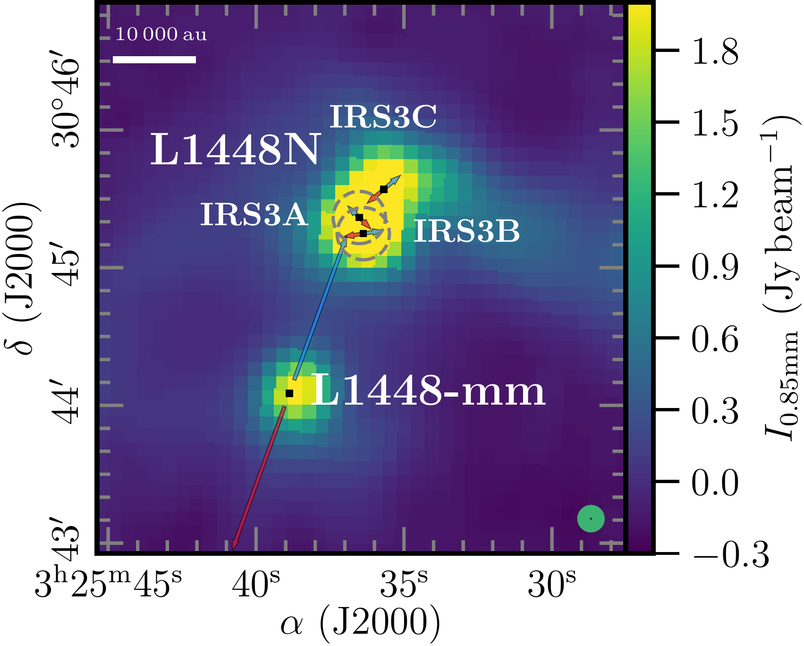
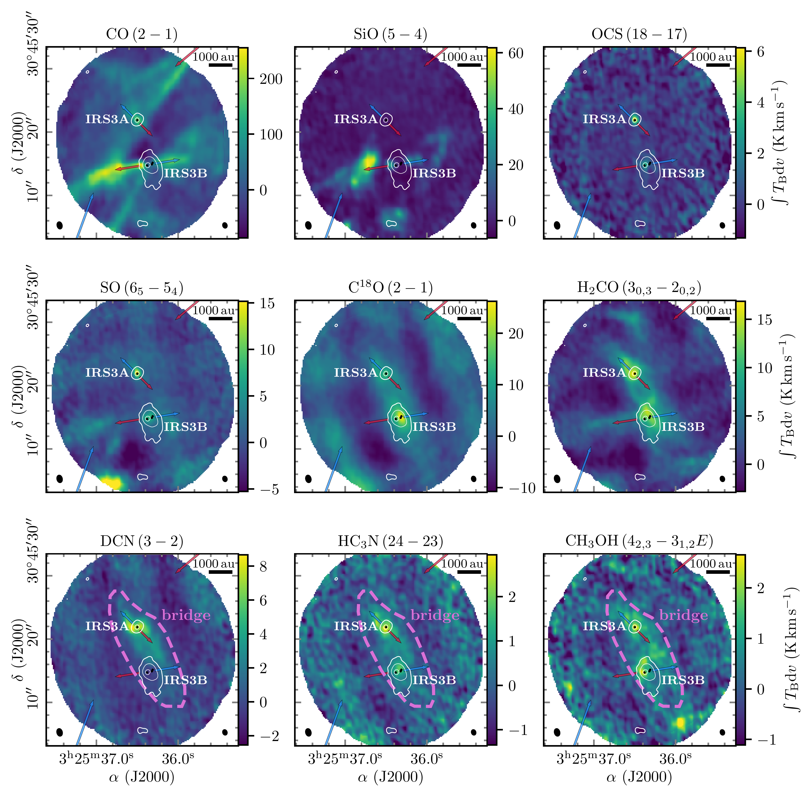
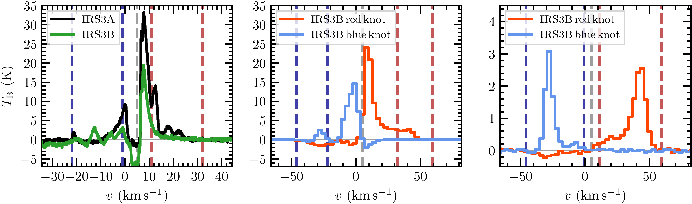

$\newcommand{\ensuremath}{}$
$\newcommand{\xspace}{}$
$\newcommand{\object}[1]{\texttt{#1}}$
$\newcommand{\farcs}{{.}''}$
$\newcommand{\farcm}{{.}'}$
$\newcommand{\arcsec}{''}$
$\newcommand{\arcmin}{'}$
$\newcommand{\ion}[2]{#1#2}$
$\newcommand{\textsc}[1]{\textrm{#1}}$
$\newcommand{\hl}[1]{\textrm{#1}}$
$\newcommand{\footnote}[1]{}$
$\newcommand{\arraystretch}{1.1}$
$\newcommand{\arraystretch}{1.1}$
$\newcommand\as{\ifmmode{\rlap.} " \! \else {\rlap.} " \!\fi}$

# PRODIGE - envelope to disk with NOEMA.: IV. An infalling gas bridge surrounding two Class 0/I systems in L1448N

<mark>Appeared on: 2024-10-25</mark> -  _17 pages, 10 figures_

C. Gieser, et al. -- incl., <mark>T. Henning</mark>, <mark>D. Semenov</mark>

**Abstract:** The formation of stars has been subject to extensive studies in the past decades from molecular cloud to protoplanetary disk scales. It is still not fully understood how the surrounding material in a protostellar system, that often shows asymmetric structures with complex kinematic properties, feeds the central protostar(s) and their disk(s). We study the spatial morphology and kinematic properties of the molecular gas surrounding the IRS3A and IRS3B protostellar systems in the L1448N region located in the Perseus molecular cloud. We present 1 mm NOEMA observations of the PRODIGE large program and analyze the kinematic properties of molecular lines. Given the complexity of the spectral profiles, the lines are fitted with up to three Gaussian velocity components. The clustering algorithm \texttt{DBSCAN} is used to disentangle the velocity components into the underlying physical structure. We discover an extended gas bridge ( $\approx$ 3000 au) surrounding both the IRS3A and IRS3B systems in six molecular line tracers (C $^{18}$ O, SO, DCN, H $_{2}$ CO, HC $_{3}$ N, and CH $_{3}$ OH). This gas bridge is oriented along the northeast-southwest direction and shows clear velocity gradients on the order of 100 km s $^{-1}$ pc $^{-1}$ towards the IRS3A system. We find that the observed velocity profile is consistent with analytical streamline models of gravitational infall towards IRS3A. The high-velocity C $^{18}$ O ( $2-1$ ) emission towards IRS3A indicates a protostellar mass of $\sim$ 1.2 $M_\odot$ . While high angular resolution continuum data often show IRS3A and IRS3B in isolation, molecular gas observations reveal that these systems are still embedded within a large-scale mass reservoir with a complex spatial morphology as well as velocity profiles. The kinematic properties of the extended gas bridge are consistent with gravitational infall toward the IRS3A protostar.

**Figure 6. -** Continuum images toward L1448N. The left panel shows in color the JCMT 850 $\upmu$m emission taken from the COMPLETE survey \citep[][]{Ridge2006, Kirk2006}. The grey dashed circles are the primary beam (22$\farcs$8) of the two NOEMA pointings of the PRODIGE observations. The protostellar systems of L1448N (IRS3A, IRS3B, and IRS3C), as well as the nearby L1448-mm system are marked by black squares. The beam of JCMT and NOEMA observations is shown in the bottom right corner in green and black, respectively. In the right panel the 1.4 mm continuum image of the PRODIGE observations is presented in color and white contours. Contour levels are 5, 10, 20, 40, 80, 160$\times \sigma_\mathrm{cont}$($\sigma_\mathrm{cont}$=0.94 mJy beam$^{-1}$). The black circles mark the positions of individual protostars taken from the VANDAM survey  ([Tobin, Looney and Li 2016]()) . The synthesized beam of the NOEMA data is shown in the bottom left corner. In both panels scale bars are marked in the top left corner and bipolar outflow orientations are highlighted by red and blue arrows (Sect. \ref{sec:outflow}). (*fig:continuum*)

**Figure 7. -** Line integrated intensity maps of the PRODIGE observations. The line integrated intensity and the 1.4 mm continuum is presented in color and white contours, respectively. Contour levels are 5, 40, 160$\times \sigma_\mathrm{cont}$($\sigma_\mathrm{cont}$=0.94 mJy beam$^{-1}$). The IRS3A and IRS3B protostellar systems toward L1448N are labeled in white. The black circles mark the positions of individual protostars taken from the VANDAM survey  ([Tobin, Looney and Li 2016]()) . Bipolar outflow orientations are indicated by blue and red arrows. The synthesized beam of the line and continuum data is indicated in the bottom left and bottom right corner, respectively. A scale bar is shown in the top right corner. In the bottom row panels, the extent of bridge structure is indicated by the dashed pink polygon. Spectra toward the continuum peak position of IRS3A and IRS3B are shown in Fig. \ref{fig:avg_spectra} for all transitions. (*fig:moment0*)

**Figure 8. -** Molecular outflows in L1448N. In the top panels, the red and blue contours show the red- and blueshifted line integrated intensities of low-velocity CO $2-1$(left), high-velocity CO $2-1$(center), and SiO $5-4$(right). Contour levels are 0.1, 0.3, 0.5, 0.9$\times$ the corresponding peak integrated intensity. In color the integrated intensity around the source velocity is presented. The integration ranges are listed in each panel and indicated by red and blue dashed vertical lines in the spectra in the bottom panels. Outflow orientations are indicated by blue and red arrows. The black contours are the 1.4 mm continuum of the PRODIGE observations. Contour levels are 5, 10, 20, 40, 80, 160$\times \sigma_\mathrm{cont}$($\sigma_\mathrm{cont}$=0.94 mJy beam$^{-1}$). The protostellar systems of the L1448N system (IRS3A and IRS3B) are labeled in black. The synthesized beam of the line and continuum data is indicated in the bottom left and bottom right corner, respectively. A scale bar is shown in the top right corner. The bottom panels show spectra extracted from the positions indicated by the black triangles in the top panels. The grey vertical dashed line is the region velocity of L1448N ($\approx$5 km s$^{-1}$). (*fig:outflow*)

