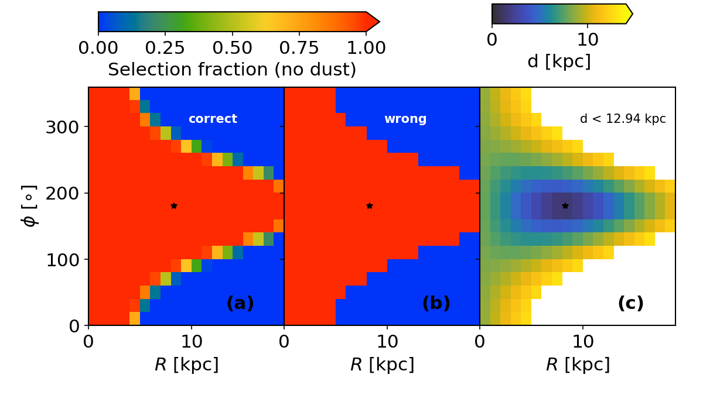
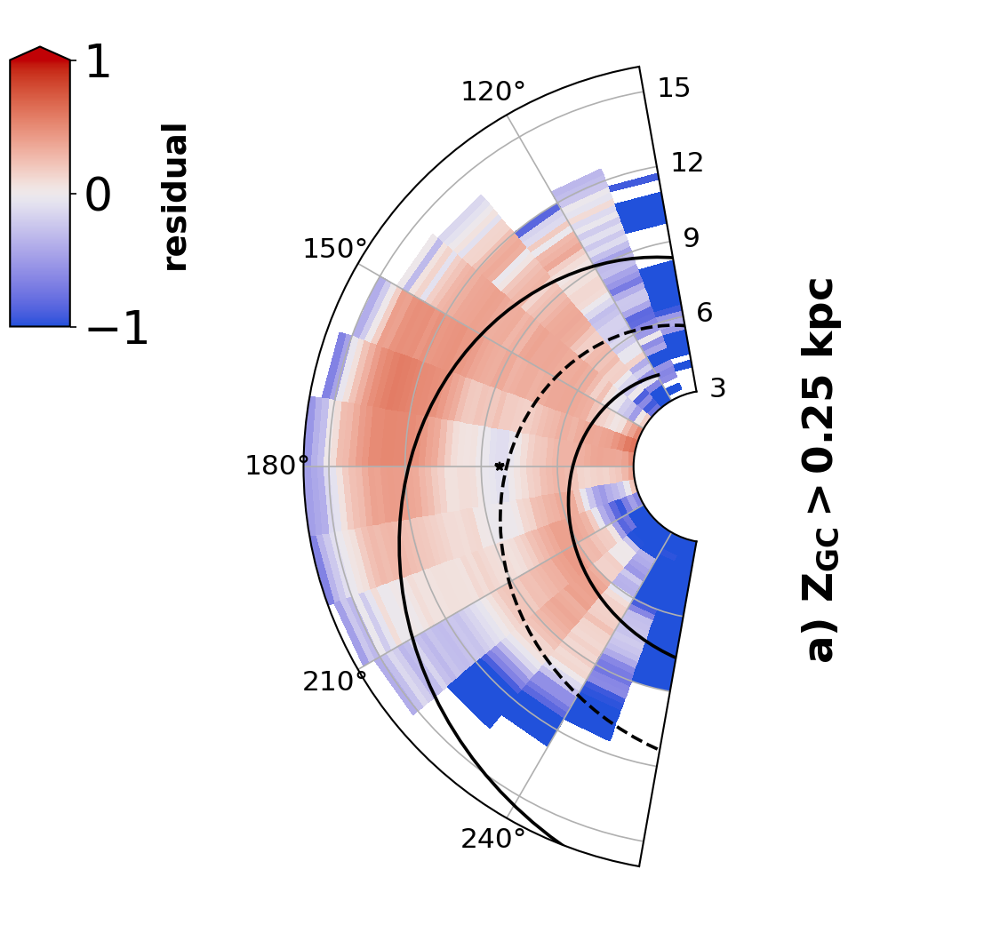

$\newcommand{\ensuremath}{}$
$\newcommand{\xspace}{}$
$\newcommand{\object}[1]{\texttt{#1}}$
$\newcommand{\farcs}{{.}''}$
$\newcommand{\farcm}{{.}'}$
$\newcommand{\arcsec}{''}$
$\newcommand{\arcmin}{'}$
$\newcommand{\ion}[2]{#1#2}$
$\newcommand{\textsc}[1]{\textrm{#1}}$
$\newcommand{\hl}[1]{\textrm{#1}}$
$\newcommand{\footnote}[1]{}$
$\newcommand{\kms}{\ensuremath{\rm  km s^{-1}}\xspace}$
$\newcommand{\masyr}{\ensuremath{\rm  mas yr^{-1}}\xspace}$
$\newcommand{\kmskpc}{\ensuremath{\rm  km s^{-1} kpc^{-1}\xspace}}$
$\newcommand{\teff}{\ensuremath{{T_{\rm eff}}}\xspace}$
$\newcommand{\lum}{\ensuremath{{L}}\xspace}$
$\newcommand{\loglum}{\ensuremath{\log\lum}\xspace}$
$\newcommand{\loggrav}{\ensuremath{\log g}\xspace}$
$\newcommand{\mass}{\ensuremath{{M}}\xspace}$
$\newcommand{\radius}{\ensuremath{{R}}\xspace}$
$\newcommand{\Zabun}{\ensuremath{{Z}}\xspace}$
$\newcommand{\azero}{\ensuremath{A_0}\xspace}$
$\newcommand{\rzero}{\ensuremath{R_0}\xspace}$
$\newcommand{\ebpminrp}{\ensuremath{E(G_{\rm BP} - G_{\rm RP})}\xspace}$
$\newcommand{\gmag}{\ensuremath{G}}$
$\newcommand{\bpmag}{\ensuremath{G_\mathrm{BP}}}$
$\newcommand{\rpmag}{\ensuremath{G_\mathrm{RP}}}$
$\newcommand{\mg}{M_\gmag}$
$\newcommand{\ag}{\ensuremath{A_G}\xspace}$
$\newcommand{\ra}{\ensuremath{\alpha}}$
$\newcommand{\dec}{\ensuremath{\delta}}$
$\newcommand{\parallax}{\ensuremath{\varpi}}$
$\newcommand{\sigparallax}{\ensuremath{\sigma_{\varpi}}}$
$\newcommand{\parzp}{\ensuremath{\varpi_{\rm zp}}}$
$\newcommand{\pmra}{\ensuremath{\mu_{\ra\ast}}}$
$\newcommand{\pmdec}{\ensuremath{\mu_\dec}}$
$\newcommand{\propm}{\ensuremath{\mu}}$
$\newcommand{\glon}{\ensuremath{\ell}}$
$\newcommand{\glat}{\ensuremath{b}}$
$\newcommand{\mag}{\ensuremath{ \mathrm{mag}}\xspace}$
$\newcommand{\nm}{\ensuremath{ \mathrm{nm}}\xspace}$
$\newcommand{\um}{\ensuremath{ \mu\mathrm{m}}\xspace}$
$\newcommand{\erg}{\ensuremath{ \rm erg}\xspace}$
$\newcommand{\ergs}{\ensuremath{ \rm erg~s}\xspace}$
$\newcommand{\yr}{\ensuremath{ \rm yr}\xspace}$
$\newcommand{\Myr}{\ensuremath{ \rm Myr}\xspace}$
$\newcommand{\Gyr}{\ensuremath{ \rm Gyr}\xspace}$
$\newcommand{\pc}{\ensuremath{ \rm pc}\xspace}$
$\newcommand{\kpc}{\ensuremath{ \rm kpc}\xspace}$
$\newcommand{\Mpc}{\ensuremath{ \rm Mpc}\xspace}$
$\newcommand{\Lsun}{\ensuremath{ {\lum}_{\odot}}\xspace}$
$\newcommand{\Msun}{\ensuremath{ {\mass}_{\odot}}\xspace}$
$\newcommand{\Rsun}{\ensuremath{ {\radius}_{\odot}}\xspace}$
$\newcommand{\Zsun}{\ensuremath{ {\Zabun}_{\odot}}\xspace}$
$\newcommand{\ang}{\ensuremath{ \text{Å}}\xspace}$
$\newcommand{\mas}{\ensuremath{ \mathrm{mas}}\xspace}$
$\newcommand{\kms}{\ensuremath{\textrm{km s}^{-1}}}$
$\newcommand{\maspyr}{\ensuremath{\textrm{mas yr}^{-1}}}$
$\newcommand{\masyr}{\ensuremath{\textrm{mas yr}^{-1}}}$
$\newcommand{\msun}{\mass_\odot}$
$\newcommand{◦ee}{\ensuremath{^\circ}}$
$\newcommand{\rpmag}{\ensuremath{G_\mathrm{RP}}}$
$\newcommand$
$\newcommand$
$\newcommand{\healpix}{{\sl HEALPix}}$
$\newcommand{\galaxia}{{\sl Galaxia}}$
$\newcommand{\agama}{{\sl AGAMA}}$
$\newcommand{\parsec}{{\sl PARSEC}}$
$\newcommand{\esagaia}{{\sl Gaia}}$
$\newcommand$
$\newcommand$
$\newcommand$
$\newcommand$
$\newcommand$
$\newcommand$
$\newcommand$
$\newcommand$
$\newcommand$
$\newcommand$
$\newcommand$
$\newcommand$
$\newcommand$
$\newcommand$
$\newcommand$
$\newcommand$
$\newcommand$
$\newcommand$
$\newcommand$
$\newcommand{\absg}{M_{G}}$
$\newcommand{\absw}{M_{W1}}$
$\newcommand{\gunlim}{\textit{GaiaUnlimited}}$
$\newcommand{\absmag}{M_{\lambda}}$
$\newcommand{\appmag}{m_{\lambda}}$
$\newcommand{\appmaglim}{m_{\lambda, lim}}$
$\newcommand{\alambda}{A_{\lambda}}$
$\newcommand{\twomass}{\textit{2MASS}}$
$\newcommand{\panstars}{\textit{Pan-STARRS}}$
$\newcommand{\allwise}{\textit{AllWISE}}$
$\newcommand{\wise}{\textit{WISE}}$
$\newcommand{\bayestar}{\textit{Bayestar}}$
$\newcommand{\gaussian}{\textit{Gaussian}}$
$\newcommand{\hi}{\mbox{H{\sc i}}}$
$\newcommand{\los}{l.o.s}$
$\newcommand{\alfe}{\ensuremath{[\mathrm{\alpha/Fe}]}}$
$\newcommand{\feh}{\ensuremath{[\mathrm{Fe/H}]}}$
$\newcommand{\dex}{\ensuremath{ \mathrm{dex}}}$
$\newcommand{\logg}{\mbox{\log g}}$
$\newcommand{\kiel}{{\sl Kiel}}$
$\newcommand{\corehel}{{\sc CHeB}}$
$\newcommand{\jkzero}{(J-K)_{0}}$
$\newcommand{\clr}{(J-K)_{0}}$
$\newcommand{\camd}{CaMD}$
$\newcommand{\cmd}{CMD}$
$\newcommand{\hpix}{HEALPix}$
$\newcommand{\AC}{{AC20-\piepi>3 }}$
$\newcommand{\ACf}{{AC20-\piepi>3}}$
$\newcommand{\bprp}{{ G_\mathrm{BP} - G_\mathrm{RP}}}$
$\newcommand{\grp}{{ G - G_\mathrm{RP}}}$
$\newcommand{\gaiaG}{{G}}$
$\newcommand{\ruwe}{\textit{RUWE}}$
$\newcommand{\astromexnoise}{\textit{astrometric\_excess\_noise }}$
$\newcommand{\visibperiods}{\textit{visibility\_periods\_used }}$
$\newcommand{\errorovparallax}{\sigma_{\varpi}/\varpi}$
$\newcommand{\cbj}{{\sl CBJ21}}$
$\newcommand{\schlegel}{{\sl S98}}$
$\newcommand{\geo}{{d_{\rm geo}}}$
$\newcommand{\photogeo}{{d_{\rm photgeo}}}$
$\newcommand{\mumaxdust}{\mu\_max_{i}}$
$\newcommand{\fsel}{{F}}$
$\newcommand{\fseli}{{F_{\rm i}}}$
$\newcommand{\fselitop}{{S_{\rm top, i}}}$
$\newcommand{\fselisub}{{S_{\rm sub, i}}}$
$\newcommand{\rcut}{{R_{\rm cut}}}$
$\newcommand{\rdtwo}{{R_{\rm d2}}}$
$\newcommand{\rd}{{R_{\rm d}}}$
$\newcommand{\hz}{{\sl h_{z}}}$
$\newcommand{\hztwo}{{\sl h_{z2,\odot}}}$
$\newcommand{\hzsun}{{\sl h_{z,\odot}}}$
$\newcommand{\logrflare}{{\log R_{fl}}}$
$\newcommand{\rflare}{\ensuremath{R_{\rm fl}}}$
$\newcommand{\fdisc}{{\sl f_{d1}}}$
$\newcommand{\zwarp}{{z_{\rm w}}}$
$\newcommand{\awarp}{{a_{\rm w}}}$
$\newcommand{\rwarp}{{R_{\rm w}}}$
$\newcommand{\hwarp}{{h_{\rm w0}}}$
$\newcommand{\phiwarp}{{\phi_{\rm w}}}$
$\newcommand{\phiprime}{\phi^{'}}$
$\newcommand{\rgal}{{\sl R}}$
$\newcommand{\zgal}{{\sl Z_{GC}}}$
$\newcommand{\xgc}{{\sl X_{GC}}}$
$\newcommand{\ygc}{{\sl Y_{GC}}}$
$\newcommand{\zgc}{{\sl Z_{GC}}}$
$\newcommand{\mir}{{MIR}}$
$\newcommand{\rdratio}{{\sl R_{d2}/R_{d1}}}$
$\newcommand{\hzratio}{{\sl h_{z2}/h_{z1}}}$
$\newcommand{\nrproj}{{\sl N(R|z=0)}}$
$\newcommand{\nzproj}{{\sl N(z|R)}}$
$\newcommand{\nmin}{{N_{\rm min, i}}}$
$\newcommand{\lucey}{{L20}}$
$\newcommand{\jie}{{Yu18}}$
$\newcommand{\elsworth}{{Els19}}$
$\newcommand{\andrae}{{A23}}$
$\newcommand{\orcit}[1]{\protect\href{https://orcid.org/#1}{\protect\includegraphics[width=8pt]{orcid.png}}}$
$\newcommand$

# GaiaUnlimited: The old stellar disc of the Milky Way \\as traced by the Red Clump

<mark>Appeared on: 2024-10-30</mark> -  _27 pages, submitted to A&A_

S. Khanna, et al. -- incl., <mark>T. Cantat-Gaudin</mark>, <mark>M. Fouesneau</mark>, <mark>H.-W. Rix</mark>

**Abstract:** We present an exploration of the Milky Way's structural parameters using an all-sky sample of $\rcfull$ (RC) giants to map the stellar density from the inner to the outer parts of the Galactic disc. These evolved giants are considered to be standard candles due to their low intrinsic variance in their absolute luminosities, allowing us to estimate their distances with reasonable confidence. We exploit all-sky photometry from the AllWISE mid-infrared survey and the Gaia survey, along with astrometry from Gaia Data Release 3 and recent 3D extinction maps, to develop a probabilistic scheme in order to select with high confidence $\rc$ -like stars.Our curated catalogue contains about 10 million sources, for which we estimate photometric distances based on the WISE $W1$ photometry. We then derive the selection function for our sample, which is the combined selection function of sources with both $\gaia$ and $\allwise$ photometry.  Using the distances and accounting for the full selection function of our observables, we are able to fit a two-disc, multi-parameter model to constrain the scale height ( $\hz$ ), scale-length ( $\rd$ ), flaring, and the relative mass ratios of the two disc components. We illustrate and verify our methodology using mock catalogues of $\rc$ stars. We find that the $\rc$ population is best described by a flared thin disc with scale length $\rd$ = $3.56\pm0.32$ kpc and scale height at the Sun of $\hzsun$ = $0.17\pm0.01$ kpc, and a shorter and thicker disc with $\rd$ = $2.59\pm0.11$ kpc, $\hzsun$ = $0.45\pm0.11$ kpc, with no flare. The thicker disc constitutes 64 \% of the $\rc$ stellar mass beyond 3 kpc, while the thin disk shows evidence of being warped beyond 9 kpc from the Galactic center. The residuals between the predicted number density of RC stars from our axisymmetric model and the measured counts show possible evidence of a two-armed spiral perturbation in the disc of the Milky Way.

**Figure 10. -** Illustration of the selection function projected in $\phi-$\rgal  space, for the case without dust at $\zgal$ =0 kpc (midplane). Panel (a) shows the map of the selection fraction computed using the sub-binning method, panel (b) shows the same for the method without sub-binning, while panel (c) shows the distance to all voxels that are within a distance of $d_{max} < 12.94 $\kpc$$ of the Sun. Panel (a) also shows the additional voxels that would be missed by assuming the median values of observables ($l,b,G$). In all panels, the location of the Sun is indicated by the black star. (*fig:sf_illus_nodust*)

**Figure 19. -** Residuals between the model and data in the $\phi$,$\zgal$  projection, same as \autoref{fig:residuals_phiz_inner} but for the outer disc ($9.5$ kpc$<$\rgal$<14.5$ kpc). (*fig:residuals_phiz_outer*)

**Figure 20. -** Relative residual (1-model/data) for Model 2 from \autoref{tab:bestfitdatamodel}, applied to \gaiawise{[RC]}, and shown in polar coordinates. The residuals are shown for three slices in $\zgal$ , above the plane (panel a), in the midplane (panel b), and below the plane (panel c). The 2-arm NIR spiral model from \cite{Drimmel:2000} is overplotted as black curves. (*fig:residuals_polar*)

