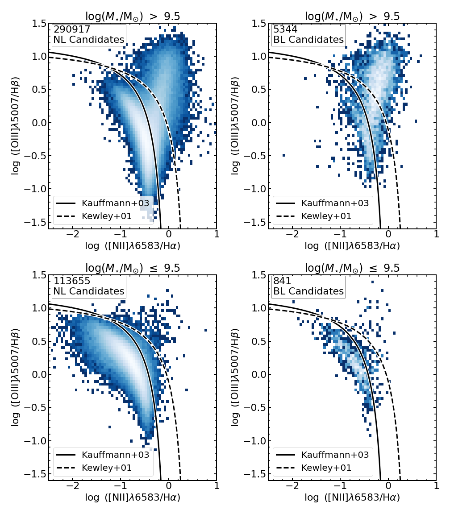

$\newcommand{\ensuremath}{}$
$\newcommand{\xspace}{}$
$\newcommand{\object}[1]{\texttt{#1}}$
$\newcommand{\farcs}{{.}''}$
$\newcommand{\farcm}{{.}'}$
$\newcommand{\arcsec}{''}$
$\newcommand{\arcmin}{'}$
$\newcommand{\ion}[2]{#1#2}$
$\newcommand{\textsc}[1]{\textrm{#1}}$
$\newcommand{\hl}[1]{\textrm{#1}}$
$\newcommand{\footnote}[1]{}$
$\newcommand{\todo}[1]{\noindent \textcolor{red}{{ [TODO:~{#1}]}}}$
$\newcommand$
$\newcommand$
$\newcommand$
$\newcommand{\lya}{\textrm{Ly}\ensuremath{\alpha}}$
$\newcommand{\cii}{\textrm{C}\textsc{ii}]}$
$\newcommand{\ciii}{\textrm{C}\textsc{iii}]}$
$\newcommand{\civ}{\textrm{C}\textsc{iv}}$
$\newcommand{\ha}{\textrm{H}\ensuremath{\alpha}}$
$\newcommand{\hb}{\textrm{H}\ensuremath{\beta}}$
$\newcommand{\hgam}{\textrm{H}\ensuremath{\gamma}}$
$\newcommand{\oi}{[\textrm{O} \textsc{i}]}$
$\newcommand{\oii}{[\textrm{O} \textsc{ii}]}$
$\newcommand{\oiilam}{[\textrm{O}~\textsc{ii}]\ensuremath{\lambda\lambda}3726,3729}$
$\newcommand{\oiii}{[\textrm{O}\textsc{iii}]}$
$\newcommand{\nii}{[\textrm{N}\textsc{ii}]}$
$\newcommand{\sii}{[\textrm{S}\textsc{ii}]}$
$\newcommand{\mgii}{\textrm{Mg}\textsc{ii}}$
$\newcommand{\oiiilam}{[\textrm{O}\textsc{iii}]\ensuremath{\lambda}5007}$
$\newcommand{\niilam}{[\textrm{N}\textsc{ii}]\ensuremath{\lambda}6584}$
$\newcommand{\nevlam}{[\textrm{Ne}\textsc{iv}]\ensuremath{\lambda}3425}$
$\newcommand{\oilam}{[\textrm{O}\textsc{i}]\ensuremath{\lambda}6300}$
$\newcommand{\siilam}{[\textrm{S}\textsc{ii}]\ensuremath{\lambda\lambda}6717,6731}$
$\newcommand{\niilamlam}{[\textrm{N}\textsc{ii}]\ensuremath{\lambda\lambda}6548,6584}$
$\newcommand{\zspec}{z_{\rm spec}}$
$\newcommand{\mbh}{{M}\ensuremath{_{\rm BH}}}$
$\newcommand{\mstar}{{M}\ensuremath{_{\star}}}$
$\newcommand{\msun}{{\rm M}\ensuremath{_{\odot}}}$
$\newcommand{\logmass}{\ensuremath{\log (\mstar/\msun)}}$
$\newcommand{\logmbh}{\ensuremath{\log (\mbh/\msun)}}$
$\newcommand{\ergscmsq}{\textrm{ergs s^{-1} cm^{-2}}}$
$\newcommand{\imtxt}[1]{\textcolor{magenta}{#1}}$
$\newcommand{\imsout}[1]{\textcolor{magenta}{\sout{#1}}}$
$\newcommand{\deg}{^{\circ}}$

# Tripling the Census of Dwarf AGN Candidates Using DESI Early Data

<mark>Appeared on: 2024-11-04</mark> -  _35 pages, 22 figures, Submitted to AAS Journals, Comments are welcome_

Ragadeepika~Pucha, et al.

**Abstract:** Using early data from the Dark Energy Spectroscopic Instrument (DESI) survey, we search for AGN signatures in 410,757 line-emitting galaxies. By employing the BPT emission-line ratio diagnostic diagram, we identify AGN in 75,928/296,261 ( $\approx$ 25.6 \% ) high-mass ( $\logmass >$ 9.5) and 2,444/114,496 ( $\approx$ 2.1 \% ) dwarf ( $\logmass \leq$ 9.5) galaxies. Of these AGN candidates, 4,181 sources exhibit a broad $\ha$ component, allowing us to estimate their BH masses via virial techniques. This study more than triples the census of dwarf AGN as well as that of intermediate-mass black hole (IMBH; $\mbh \le 10^6 \msun$ ) candidates, spanning a broad discovery space in stellar mass (7 $< \logmass <$ 12) and redshift (0.001 $< \rm z <$ 0.45). The observed AGN fraction in dwarf galaxies ( $\approx$ 2.1 \% ) is nearly four times higher than prior estimates, primarily due to DESI's smaller fiber size, which enables the detection of lower luminosity dwarf AGN candidates. We also extend the $\mbh - \mstar$ scaling relation down to $\logmass \approx$ 8.5 and $\logmbh \approx$ 4.4, with our results aligning well with previous low-redshift studies. The large statistical sample of dwarf AGN candidates from current and future DESI releases will be invaluable for enhancing our understanding of galaxy evolution at the low-mass end of the galaxy mass function.

**Figure 12. -** BPT-AGN Fraction as a function of stellar mass: The fraction of BPT-AGN candidates in line-emitting galaxies is shown as red squares, while the fraction of BPT-AGN candidates considering all galaxies is shown as black circles. _ Right:_ BPT-AGN Fraction as a function of stellar mass in the dwarf galaxy regime. The overall observed BPT-AGN fraction from our study and \citet{Reines+2013} are shown as a dashed-dotted red line and dashed pink line, respectively. (*fig:agnfrac-mstar*)

**Figure 14. -** $\mbh - $\mstar$$ scaling relation of _ confident_ BL-AGN candidates (_ Left_) and all BL-AGN candidates(_ Right_), excluding point sources. The color bar displays the number of sources within each bin of the 2D distribution. In each of the panels, our empirical fits for confident and all BL-AGN candidates are plotted as solid and dashed red lines, respectively. The fits from \citet{Reines&Volonteri2015} and \citet{Suh+2020} are shown as black and orange lines, respectively. (*fig:mbh-mstar*)

**Figure 10. -** BPT $\oi$ii/$\hb$ vs $\nii$/$\ha$ narrow-line diagnostic diagram for high-mass ($\logmass > 9.5$; _ Top_) and dwarf ($\logmass \leq 9.5$; _ Bottom_) galaxies, divided as NL (_ Left_) and BL (_ Right_) candidates. The solid line in all the panels is from \citet{Kauffmann+2003}, which separates the pure star-forming sources and those with AGN contribution. The dashed line represents the "maximum starburst line" using stellar photoionization models \citep{Kewley+2001}. (*fig:bpt_all*)

