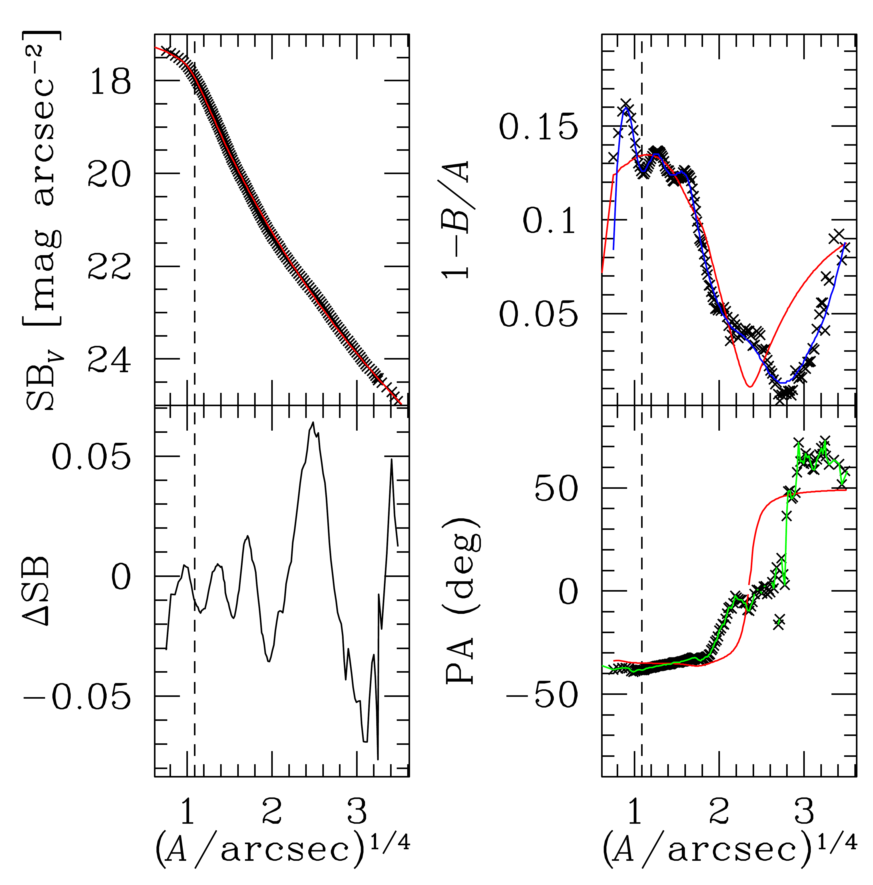

$\newcommand{\ensuremath}{}$
$\newcommand{\xspace}{}$
$\newcommand{\object}[1]{\texttt{#1}}$
$\newcommand{\farcs}{{.}''}$
$\newcommand{\farcm}{{.}'}$
$\newcommand{\arcsec}{''}$
$\newcommand{\arcmin}{'}$
$\newcommand{\ion}[2]{#1#2}$
$\newcommand{\textsc}[1]{\textrm{#1}}$
$\newcommand{\hl}[1]{\textrm{#1}}$
$\newcommand{\footnote}[1]{}$
$\newcommand{\orcid}[1]$
$\newcommand\natexlab{#1}$

# $\Euclid$: The $r_{\rm b}$-$M_\ast$ relation as a function of redshift. I. The $5\expo{9}\solarmass$ black hole in NGC 1272$\thanks{This paper is    published on       behalf of the Euclid Consortium}$

<mark>Appeared on: 2024-11-05</mark> -  _Accepted for publication in A&A_

R. Saglia, et al. -- incl., <mark>K. Jahnke</mark>

**Abstract:** Core ellipticals, massive    early-type galaxies with almost constant inner surface brightness    profiles, are the results of dry mergers. During these events a    binary black hole is formed, destroying the original cuspy central    regions of the merging objects and scattering stars that are not on    tangential orbits. The size of the emerging core correlates with    the mass of the finally merged black hole. Therefore, the    determination of the size of the core of massive early type    galaxies provides key insights not only on the mass of the black    hole, but also on the origin and evolution of these objects.    In this work we report the first $\Euclid$ -based dynamical mass determination of a supermassive black    hole.  We perform it by studying the centre of NGC 1272, the    second most luminous elliptical galaxy in the Perseus cluster,    combining the $\Euclid$ VIS photometry coming from the Early Release    Observations of the Perseus cluster with VIRUS spectroscopic    observations at the Hobby-Eberly Telescope.    The core of NGC 1272 is detected    on the $\Euclid$ VIS image. Its size is $1\arcsecf29\pm 0\arcsecf07$ or 0.45 $\kiloparsec$ , determined by    fitting PSF-convolved core-Sérsic and Nuker-law functions. We    deproject the surface brightness profile of the galaxy, finding    that the galaxy is axisymmetric and nearly spherical. The    two-dimensional stellar kinematics of the galaxy is measured from    the VIRUS spectra by deriving optimally regularized non-parametric    line-of-sight velocity distributions. Dynamical models of the    galaxy are constructed using our axisymmetric and triaxial    Schwarzschild codes.    We measure a black hole mass of $(5\pm3)\expo{9}\solarmass$ ,    in line with the expectation from the $M_{\rm BH}$ - $r_{\rm b}$ correlation, but eight times larger than    predicted by the $M_{\rm BH}$ - $\sigma$ correlation (at $1.8\sigma$ significance).    The core size, rather than the velocity dispersion, allows one to    select galaxies harboring the most massive black holes. The    spatial resolution, wide area coverage, and depth of the $\Euclid$ (Wide and Deep) surveys allow us to find cores of passive galaxies    larger than 2 $\kiloparsec$ up to redshift 1.

**Figure 3. -** *Top Left:* surface brightness profile of NGC 1272,
  measured from the \Euclid VIS image, calibrated to the $V-$band
  and corrected for Galactic absorption and cosmological dimming,
  as a function of the 1/4 power of the semi-major distance
  $A$ on the sky in arcsec. *Bottom Left:* the difference
  $\Delta$_ SB_ between the surface brightness profile of NGC 1272 and the
  surface brightness of the core-Sérsic+Sérsic model.
  *Right:* ellipticity $1-B/A$, where $B$ is the semi-minor
  axis length on the sky (top) and PA (bottom) as a function of the 1/4
  power of $A$.  The solid red lines show the core-Sérsic+Sérsic
  model. The dashed lines show its core radius. The blue line shows
  the ellipticity profile of the axisymmetric deprojection. The green
  line shows the PA profile of the triaxial deprojection. (*Fig_photoN1272*)

**Figure 5. -** Profiles of $p(r)$ and $q(r)$(where $p=b/a$, $q=c/a$ and $a$, $b$ and $c$ are the major,
intermediate and minor semi-axis of the galaxy) derived from the axisymmetric (dotted), triaxial (full line), the spherical (dashed line), and prolate (dashed-dotted line) deprojections
of the galaxy, as a function of the distance $r$ from the center.
The red and blue shaded areas show the whole range of
      allowed deprojections with ${\rm RMS}\le 1.2\times{\rm RMS_{min}}$ ([Saglia, et. al 2020](), [Saglia and Thomas 2022](), [Neureiter, et. al 2022]()) . (*Fig_pqprofiles*)

**Figure 11. -** Two-dimensional stellar kinematics of NGC 1272.
      The horizontal and vertical dashed lines show the major and minor
      axes of the galaxy, respectively. North is up and east is to the left. (*Fig_2dimKinN1272*)

