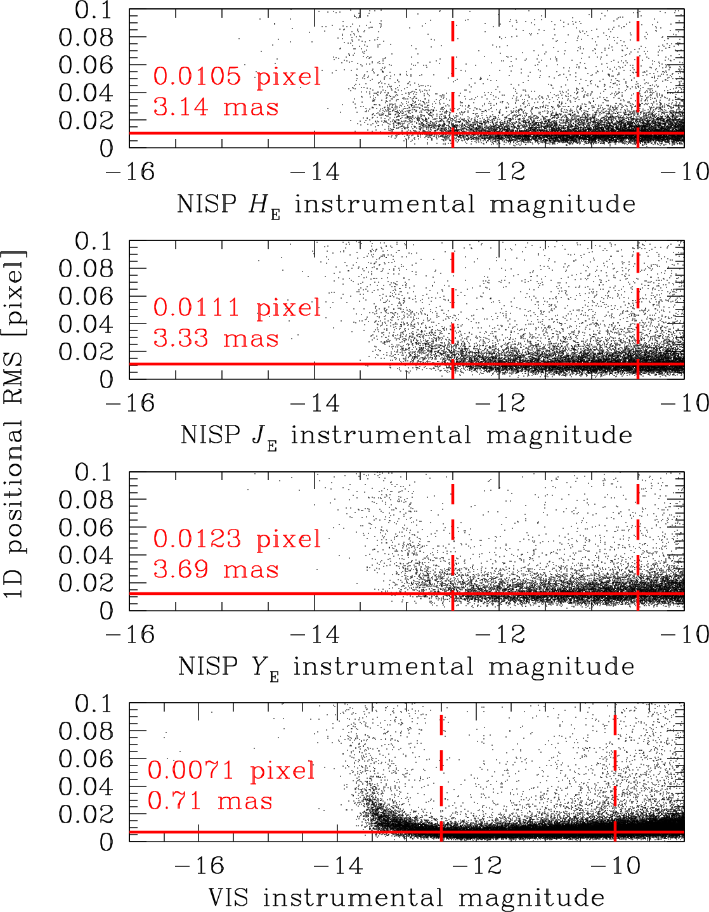

$\newcommand{\ensuremath}{}$
$\newcommand{\xspace}{}$
$\newcommand{\object}[1]{\texttt{#1}}$
$\newcommand{\farcs}{{.}''}$
$\newcommand{\farcm}{{.}'}$
$\newcommand{\arcsec}{''}$
$\newcommand{\arcmin}{'}$
$\newcommand{\ion}[2]{#1#2}$
$\newcommand{\textsc}[1]{\textrm{#1}}$
$\newcommand{\hl}[1]{\textrm{#1}}$
$\newcommand{\footnote}[1]{}$
$\newcommand{\vdag}{(v)^\dagger}$
$\newcommand$
$\newcommand$
$\newcommand{\hstfull}{\HST\xspace}$
$\newcommand{\hst}{HST\xspace}$
$\newcommand{\jwstfull}{\textit{James Webb} Space Telescope\xspace}$
$\newcommand{\jwst}{JWST\xspace}$
$\newcommand{\gaia}{\textit{Gaia}\xspace}$
$\newcommand{\euclid}{\textit{Euclid}\xspace}$
$\newcommand{\qfit}{\texttt{QFIT}\xspace}$
$\newcommand{\radxs}{\texttt{RADXS}\xspace}$
$\newcommand{\hpass}{\texttt{hst1pass}\xspace}$
$\newcommand{\jpass}{\texttt{jwst1pass}\xspace}$
$\newcommand{\epass}{\texttt{euclid1pass}\xspace}$
$\newcommand{\kstwo}{\texttt{KS2}\xspace}$
$\newcommand{\masyr}{mas yr^{-1}\xspace}$
$\newcommand{\egpm}{\mbox{\textit{E}-\textit{G}}\xspace}$
$\newcommand{\addtext}[1]{\textcolor{OliveGreen}{\uwave{#1}}}$

# $\euclid$: High-precision imaging astrometry and photometry from Early Release Observations$\thanks{This paper is published on behalf of the Euclid Consortium.}$: I. Internal kinematics of NGC 6397 by combining $\euclid$ and $\gaia$ data

<mark>Appeared on: 2024-11-06</mark> -  _23 pages, 21 figures. Accepted for publication in A&A on October 24, 2024. Astro-photometric catalogs and stacked images will be available at the CDS after the paper will be published_

M. Libralato, et al. -- incl., <mark>M. Schirmer</mark>, <mark>K. Jahnke</mark>

**Abstract:** The instruments at the focus of the $\euclid$ space observatory offer superb, diffraction-limited imaging over an unprecedented (from space) wide field of view of 0.57 deg $^2$ . This exquisite image quality has the potential to produce high-precision astrometry for point sources once the undersampling of $\euclid$ 's cameras is taken into account by means of accurate, effective point spread function (ePSF) modelling. We present a complex, detailed workflow to simultaneously solve for the geometric distortion (GD) and model the undersampled ePSFs of the $\euclid$ detectors. Our procedure was successfully developed and tested with data from the Early Release Observations (ERO) programme focused on the nearby globular cluster NGC 6397.  Our final one-dimensional astrometric precision for a well-measured star just below saturation is 0.7 mas (0.007 pixel) for the Visible Instrument (VIS) and 3 mas (0.01 pixel) for the Near-Infrared Spectrometer and Photometer (NISP). Finally, we present a specific scientific application of this high-precision astrometry: the combination of $\euclid$ and $\gaia$ data to compute proper motions and study the internal kinematics of NGC 6397. Future work, when more data become available, will allow for a better characterisation of the ePSFs and GD corrections that are derived here, along with assessment of their temporal stability, and their dependencies on the spectral energy distribution of the sources as seen through the wide-band filters of $\euclid$ .

**Figure 9. -** GD maps for the VIS quadrant 1-1.E before (left panel) and after (right panel) applying the polynomial correction. Vectors are magnified by a factor of 50 (left) and 10 000 (right) to enhance the details. The positional $x$ and $y$ positional residuals as a function of $x$ and $y$ raw VIS positions are shown in the side panels. (*fig:VISGDdet1*)

**Figure 1. -** Oned dimensional (1D) positional RMS (expressed in units of VIS or NISP pixel depending on the panel) as a function of VIS or NISP instrumental magnitude. The red horizontal line is set at the median value of bright, well-measured ($\qfit$$<$ 0.05) stars that lie within the two red, dashed, vertical lines. The median values in pixels and mas are reported in each panel. Only 20\% of the points are shown for clarity. (*fig:1drms*)

**Figure 10. -** Similar to Fig. \ref{fig:VISGDdet1}, but for the NISP DET11 detector with $\YE$-filter data. Units are now NISP pixels. (*fig:NISPYGDdet1*)

