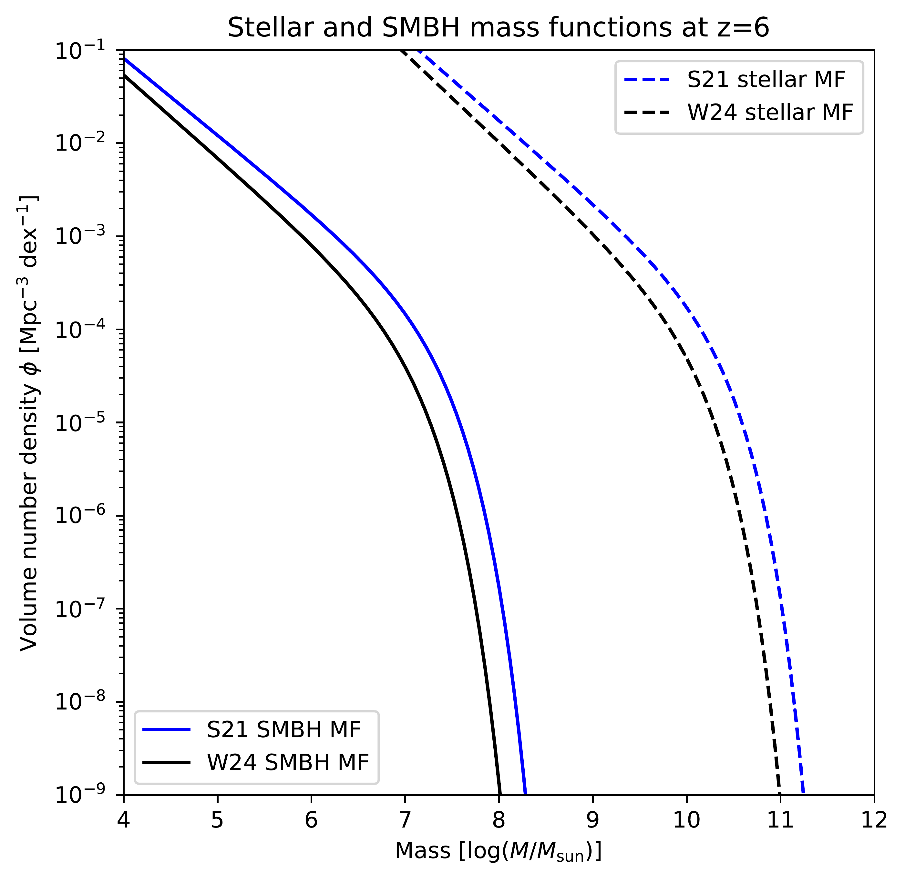

$\newcommand{\ensuremath}{}$
$\newcommand{\xspace}{}$
$\newcommand{\object}[1]{\texttt{#1}}$
$\newcommand{\farcs}{{.}''}$
$\newcommand{\farcm}{{.}'}$
$\newcommand{\arcsec}{''}$
$\newcommand{\arcmin}{'}$
$\newcommand{\ion}[2]{#1#2}$
$\newcommand{\textsc}[1]{\textrm{#1}}$
$\newcommand{\hl}[1]{\textrm{#1}}$
$\newcommand{\footnote}[1]{}$
$\newcommand{\red}[1]{\textcolor{red}{#1}}$
$\newcommand{\green}[1]{\textcolor{green}{#1}}$
$\newcommand{\blue}[1]{\textcolor{blue}{#1}}$
$\newcommand{\orange}[1]{\textcolor{orange}{#1}}$
$\newcommand{\magenta}[1]{\textcolor{magenta}{#1}}$
$\newcommand{\MBH}{M_\mathrm{BH}}$
$\newcommand{\MBHm}{M_\mathrm{BH}}$
$\newcommand{\Msun}{M_\odot}$
$\newcommand{\Msunm}{\mathrm{M}_\odot}$
$\newcommand{\MS}{M_\star}$
$\newcommand{\MSm}{M_\star}$
$\newcommand{\MBHMS}{M_\mathrm{BH}--M_\star}$
$\newcommand{\MBHDm}{\rho_\mathrm{BH}}$
$\newcommand{\MBHDsm}{\rho_\mathrm{BH,\star}}$
$\newcommand{\MBHD}{\rho_\mathrm{BH}}$
$\newcommand{\MBHDs}{\rho_\mathrm{BH,\star}}$
$\newcommand{\MAG}{\mathcal{M}}$
$\newcommand{\arraystretch}{1.2}$

# The Soltan argument at $z=6$:\ UV-luminous quasars contribute less than 10\% to early black hole mass growth

<mark>Appeared on: 2024-11-06</mark> -  _Submitted to Open Journal of Astrophysics; 10 pages, 5 figures_

<mark>K. Jahnke</mark>

**Abstract:** We combine stellar mass functions and the recent first JWST-based galaxy--black hole scaling relations at $z=6$ to for the first time compute the supermassive black hole (SMBH) mass volume density at this epoch, and compare this to the integrated SMBH mass growth from the population of UV-luminous quasars at $z>6$ .We show that even under very conservative assumptions almost all growth of supermassive black hole mass at $z>6$ does not take place in these UV-luminous quasars, but must occur in systems obscured through dust and/or with lower radiative efficiency than standard thin accretion disks.The `Sołtan argument' is not fulfilled  by the known population of bright quasars at $z>6$ : the integrated SMBH mass growth inferred from these largely unobscured active galactic nuclei (AGN) in the early Universe is by a factor $\ge$ 10 smaller than the total black hole mass volume density at $z=6$ .This is valid under a large range of assumption about luminosity and mass functions as well as accretion modes, and is likely still at least a factor $>$ 2 smaller when accounting for the known obscuration fractions at this epoch.The resulting consequences are: $>$ 90 \% , possibly substantially more, of SMBH-buildup in the early Universe does not take place in luminous unobscured quasar phases, but has to occur in obscured systems, with dust absorbing most of the emitted UV--visible AGN emission, potentially with accretion modes with super-Eddington specific accretion rates. This is consistent with short lifetime arguments for luminous quasar phases from quasar proximity zone studies and clustering. This would remove the empirical need for slow SMBH growth and hence exotic `high-mass seed' black holes at early cosmic time. It also predicts a large population of luminous but very obscured lower-mass quasars at $z>6$ , possibly the JWST `Little Red Dots'. This finding might severe impact on how we will diagnose SMBH growth at $z=7$ --15 in the future.

**Figure 1. -** Bolometric quasar luminosity volume density for largely unobscured UV-luminous quasars at $z=6$, as function of lower cutoff luminosity for integrating the QLF. Black lines show the values for the S23 QLF, green lines for the M18 QLF. Dashed lines use a constant bolometric correction, solid lines a luminosity-dependent BC. (*fig:lumdensity*)

**Figure 2. -** Fast evolution of the quasar luminosity function before $z=6$. The curves are normalised to 1 at $z=6$ and show the evolution for three different parameters $k$ as $(1+z)^k$, with values $k=-0.70$(solid line), $k=-0.78$(dashed line), and an extreme $k=-0.5$(dotted) line as a general comparison. The area under the curve is the effective time multiplier to convert the luminosity volume density at $z=6$ into a cumulated emitted energy by quasars from $z=\infty$ to $z=6$. (*fig:lfevo*)

**Figure 3. -** Stellar mass functions (dashed lines) and inferred SMBH mass functions (solid lines). Blue lines refer to the ST21 MF, black lines to the WE24 MF. We note that in both MFs $\MS$ is only constrained by data out to $\log($\MS$m/M_\odot)\sim10.6$. While the massive end does not contribute substantially to the total mass, the notable existence of $\log($\MBH$m)\sim9$ quasars at $z=6$ is not at odds with this. (*fig:massfncts*)

