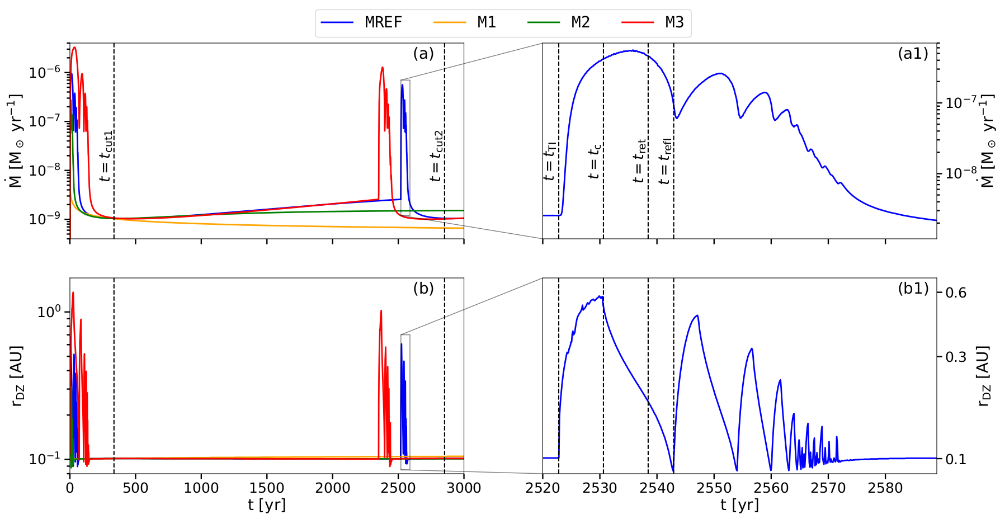

$\newcommand{\ensuremath}{}$
$\newcommand{\xspace}{}$
$\newcommand{\object}[1]{\texttt{#1}}$
$\newcommand{\farcs}{{.}''}$
$\newcommand{\farcm}{{.}'}$
$\newcommand{\arcsec}{''}$
$\newcommand{\arcmin}{'}$
$\newcommand{\ion}[2]{#1#2}$
$\newcommand{\textsc}[1]{\textrm{#1}}$
$\newcommand{\hl}[1]{\textrm{#1}}$
$\newcommand{\footnote}[1]{}$
$\newcommand{\vect}[1]{\mathbf{#1}}$
$\newcommand{\rot}[1]{\vect{\nabla}\times{#1}}$
$\newcommand$
$\newcommand{\sref}[1]{Sec.~\ref{#1}}$
$\newcommand{\tab}[1]{Table~\ref{#1}}$
$\newcommand{\fig}[1]{Fig.~\ref{#1}}$
$\newcommand{\equ}[1]{Eq.~(\ref{#1})}$
$\newcommand{\equo}[1]{Eq.~\ref{#1}}$
$\newcommand{\equs}[2]{Eqs.~(\ref{#1})~-~(\ref{#2})}$
$\newcommand{\equos}[2]{Eqs.~\ref{#1}~-~\ref{#2}}$
$\newcommand{\Msunpyr}{\mathrm{M_\odot/yr}}$
$\newcommand{\colout}[1]{\bgroup\markoverwith{\textcolor{#1}{\rule[.5ex]{2pt}{0.4pt}}}\ULon}$
$\newcommand{\pder}[2][]{\frac{\partial#1}{\partial#2}}$
$\newcommand{\grad}[1]{\nabla{#1}}$
$\newcommand{\div}[1]{\nabla\cdot\mathchoice{#1}}$
$\newcommand{\arraystretch}{1.5}$
$\newcommand{\arraystretch}{1.5}$
$\newcommand{\cs}{c_{\sf s}}$
$\newcommand{\Teff}{T_{\sf eff}}$

# Variability of the inner dead zone edge in 2D radiation hydrodynamic simulations

<mark>Appeared on: 2024-11-11</mark> -  _20 pages, 15 figures, accepted for publication in A&A_

<mark>M. Cecil</mark>, <mark>M. Flock</mark>

**Abstract:** The inner regions of protoplanetary disks are prone to thermal instability (TI), which can significantly impact the thermal and dynamical evolution of planet-forming regions. Observable as episodic accretion outbursts, such periodic disturbances shape the disk's vertical and radial structure. We investigate the stability of the inner disk edge around a Class II T Tauri star and analyse the consequences of TI on the thermal and dynamic evolution in both the vertical and radial dimensions. A particular focus is laid on the emergence and destruction of solid-trapping pressure maxima. We conduct 2D axisymmetric radiation hydrodynamic simulations of the inner disk in a radial range of 0.05 AU to 10 AU. The models include a highly turbulent inner region, the transition to the dead zone, heating by both stellar irradiation and viscous dissipation, vertical and radial radiative transport and tracking of the dust-to-gas mass ratio at every location. The simulated time frames include both the TI phase and the quiescent phase between TI cycles. We track the TI on S-curves of thermal stability. TI can develop in disks with accretion rates of $\geq 3.6\cdot 10^{-9} \mathrm{M}_\odot \mathrm{yr}^{-1}$ and results from the activation of the magnetorotational instability (MRI) in the dead zone after the accumulation of material beyond the MRI transition. The TI creates an extensive MRI active region around the midplane and disrupts the stable pebble- and migration trap at the inner edge of the dead zone. Our simulations consistently show the occurrence of TI-reflares, which, together with the initial TI, produce pressure maxima in the inner disk within 1 AU, possibly providing favourable conditions for streaming instability. During the TI phase, the dust content in the ignited regions adapts itself in order to create a new thermal equilibrium manifested on the upper branch of the S-curve. In these instances, we find a simple relation between the gas- and dust-surface density. On a timescale of a few thousand years, TI regularly disrupts the radial and vertical structure of the disk within 1 AU. While several pressure maxima are created, stable migration traps are destroyed and reinstated after the TI phase. Our models provide a foundation for more detailed investigations into phenomena such as short-term variability of accretion rates.

**Figure 1. -** Surface density profiles of models with different $\dot{M}_\mathrm{init}$ at distinct evolutionary stages. Panel a shows the initial configuration for all models, while panel b presents their structure after the first TI and the subsequent diffusion of the resulting density bumps. Panel c compares the surface density of \texttt{MREF} and \texttt{M3} at the start of their respective second TI cycle, and panel d shows the structure of both models after they have become quiescent again (similar to panel b). In all cases, the TI phase persists until enough mass has been accreted so that the surface density does not exceed $\Sigma_\mathrm{cut}$. (*fig:sigmacompare_mdots*)

**Figure 14. -** 
    Temperature maps (upper row) and corresponding surface density profiles (lower row) for four snapshots in time during an outburst event. In the upper row, the black contour lines correspond to $T=T_\mathrm{MRI}$, the yellow ones to $T=T_\mathrm{S}$ and the green ones to a radial optical depth of $\tau_*=2/3$. $t_\mathrm{TI}$ is chosen to be the point in time at which the thermal instability is triggered. The second column shows the state of the disk at the time the MRI-active region has reached its largest extent during the main burst ($t_\mathrm{c}$). The third column represents the stage of the ignition of the first reflare ($t_\mathrm{refl}$), the maximum extent of which is reached at the time depicted in column four. The state of the disk shortly after the instability has ended is shown in column five.
     (*fig:burststructure*)

**Figure 13. -** Evolution of the accretion rate (panel a) and the position of the dead zone inner edge at the midplane (panel b) for the four different models analysed in this work. Panels a1 and b1 show a zoom-in to the time frame in which the TI-induced accretion event is occurring in the \texttt{MREF} model. The vertical dashed lines in panel a1 indicate the times corresponding to the ignition of the TI ($t_\mathrm{TI}$), the heating front reaching its largest extent and a cooling front starting to develop ($t_\mathrm{c}$), the retreat of the cooling front towards the star ($t_\mathrm{ret}$) and the ignition of the first reflare ($t_\mathrm{refl}$). In panel a, the vertical dashed lines mark the points in time for which the surface profiles of the \texttt{MREF} model in panels b ($t_\mathrm{cut1}$) and d ($t_\mathrm{cut2}$) of Fig. \ref{fig:sigmacompare_mdots} are shown. (*fig:accr_rate_inset*)

