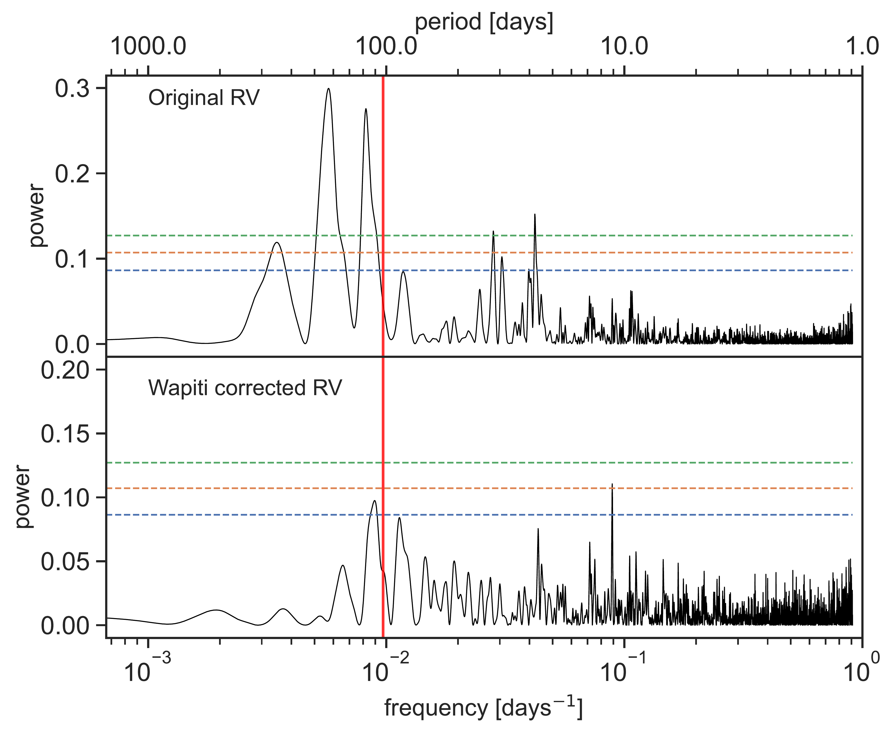
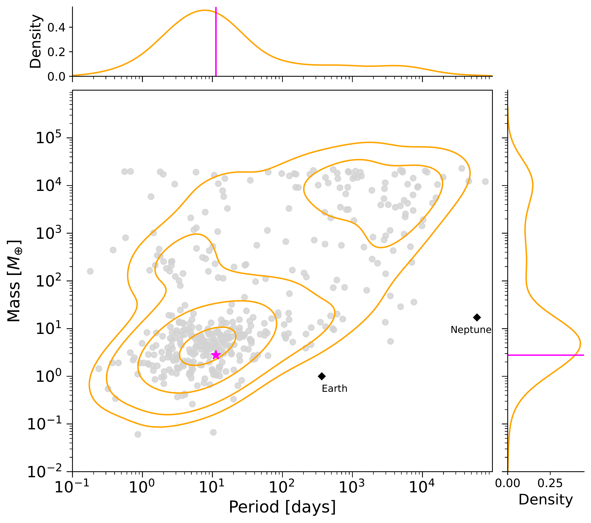

$\newcommand{\ensuremath}{}$
$\newcommand{\xspace}{}$
$\newcommand{\object}[1]{\texttt{#1}}$
$\newcommand{\farcs}{{.}''}$
$\newcommand{\farcm}{{.}'}$
$\newcommand{\arcsec}{''}$
$\newcommand{\arcmin}{'}$
$\newcommand{\ion}[2]{#1#2}$
$\newcommand{\textsc}[1]{\textrm{#1}}$
$\newcommand{\hl}[1]{\textrm{#1}}$
$\newcommand{\footnote}[1]{}$
$\newcommand{\DIFaddtex}[1]{{\bf #1}}$
$\newcommand{\DIFdeltex}[1]$
$\newcommand{\DIFaddbegin}$
$\newcommand{\DIFaddend}$
$\newcommand{\DIFdelbegin}$
$\newcommand{\DIFdelend}$
$\newcommand{\DIFmodbegin}$
$\newcommand{\DIFmodend}$
$\newcommand{\DIFaddFL}[1]{\DIFadd{#1}}$
$\newcommand{\DIFdelFL}[1]{\DIFdel{#1}}$
$\newcommand{\DIFaddbeginFL}$
$\newcommand{\DIFaddendFL}$
$\newcommand{\DIFdelbeginFL}$
$\newcommand{\DIFdelendFL}$
$\newcommand{\DIFadd}[1]{\texorpdfstring{\DIFaddtex{#1}}{#1}}$
$\newcommand{\DIFdel}[1]{\texorpdfstring{\DIFdeltex{#1}} }$
$\newcommand{\ha}{\rm H\alpha}$
$\newcommand{\ms}{m s^{-1}}$
$\newcommand{\teff}{T_{\rm eff}}$
$\newcommand{\logg}{\log g}$
$\newcommand{\vsini}{v\sin i}$
$\newcommand{\feh}{[Fe/H]}$
$\newcommand{\kms}{\hbox{km s^{-1}}}$
$\newcommand{\prot}{P_{\rm rot} = 103.1\pm6.1  \rm d }$
$\newcommand{\protv}{103.1\pm6.1 }$
$\newcommand{\starA}{\rm Gl~725A }$
$\newcommand{\DIFscaledelfig}{0.5}$
$\newcommand{\DIFaddincludegraphics}[2][]{{\color{blue}\fbox{\DIFOincludegraphics[#1]{#2}}}}$
$\newcommand{\DIFdelincludegraphics}[2][]{$
$\sbox{\DIFdelgraphicsbox}{\DIFOincludegraphics[#1]{#2}}$
$\settoboxwidth{\DIFdelgraphicswidth}{\DIFdelgraphicsbox}$
$\settoboxtotalheight{\DIFdelgraphicsheight}{\DIFdelgraphicsbox}$
$\scalebox{\DIFscaledelfig}{$
$\parbox[b]{\DIFdelgraphicswidth}{\usebox{\DIFdelgraphicsbox}\\[-\baselineskip] \rule{\DIFdelgraphicswidth}{0em}}\llap{\resizebox{\DIFdelgraphicswidth}{\DIFdelgraphicsheight}{$
$\setlength{\unitlength}{\DIFdelgraphicswidth}$
$\begin{picture}(1,1)$
$\thicklines\linethickness{2pt}{\color[rgb]{1,0,0}\put(0,0){\framebox(1,1) }}{\color[rgb]{1,0,0}\put(0,0){\line( 1,1){1}}}{\color[rgb]{1,0,0}\put(0,1){\line(1,-1){1}}}$
$\end{picture}$
$}\hspace*{3pt}}}$
$}$
$\newcommand{\arraystretch}{1.3}$
$\newcommand{\arraystretch}{1.5}$
$\newcommand\hyper{@linkstart##1##2 $
$     }$
$\newcommand\hyper{@linkstart##1##2 $
$     }$
$\newcommand\hyper{@linkstart##1##2 $
$     }$
$\newcommand\hyper{@linkstart##1##2 $
$     }$

# Gl 725A b: a potential super-Earth detected with SOPHIE and SPIRou in an M dwarf binary system at 3.5 pc

<mark>Appeared on: 2024-11-15</mark> -  _26 pages, 17 figures. Accepted in A&A_

P. Cortés-Zuleta, et al. -- incl., <mark>L. Acuña</mark>

**Abstract:** We report the discovery of a super-Earth candidate orbiting the nearby mid M dwarf Gl 725A using the radial velocity (RV) method. The planetary signal has been independently identified using high-precision RVs from the SOPHIE and SPIRou spectrographs, in the optical and near-infrared domains, respectively. We modelled the stellar activity signal jointly with the planet using two Gaussian Processes, one for each instrument to account for the chromaticity of the stellar activity and instrumental systematics, along with a Keplerian model. The signal is significantly detected with a RV semi-amplitude of $1.67\pm0.20$ m/s. The planet Gl 725A b is found to be in an orbit compatible with circular with a period of $11.2201\pm0.0051$ days. We analysed 27 sectors of TESS photometry on which no transit event was found. We determined a minimum mass of $M_{p}\sin{i}=2.78\pm0.35 M_{\oplus}$ which places the planet in the super-Earth regime. Using Mass-Radius relationships we predict a planetary radius to be between 1.2 and $2.0 R_{\oplus}$ . The proximity of Gl 725A, of only 3.5 pc, makes this new exoplanet one of the closest to Earth and joins the group of S-type low-mass planets in short orbits ( $P<15$ d) around close M dwarfs.

**Figure 1. -** Periodograms of the SOPHIE and SPIRou RVs and activity indicators. The pointed and dashed horizontal lines mark the 0.1 and 1$\%$ FAP. The magenta and orange dashed vertical lines depict the orbital period of the planet at 11.2 d and the stellar rotation period at 103.1 d, respectively. (*fig:periodograms*)

**Figure 3. -** Periodograms of the original SPIRou RVs (top) and after the \texttt{wapiti} correction (bottom), on which the period with the highest power correspond to the planet signal at 11.2 days. The horizontal dashed lines in blue, orange, and green depict the FAP at 10, 1, and 0.1$\%$, respectively. The vertical line indicates the stellar rotation period at 103.1 days. Details odf the \texttt{wapiti} correction can be found in Sect. \ref{wapiti}. (*fig:wapiti_periodograms*)

**Figure 7. -** Orbital period versus mass diagram of planets around M dwarfs. For simplicity, planets with orbits larger than $10^5$ days are not included. The orange contours indicate 10, 30, 60, and 90$\%$ of density levels of the observed probability density of the joint mass and period distribution. The magenta star and lines indicate the position of Gl 725A b, with a minimum mass of $M{_p}\sin{i}=2.78\pm0.35 M_{\oplus}$, and an orbital period of 11.2 days. The top and right histograms correspond to the probability density distribution of the orbital periods and planetary masses, respectively. For reference, the black diamonds represent the Earth and Neptune. (*fig:Mdwarf_planets*)

