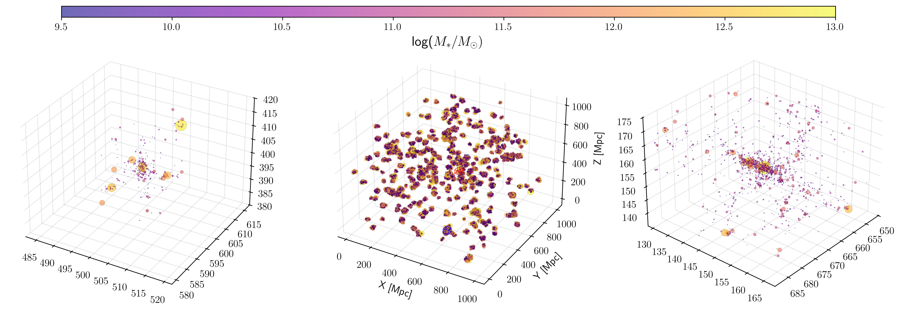

$\newcommand{\ensuremath}{}$
$\newcommand{\xspace}{}$
$\newcommand{\object}[1]{\texttt{#1}}$
$\newcommand{\farcs}{{.}''}$
$\newcommand{\farcm}{{.}'}$
$\newcommand{\arcsec}{''}$
$\newcommand{\arcmin}{'}$
$\newcommand{\ion}[2]{#1#2}$
$\newcommand{\textsc}[1]{\textrm{#1}}$
$\newcommand{\hl}[1]{\textrm{#1}}$
$\newcommand{\footnote}[1]{}$
$\newcommand{\nikhil}[1]{\textcolor{blue}{#1}}$
$\newcommand{\john}[1]{\textcolor{red}{#1}}$
$\newcommand{\common}[1]{\textcolor{purple}{#1}}$
$\newcommand{\mhalo}{{\rm{M}_{\rm{halo}}}}$
$\newcommand{\mst}{{\rm{M}_{*}}}$
$\newcommand{\msun}{{\rm{M}_{\odot}}}$
$\newcommand{\nikhil}[1]{\textcolor{blue}{#1}}$
$\newcommand{\john}[1]{\textcolor{red}{#1}}$
$\newcommand{\common}[1]{\textcolor{purple}{#1}}$
$\newcommand{\mhalo}{{\rm{M}_{\rm{halo}}}}$
$\newcommand{\mst}{{\rm{M}_{*}}}$
$\newcommand{\msun}{{\rm{M}_{\odot}}}$

# Estimating Dark Matter Halo Masses in Simulated Galaxy Clusters with Graph Neural Networks

<mark>Appeared on: 2024-11-20</mark> -  _9 pages, 4 figures, accepted at the NeurIPS ML4PS 2024 workshop_

N. Garuda, J. F. Wu, D. Nelson, <mark>A. Pillepich</mark>

**Abstract:** Galaxies grow and evolve in dark matter halos. Because dark matter is not visible, galaxies' halo masses ( $\mhalo$ ) must be inferred indirectly. We present a graph neural network (GNN) model for predicting $\mhalo$ from stellar mass ( $\mst$ ) in simulated galaxy clusters using data from the IllustrisTNG simulation suite. Unlike traditional machine learning models like random forests, our GNN captures the information-rich substructure of galaxy clusters by using spatial and kinematic relationships between galaxy neighbour. A GNN model trained on the TNG-Cluster dataset and independently tested on the TNG300 simulation achieves superior predictive performance compared to other baseline models we tested. Future work will extend this approach to different simulations and real observational datasets to further validate the GNN model’s ability to generalise.

**Figure 2. -** Validation set RMSE as a function of distance from cluster center. Results shown for the GNN (blue) and RF with $\mst$ and $\Delta_G$(orange).\vspace{-1em} (*fig:rmse-dist-from-center*)

**Figure 3. -** Spatial distribution of halos within the TNG-Cluster simulation. The middle panel shows the full simulation, and the left and right panels highlight two example galaxy clusters. The boundaries of these clusters are marked as blue and red boxes in the middle panel. (*fig:halo-distr-tng-cluster*)

**Figure 5. -** Validation set RMSE as a function of distance from cluster center. Results shown for the GNN (blue) and RF with $\mst$ and $\Delta_G$(orange).\vspace{-1em} (*fig:rmse-dist-from-center*)

