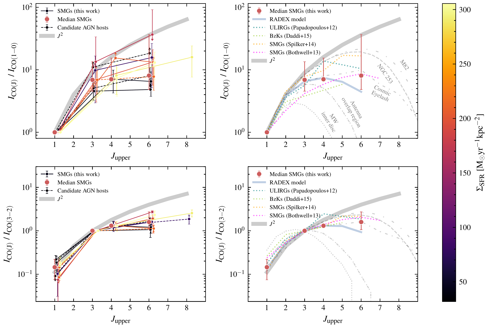
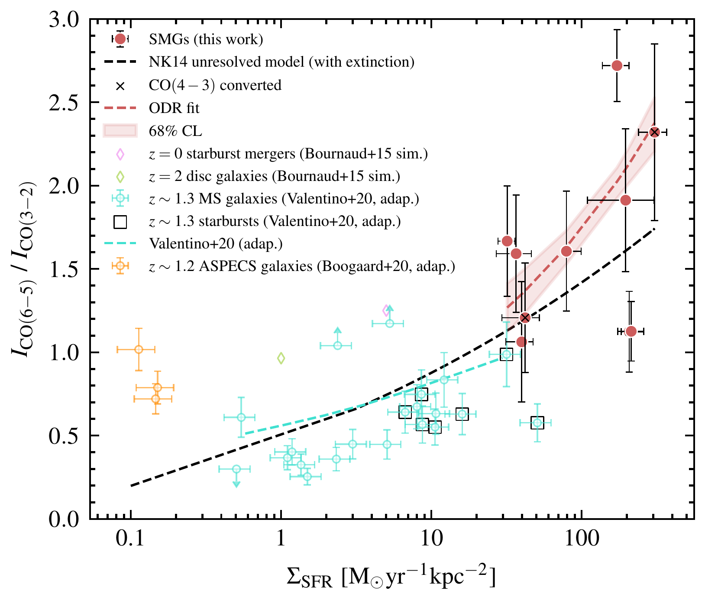

$\newcommand{\ensuremath}{}$
$\newcommand{\xspace}{}$
$\newcommand{\object}[1]{\texttt{#1}}$
$\newcommand{\farcs}{{.}''}$
$\newcommand{\farcm}{{.}'}$
$\newcommand{\arcsec}{''}$
$\newcommand{\arcmin}{'}$
$\newcommand{\ion}[2]{#1#2}$
$\newcommand{\textsc}[1]{\textrm{#1}}$
$\newcommand{\hl}[1]{\textrm{#1}}$
$\newcommand{\footnote}[1]{}$
$\newcommand{\arraystretch}{1.25}$
$\newcommand{\thetable}{A\arabic{table}}$
$\newcommand{\thefigure}{A\arabic{figure}}$
$\newcommand{\thebibliography}{\DeclareRobustCommand{\VAN}[3]{##3}\VANthebibliography}$

# The properties of the interstellar medium in dusty, star-forming galaxies at $*ph z* \sim 2-4$: The shape of the CO spectral line energy distributions

<mark>Appeared on: 2024-11-22</mark> -  _Accepted for publication in MNRAS; 17 pages, 7 figures_

D. J. Taylor, et al. -- incl., <mark>U. Dudzeviciute</mark>

**Abstract:** The molecular gas in the interstellar medium (ISM) of star-forming galaxy populations exhibits diverse physical properties.We investigate the $^{12}$ CO excitation of twelve dusty, luminous star-forming galaxies at $z \sim$ 2--4 by combining observations of the $^{12}$ CO from $J_{\rm up} = 1$ to $J_{\rm up} = 8$ .The spectral line energy distribution (SLED) has a similar shape to NGC 253, M82, and local ULIRGs, with much stronger excitation than the Milky Way inner disc.By combining with resolved dust continuum sizes from high-resolution $870$ - $\upmu$ m ALMA observations and dust mass measurements determined from multi-wavelength SED fitting, we measure the relationship between the $^{12}$ CO SLED and probable physical drivers of excitation: star-formation efficiency, the average intensity of the radiation field $\langle U\rangle$ , and the star-formation rate surface density. The primary driver of high- $J_{\rm up}$ $^{12}$ CO excitation in star-forming galaxies is star-formation rate surface density.We use the ratio of the CO(3--2) and CO(6--5) line fluxes to infer the CO excitation in each sourceand find that the average ratios for our sample are elevated compared to observations of low-redshift, less actively star-forming galaxies and agree well with predictions from numerical models that relate the ISM excitation to the star-formation rate surface density.The significant scatter in the line ratios of a factor $\approx 3$ within our sample likely reflects intrinsic variations in the ISM properties which may be caused by other effects on the excitation of the molecular gas, such as cosmic ray ionization rates and mechanical heating through turbulence dissipation.

**Figure 5. -** CO SLEDs for our sample SMGs. Individual fluxes measured from fits to the spectra are shown as circles with error-bars indicating their propagated uncertainties determined via a Monte Carlo method.
    _ Top left:_ Fluxes are normalised to the flux (or upper limits) of the CO(1--0) line and are coloured by their respective star-formation rate surface densities denoted by the colour bar (applicable to both top- and bottom-left panels). AS2COS0065.1 is shown with a limit for the lower error since it causes the error-bar to decrease below a line ratio of 1. We also show the combined composite SLED of the sample (circles), normalised by the star-formation rate surface density ($\Sigma_{\rm SFR}$) and 68\% confidence level as error-bars.
    _ Top right:_ The combined composite SLED of the sample (circles) with errors corresponding to the scatter in the sample, similar to systems such as SMM J2135-0102 (Cosmic Eyelash), NGC 253, and local ULIRGs. $J_{\rm up} = 8$ measurements are omitted for the median, since there is only one available.
    Shown alongside is the best-fit \texttt{RADEX} model to the composite CO SLED, computed from a grid of temperatures and densities, which suggests average ISM conditions of $T_{\rm kin} \sim $ 30--50 K, $\log_{10}(\langle n_{\rm H_2}\rangle[{\rm cm}^{-3}]) \sim $ 3.2--3.5, and $\langle dv/dr \rangle = $ 0.5--5 kms$^{-1}$pc$^{-1}$, though there is large covariance.
    _ Bottom left:_ Similar to the top-left panel, but fluxes are normalised to the flux of the CO(3--2) where they are available, or are otherwise normalised by the predicted flux of the CO(3--2) from the CO(4--3) using the line/brightness temperature ratio measured from \citet{Danielson_2011}.
    _ Bottom right:_ Similar to the top right panel, but with fluxes normalised to the CO(3--2).
    We add a small offset to the $J_{\rm up}$ of each measurement for each source to separate their error-bars which would otherwise overlap.
    We also show $J_{\rm up}^2$ scaling which is the expected scaling of intensities for levels in LTE and in the Rayleigh-Jeans limit.
    We compare to the CO SLEDs of other systems such as the Milky Way inner disc \citep{Fixsen_1999}, the overlap region of the antennae galaxies NGC 4038 and NGC 4039 \citep[Antenna overlap region;][]{Mashian_2015}, SMM J2135-0102 \citep[Cosmic Eyelash;][]{Danielson_2011}, M82 \citep{Weiss_2005}, NGC 253 \citep{Israel_1995,Harrison_1999,Israel_2002,Bradford_2003}, ULIRGs \citep{Papadopoulos_2012}, BzKs \citep{Daddi_2015}, and SMGs from \citet{Spilker_2014} as well as \citet{Bothwell_2013}.
     (*fig:sled*)

**Figure 7. -** $^{12}$CO SLED shapes of ten sources from our sample of SMGs with CO(6--5) observations, probed by measurements of their $J_{\rm up} = 3$ and $J_{\rm up} = 6$ CO line fluxes, versus star-formation rate surface density ($\Sigma_{\rm SFR}$). For sources without a CO(3--2) measurement, we find the predicted flux from the CO(4--3) measurement using the line/brightness temperature ratio measured for the archetypal SMG SMM J2135-0102 \citep{Danielson_2011}. We exclude sources AS2UDS072.0 and AS2COS0139.1, however, since the available high-$J_{\rm up}$ line was the CO(8--7) and the same excitation processes may not be present in both $J_{\rm up} = 6$ and $J_{\rm up} = 8$ regions of emission.
    We show an orthogonal distance regression (ODR) fit to our observations with the 68\% confidence level estimated by bootstrapping.
    We compare to the unresolved model from \citetalias{Narayanan_2014} with added extinction, which predicts that the increasing SLED shape correlates with sources with higher $\Sigma_{\rm SFR}$, suggesting more intense ISM properties.
    We also compare our results to those from \citet{Bournaud_2015} for simulated $z = 0$ starburst mergers and $z = 2$ discs, as well as \citet{Valentino_2020} for $z \sim$ 1.3 main-sequence galaxies and starbursts and \citet{Boogaard_2020} for $z \sim $ 1.2 ASPECS galaxies, where we converted their $R_{5,2}$ line ratios to $R_{6,3}$ using line flux ratios taken from \citet{Weiss_2005} for local starburst M82, with typical error-bars associated with the data. The fit to the low-redshift measurements was computed on the sources shown with the addition of others that had upper limits on $\Sigma_{\rm SFR}$.
    The correlation coefficient and probability for the relationship can be found in Table \ref{tab:MIC}.
    The observations of our SMGs are consistent with the \citetalias{Narayanan_2014} model to within $3\sigma$. However, we find significant scatter, indicative of intrinsic variations in the ISM for a given $\Sigma_{\rm SFR}$, which could be described by other physical properties.
    In combination with the observations from \citet{Valentino_2020}, we find that the strongest driver of CO excitation is $\Sigma_{\rm SFR}$. (*fig:model*)

**Figure 6. -** $^{12}$CO SLED shapes of ten sources from our sample of SMGs with CO(6--5) observations, probed by measurements of their $J_{\rm up} = 3$ and $J_{\rm up} = 6$ CO line fluxes, versus proposed drivers of excitation, SFE (_ left_) and $\langle U \rangle$(_ right_). For sources without a CO(3--2) measurement, we derive the predicted flux from the CO(4--3) measurement using the line/brightness temperature ratio measured for the archetypal SMG SMM J2135-0102 \citep{Danielson_2011}. We exclude sources AS2UDS072.0 and AS2COS0139.1, however, since the available high-$J_{\rm up}$ line was the CO(8--7) and the same excitation processes may not be present in both $J_{\rm up} = 6$ and $J_{\rm up} = 8$ regions of emission.
    We show orthogonal distance regression (ODR) fits to our observations with the 68\% confidence levels estimated by bootstrapping.
    We also compare our results to those from \citet{Valentino_2020} for $z \sim $ 1.3 main-sequence galaxies and starbursts, where we converted their $R_{5,2}$ line ratios to $R_{6,3}$ using line flux ratios taken from \citet{Weiss_2005} for local starburst M82, with typical error-bars associated with the data.
    Correlation coefficients and probabilities for the relationships can be found in Table \ref{tab:MIC}.
    Offsets between the line ratios of SMGs and low-redshift galaxies at fixed SFE or $\langle U\rangle$ indicate that these drivers may not be optimal to describe CO excitation, whereas models improve by considering galaxy sizes (Figure \ref{fig:model}).
     (*fig:sfe_isrf_models*)

