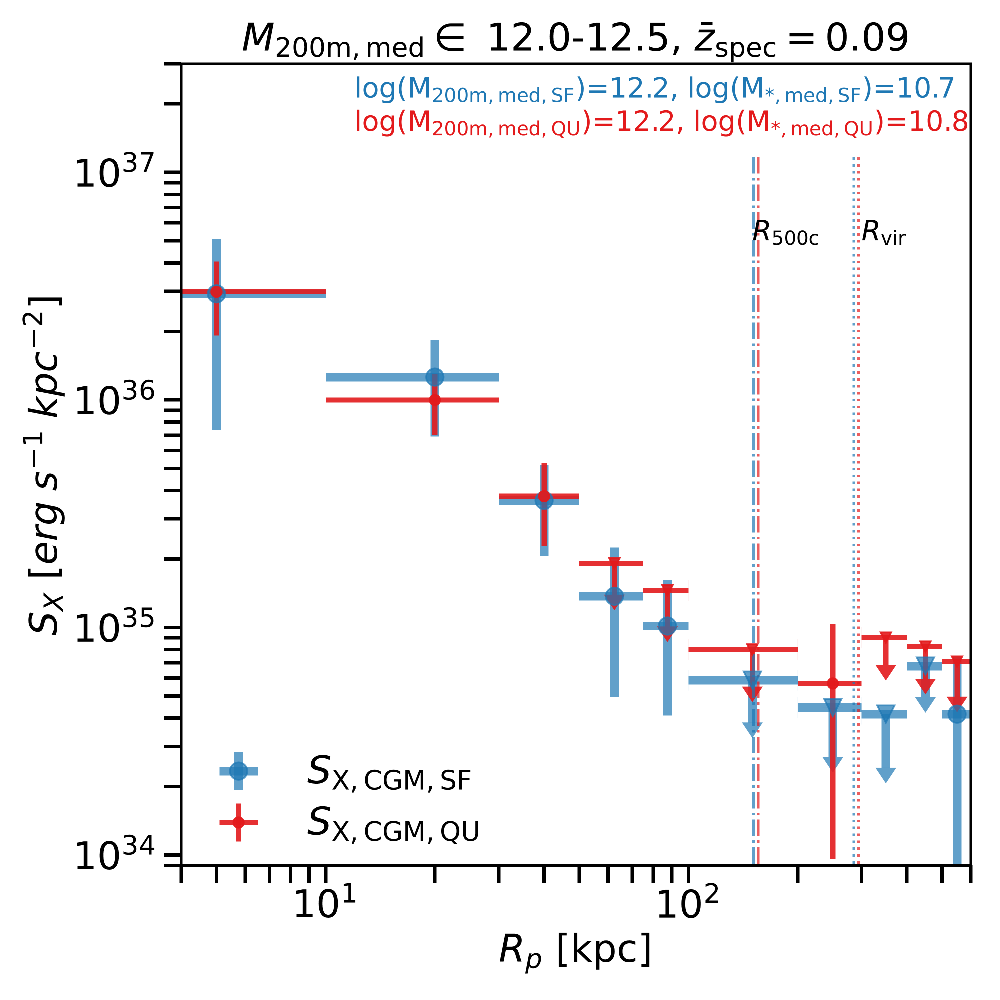
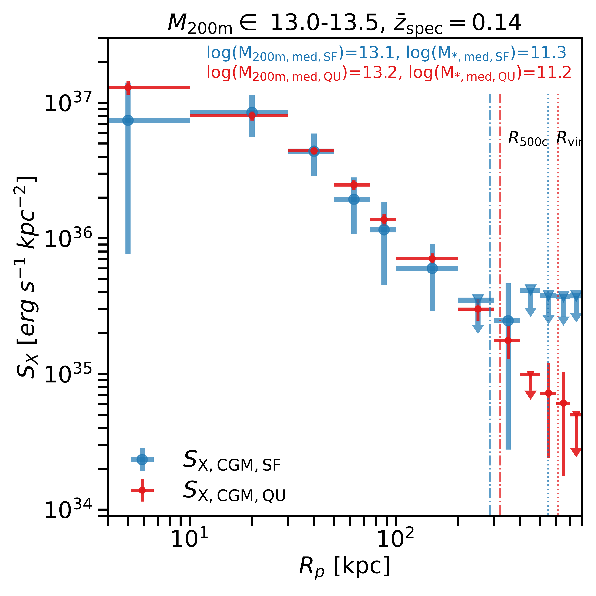

$\newcommand{\ensuremath}{}$
$\newcommand{\xspace}{}$
$\newcommand{\object}[1]{\texttt{#1}}$
$\newcommand{\farcs}{{.}''}$
$\newcommand{\farcm}{{.}'}$
$\newcommand{\arcsec}{''}$
$\newcommand{\arcmin}{'}$
$\newcommand{\ion}[2]{#1#2}$
$\newcommand{\textsc}[1]{\textrm{#1}}$
$\newcommand{\hl}[1]{\textrm{#1}}$
$\newcommand{\footnote}[1]{}$
$\newcommand{\jc}[1]{\textcolor{purple}{JC: #1}}$
$\newcommand{\gab}[1]{\textcolor{orange}{GP: #1}}$
$\newcommand{\yi}[1]{\textcolor{brown}{#1}}$
$\newcommand{\arraystretch}{1.5}$

# The hot circumgalactic medium in the eROSITA All-Sky Survey: III. Star-forming and quiescent galaxies

<mark>Appeared on: 2024-12-03</mark> -  _16 pages, 12 figures, accepted for publication in A&A_

Y. Zhang, et al. -- incl., <mark>A. Pillepich</mark>, <mark>X. Zhang</mark>

**Abstract:**            The circumgalactic medium (CGM), as the gas repository for star formation, might contain the answer to the mysterious galaxy quenching and bimodal galaxy population origin. We measured the X-ray emission of the hot CGM around star-forming and quiescent galaxies. We detect extended X-ray emission from the hot CGM around star-forming galaxies with $\log(M_*/M_\odot)>11.0$ and quiescent galaxies with $\log(M_*/M_\odot)>10.5$, extending out to $R_{\rm 500c}$. $L_{\rm X, CGM}$ of star-forming galaxies with median stellar masses $\log(M_{\rm *,med}/M_\odot) = 10.7, 11.1, 11.3$ are approximately $0.8\,, 2.3\,, 4.0 \times 10^{40}\,\rm erg/s$, while for quiescent galaxies with $\log(M_{\rm *,med}/M_\odot) = 10.8, 11.1, 11.4$, they are $1.1\,, 6.2\,, 30 \times 10^{40}\,\rm erg/s$. Notably, quiescent galaxies with $\log(M_{\rm *,med}/M_\odot) > 11.0$ exhibit brighter hot CGM than their star-forming counterparts. In halo mass bins, we detect similar X-ray emission around star-forming and quiescent galaxies with $\log(M_{\rm 200m}/M_\odot) > 12.5$, suggesting that galaxies in the same mass dark matter halos host equally bright hot CGM. We emphasize the observed $L_{\rm X, CGM} - M_{\rm 500c}$ relations of star-forming and quiescent galaxies are sensitive to the stellar-to-halo mass relation (SHMR). A comparison with cosmological hydrodynamical simulations (EAGLE, TNG100, and SIMBA) reveals varying degrees of agreement, contingent on the simulation and the specific stellar or halo mass ranges considered. Either selected in stellar mass or halo mass, the star-forming galaxies do not host brighter stacked X-ray emission from the hot CGM than their quiescent counterparts at the same mass range. The result provides useful constraints on the extent of feedback's impacts as a mechanism for quenching star formation as implemented in current cosmological simulations.         

**Figure 10. -** X-ray surface brightness profiles of the hot CGM of the central star-forming ($S_{\rm X, CGM, SF}$, blue) and quiescent ($S_{\rm X, CGM, QU}$, red) galaxies with $M_{\rm 200m}\in 12.0-12.5$, $12.5-13.0$ and $13.0-13.5$(top left, top right and bottem left). The vertical dash-dotted lines denote the average $R_{\rm 500c}$ and $R_{\rm vir}$ of stacked galaxies. The median redshift ($\bar{z}_{\rm spec}$), median $M_{\rm 200m}$ and median $M_*$ are denoted. Hot CGM X-ray luminosity of central star-forming galaxies ($L_{\rm X,CGM, SF}$, blue) and quiescent galaxies ($L_{\rm X,CGM, QU}$, red) within $R_{\rm 500c}$ in $0.5-2$ keV as a function of $M_{\rm 500c}$, compared to the $L_{\rm X,CGM}-M_{\rm 500c}$ scaling relation from [Zhang, Comparat and Ponti (2024)]()(bottom right).  (*Fig_profile_cenhalo*)

**Figure 2. -** Comparison of $M_{\rm 500c}-M*$ relations of central star-forming (top) and quiescent (bottom) galaxies in catalog [ and Tinker (2021)]() and [Yang and Mo (2007)](), and EAGLE, TNG100 and SIMBA simulations. The shadow area denotes the 16--84\% scatter of the relation. [Yang and Mo (2007)]() only includes galaxy groups with $\log(M_{\rm 500c})>11.5$ and causes the turnover of the quiescent SHMR at low mass end. (*Fig_shmr_yang*)

**Figure 1. -** The median $M_{\rm 200m}$ and median $M_*$ of galaxies with the $16-84\%$ scatter for each mass bin in the CEN$_{\rm halo,SF}$(blue band), CEN$_{\rm halo,QU}$(red band), CEN$_{\rm SF}$(green crosses), and CEN$_{\rm QU}$(orange cross) samples. (*Fig_SHMR*)

