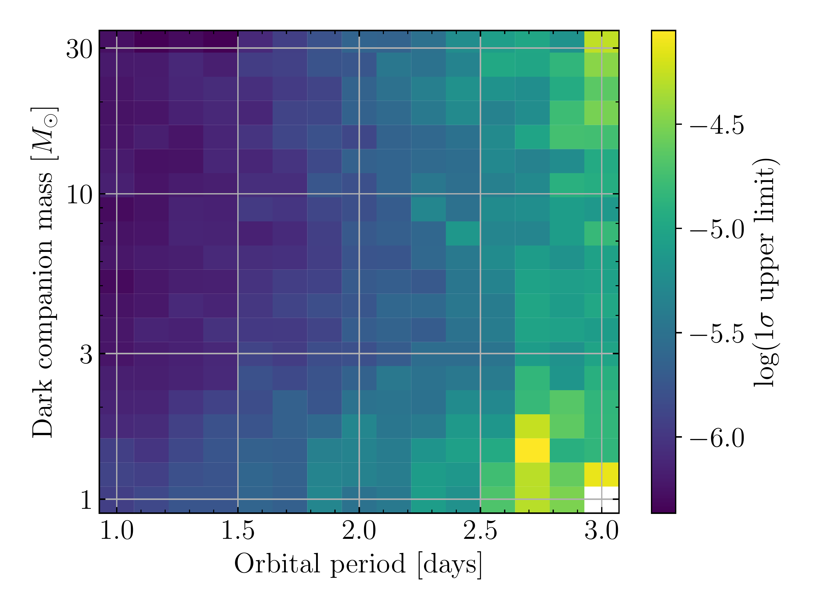
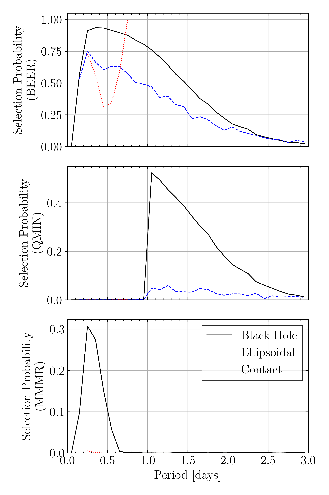

$\newcommand{\ensuremath}{}$
$\newcommand{\xspace}{}$
$\newcommand{\object}[1]{\texttt{#1}}$
$\newcommand{\farcs}{{.}''}$
$\newcommand{\farcm}{{.}'}$
$\newcommand{\arcsec}{''}$
$\newcommand{\arcmin}{'}$
$\newcommand{\ion}[2]{#1#2}$
$\newcommand{\textsc}[1]{\textrm{#1}}$
$\newcommand{\hl}[1]{\textrm{#1}}$
$\newcommand{\footnote}[1]{}$
$\newcommand{\cmnt}[1]$
$\newcommand{\review}[1]{#1}$
$\newcommand{\porb}{P_\mathrm{orb}}$
$\newcommand{\pdot}{\dot{P}_\mathrm{orb}}$
$\newcommand{\mdot}{\dot{M}}$
$\newcommand{\teff}{T_\mathrm{eff}}$
$\newcommand{\halpha}{H\alpha}$
$\newcommand{\hbeta}{H\beta}$
$\newcommand{\hei}{\ion{He}{I}}$
$\newcommand{\heii}{\ion{He}{II}}$
$\newcommand{\siii}{\ion{Si}{II}}$
$\newcommand{\filus}{\textit{u_s}}$
$\newcommand{\filgs}{\textit{g_s}}$
$\newcommand{\filrs}{\textit{r_s}}$
$\newcommand{\filis}{\textit{i_s}}$
$\newcommand{\filzs}{\textit{z_s}}$
$\newcommand{\filu}{\textit{u'}}$
$\newcommand{\filg}{\textit{g'}}$
$\newcommand{\filr}{\textit{r'}}$
$\newcommand{\fili}{\textit{i'}}$
$\newcommand{\filz}{\textit{z'}}$
$\newcommand{\filkg}{\textit{KG5}}$
$\newcommand{\inp}{{\tt input}}$
$\newcommand{\beer}{{\tt beer}}$
$\newcommand{\qmin}{{\tt qmin}}$
$\newcommand{\mmmr}{{\tt mmmr}}$
$\newcommand{\aell}{A_{\rm ell}}$
$\newcommand{\qm}{q_{\rm min}}$
$\newcommand{\fbh}{f_{\rm BH}}$
$\newcommand{\sbar}{\Bar{S}'}$
$\newcommand{\mpia}{1}$
$\newcommand{\tlv}{2}$
$\newcommand{\barilan}{3}$
$\newcommand{\edin}{4}$
$\newcommand{\caltech}{5}$
$\newcommand{\ing}{6}$
$\newcommand{\sheff}{7}$
$\newcommand{\warw}{8}$

# An upper limit on the frequency of short-period black hole companions to Sun-like stars

<mark>Appeared on: 2024-12-04</mark> -  _14 pages, 12 figures. Submitted to A&A. Comments welcome. Long forms of Tables 3 and 4 are included as FITS files in the Arxiv zip folder_

M. J. Green, et al. -- incl., <mark>H.-W. Rix</mark>, <mark>K. El-Badry</mark>

**Abstract:** Stellar-mass black holes descend from high-mass stars, most of which had stellar binary companions.However, the number of those binary systems that survive the binary evolution and black hole formation is uncertain by multiple orders of magnitude.The survival rate is particularly uncertain for massive stars with low-mass companions, which are thought to be the progenitors of most black hole X-ray binaries.We present a search for close black hole companions (separation $\lesssim 20 R_\odot$ ) to AFGK-type stars in _TESS_ , i.e. the non-accreting counterparts to and progenitors of low-mass X-ray binaries. Such black holes can be detected by the tidally induced ellipsoidal deformation of the visible star, and the ensuing photometric light-curve variations. From an initial sample of $4.7\times10^6$ TESS stars, we have selected 457 candidates for such variations. However, spectroscopic followup of 251 of them shows that none are consistent with a close black hole companion.On the basis of this non-detection, we determine ( $2\sigma$ confidence) that fewer than one in $10^5$ Solar-type stars in the Solar neighbourhood host a short-period black hole companion.This upper limit is in tension with a number of "optimistic" population models in the literature that predict short-period black hole companions around one in $\sim 10^{4-5}$ stars. Our limits are still consistent with other models that predict only a few in $\sim 10^{7-8}$ .

**Figure 8. -** 
Two-dimensional upper limits on the frequency of black hole companions to Solar-type stars as a function of orbital period and black hole mass, $f_{\rm BH} (M_2, P_{\rm orb})$.
The existence of orbital periods close to 1 day is more tightly constrained than the existence of periods close to 3 days.
Dark companions with masses $M_2 < 3 M_\odot$ are less tightly constrained than more massive companions, but above this limit the dependence on companion mass is weak.
$\cmnt${Is it true that high-mass bhs are harder to find at fixed period?} (*fig:upperlim-2d*)

**Figure 6. -** 
The $K$-amplitudes derived via two methods from _Gaia_ data, against those measured from orbital solutions, for all targets with both measurements.
There is generally reasonable agreement, with some outlying points, as discussed in the text.
 (*fig:rv-comparison*)

**Figure 9. -** 
Probability for simulated binary systems of various types to be accepted into the $\beer$ sample (top), $\qmin$ sample (middle), and $\mmmr$ sample (bottom), as a function of period.
Other variables ($\cos i$, $M_1$, and $M_2$) have been marginalised over.
 (*fig:selection-function-beer*)

