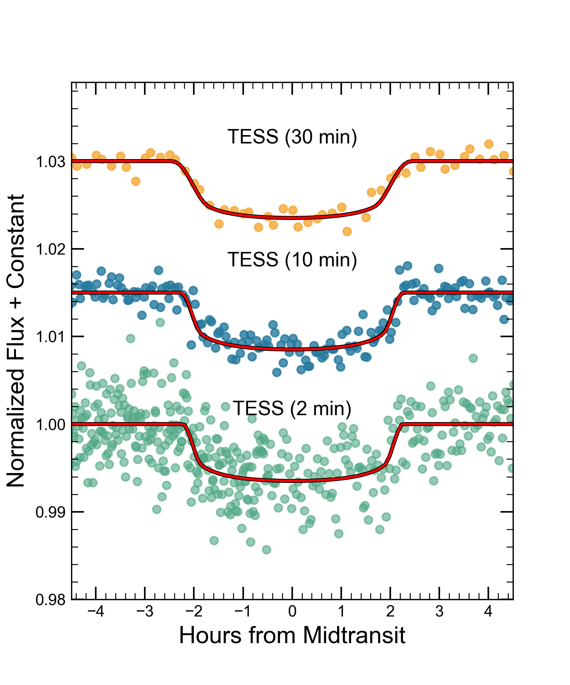

$\newcommand{\ensuremath}{}$
$\newcommand{\xspace}{}$
$\newcommand{\object}[1]{\texttt{#1}}$
$\newcommand{\farcs}{{.}''}$
$\newcommand{\farcm}{{.}'}$
$\newcommand{\arcsec}{''}$
$\newcommand{\arcmin}{'}$
$\newcommand{\ion}[2]{#1#2}$
$\newcommand{\textsc}[1]{\textrm{#1}}$
$\newcommand{\hl}[1]{\textrm{#1}}$
$\newcommand{\footnote}[1]{}$
$\newcommand$
$\newcommand{\bjdtdb}{\ensuremath{\rm{BJD_{TDB}}}}$
$\newcommand{\feh}{\ensuremath{\left[{\rm Fe}/{\rm H}\right]}}$
$\newcommand{\mh}{\ensuremath{\left[{\rm m}/{\rm H}\right]}}$
$\newcommand{\teff}{\ensuremath{T_{\rm eff}}\xspace}$
$\newcommand{\logg}{\ensuremath{\log g}}$
$\newcommand{\ecosw}{\ensuremath{e\cos{\omega_*}}}$
$\newcommand{\esinw}{\ensuremath{e\sin{\omega_*}}}$
$\newcommand{\msun}{\ensuremath{ M_\Sun}}$
$\newcommand{\rsun}{\ensuremath{ R_\Sun}}$
$\newcommand{\lsun}{\ensuremath{ L_\Sun}}$
$\newcommand{\mj}{\ensuremath{ M_{\rm J}}}$
$\newcommand{\rj}{\ensuremath{ R_{\rm J}}}$
$\newcommand{\rearth}{\ensuremath{ R_{\rm \Earth}}\xspace}$
$\newcommand{\mearth}{\ensuremath{ M_{\rm \Earth}}\xspace}$
$\newcommand{\re}{\ensuremath{ R_{\rm \Earth}}\xspace}$
$\newcommand{\me}{\ensuremath{ M_{\rm \Earth}}\xspace}$
$\newcommand{\fave}{\langle F \rangle}$
$\newcommand{\fluxcgs}{10^9 erg s^{-1} cm^{-2}}$
$\newcommand{\newln}{\\&\quad\quad }$
$\newcommand{\Kepler}{{\it Kepler}}$
$\newcommand{\Ktwo}{{\it K2}}$
$\newcommand{\loggstar}{\ensuremath{\log{g_\star}}}$
$\newcommand{\vsini}{\ensuremath{v\sin{i_*}}}$
$\newcommand{\kms}{ km s^{-1}}$
$\newcommand{\ms}{ m s^{-1}}$
$\newcommand{\vdag}{(v)^\dagger}$
$\newcommand$
$\newcommand$
$\newcommand{\cfa}{Center for Astrophysics \textbar  Harvard \& Smithsonian, 60 Garden St, Cambridge, MA 02138, USA}$
$\newcommand{\msu}{Center for Data Intensive and Time Domain Astronomy, Department of Physics and Astronomy, Michigan State University, East$
$Lansing, MI 48824, USA}$
$\newcommand{\umich}{Astronomy Department, University of Michigan, 1085 S University Avenue, Ann Arbor, MI 48109, USA}$
$\newcommand{\utaustin}{Department of Astronomy, The University of Texas at Austin, Austin, TX 78712, USA}$
$\newcommand{\MIT}{Department of Physics and Kavli Institute for Astrophysics and Space Research, Massachusetts Institute of Technology, Cambridge, MA 02139, USA}$
$\newcommand{\MITEPS}{Department of Earth, Atmospheric and Planetary Sciences, Massachusetts Institute of Technology,  Cambridge,  MA 02139, USA}$
$\newcommand{\uflorida}{Department of Astronomy, University of Florida, 211 Bryant Space Science Center, Gainesville, FL, 32611, USA}$
$\newcommand{\riverside}{Department of Earth and Planetary Sciences, University of California, Riverside, CA 92521, USA}$
$\newcommand{\usq}{Centre for Astrophysics, University of Southern Queensland, West Street, Toowoomba, QLD 4350, Australia}$
$\newcommand{\ames}{NASA Ames Research Center, Moffett Field, CA, 94035, USA}$
$\newcommand{\geneva}{Observatoire astronomique de l\' Université de Genève, 51 Chemin Pegasi, 1290 Versoix, Switzerland}$
$\newcommand{\uw}{Astronomy Department, University of Washington, Seattle, WA 98195 USA}$
$\newcommand{\warwick}{Department of Physics, University of Warwick, Gibbet Hill Road, Coventry CV4 7AL, UK}$
$\newcommand{\warwickceh}{Centre for Exoplanets and Habitability, University of Warwick, Gibbet Hill Road, Coventry CV4 7AL, UK}$
$\newcommand{\princeton}{Department of Astrophysical Sciences, Princeton University, 4 Ivy Lane, Princeton, NJ, 08544, USA}$
$\newcommand{\liege}{Space Sciences, Technologies and Astrophysics Research (STAR) Institute, Université de Liège, 19C Allée du 6 Ao\^ut, 4000 Liège, Belgium}$
$\newcommand{\vanderbilt}{Department of Physics and Astronomy, Vanderbilt University, Nashville, TN 37235, USA}$
$\newcommand{\fisk}{Department of Physics, Fisk University, 1000 17th Avenue North, Nashville, TN 37208, USA}$
$\newcommand{\columbia}{Department of Astronomy, Columbia University, 550 West 120th Street, New York, NY 10027, USA}$
$\newcommand{\toronto}{Dunlap Institute for Astronomy and Astrophysics, University of Toronto, Ontario M5S 3H4, Canada}$
$\newcommand{\unc}{Department of Physics and Astronomy, University of North Carolina at Chapel Hill, Chapel Hill, NC 27599, USA}$
$\newcommand{\iac}{Instituto de Astrofísica de Canarias (IAC), E-38205 La Laguna, Tenerife, Spain}$
$\newcommand{\lalaguna}{Departamento de Astrofísica, Universidad de La Laguna (ULL), E-38206 La Laguna, Tenerife, Spain}$
$\newcommand{\louisville}{Department of Physics and Astronomy, University of Louisville, Louisville, KY 40292, USA}$
$\newcommand{\aavso}{American Association of Variable Star Observers, 49 Bay State Road, Cambridge, MA 02138, USA}$
$\newcommand{\utokyo}{The University of Tokyo, 7-3-1 Hongo, Bunky\={o}, Tokyo 113-8654, Japan}$
$\newcommand{\naoj}{National Astronomical Observatory of Japan, 2-21-1 Osawa, Mitaka, Tokyo 181-8588, Japan}$
$\newcommand{\jstpresto}{JST, PRESTO, 7-3-1 Hongo, Bunkyo-ku, Tokyo 113-0033, Japan}$
$\newcommand{\astrobiojapan}{Astrobiology Center, 2-21-1 Osawa, Mitaka, Tokyo 181-8588, Japan}$
$\newcommand{\ctio}{Cerro Tololo Inter-American Observatory, Casilla 603, La Serena, Chile}$
$\newcommand{\noirlab}{NOIRLab/Cerro Tololo Inter-American Observatory, Casilla 603, La Serena, Chile}$
$\newcommand{\nexsci}{Caltech IPAC -- NASA Exoplanet Science Institute 1200 E. California Ave, Pasadena, CA 91125, USA}$
$\newcommand{\ucsc}{Department of Astronomy and Astrophysics, University of$
$California, Santa Cruz, CA 95064, USA}$
$\newcommand{\gsfc}{Exoplanets and Stellar Astrophysics Laboratory, Code 667, NASA Goddard Space Flight Center, Greenbelt, MD 20771, USA}$
$\newcommand{\sgtinc}{SGT, Inc./NASA AMES Research Center, Mailstop 269-3, Bldg T35C, P.O. Box 1, Moffett Field, CA 94035, USA}$
$\newcommand{\chile}{Center of Astro-Engineering UC, Pontificia Universidad Católica de Chile, Av. Vicuña Mackenna 4860, 7820436 Macul, Santiago, Chile}$
$\newcommand{\Pontificia}{Facultad de Ingeniería y Ciencias, Universidad Adolfo Ibáñez, Av. Diagonal las Torres 2640, Peñalolén, Santiago, Chile}$
$\newcommand{\Millennium}{Millennium Institute for Astrophysics, Chile}$
$\newcommand{\maxplank}{Max-Planck-Institut für Astronomie, Königstuhl 17, Heidelberg 69117, Germany}$
$\newcommand{\utdallas}{Department of Physics, The University of Texas at Dallas, 800 West$
$Campbell Road, Richardson, TX 75080-3021 USA}$
$\newcommand{\MauryLewin}{Maury Lewin Astronomical Observatory, Glendora, CA 91741, USA}$
$\newcommand{\umbc}{University of Maryland, Baltimore County, 1000 Hilltop Circle, Baltimore, MD 21250, USA}$
$\newcommand{\osu}{Department of Astronomy, The Ohio State University, 140 West 18th Avenue, Columbus, OH 43210, USA}$
$\newcommand{\MITAA}{Department of Aeronautics and Astronautics, MIT, 77 Massachusetts Avenue, Cambridge, MA 02139, USA}$
$\newcommand{\openu}{School of Physical Sciences, The Open University, Milton Keynes MK7 6AA, UK}$
$\newcommand{\swarthmore}{Department of Physics and Astronomy, Swarthmore College, Swarthmore, PA 19081, USA}$
$\newcommand{\seti}{SETI Institute, Mountain View, CA 94043, USA}$
$\newcommand{\lehigh}{Department of Physics, Lehigh University, 16 Memorial Drive East, Bethlehem, PA 18015, USA}$
$\newcommand{\utah}{Department of Physics and Astronomy, University of Utah, 115 South 1400 East, Salt Lake City, UT 84112, USA}$
$\newcommand{\USNA}{Department of Physics, United States Naval Academy, 572C Holloway Rd., Annapolis, MD 21402, USA}$
$\newcommand{\DTM}{Department of Terrestrial Magnetism, Carnegie Institution for Science, 5241 Broad Branch Road, NW, Washington, DC 20015, USA}$
$\newcommand{\UPenn}{The University of Pennsylvania, Department of Physics and Astronomy, Philadelphia, PA, 19104, USA}$
$\newcommand{\montana}{Department of Physics and Astronomy, University of Montana, 32 Campus Drive, No. 1080, Missoula, MT 59812 USA}$
$\newcommand{\psu}{Department of Astronomy \& Astrophysics, The Pennsylvania State University, 525 Davey Lab, University Park, PA 16802, USA}$
$\newcommand{\psust}{Center for Exoplanets and Habitable Worlds, The Pennsylvania State University, 525 Davey Lab, University Park, PA 16802, USA}$
$\newcommand{\Kutztown}{Department of Physical Sciences, Kutztown University, Kutztown, PA 19530, USA}$
$\newcommand{\udel}{Department of Physics \& Astronomy, University of Delaware, Newark, DE 19716, USA}$
$\newcommand{\Westminster}{Department of Physics, Westminster College, New Wilmington, PA 16172}$
$\newcommand{\steward}{Department of Astronomy and Steward Observatory, University of Arizona, Tucson, AZ 85721, USA}$
$\newcommand{\saao}{South African Astronomical Observatory, PO Box 9, Observatory, 7935, Cape Town, South Africa}$
$\newcommand{\salt}{Southern African Large Telescope, PO Box 9, Observatory, 7935, Cape Town, South Africa}$
$\newcommand{\ssl}{Società Astronomica Lunae, Italy}$
$\newcommand{\spot}{Spot Observatory, Nashville, TN 37206, USA}$
$\newcommand{\txamGP}{George P. and Cynthia Woods Mitchell Institute for Fundamental Physics and Astronomy, Texas A\&M University, College Station, TX77843 USA}$
$\newcommand{\txam}{Department of Physics and Astronomy, Texas A\&M university, College Station, TX 77843 USA}$
$\newcommand{\wellesley}{Department of Astronomy, Wellesley College, Wellesley, MA 02481, USA}$
$\newcommand{\Wesleyan}{Astronomy Department and Van Vleck Observatory, Wesleyan University, Middletown, CT 06459, USA}$
$\newcommand{\inaf}{INAF -- Osservatorio Astronomico di Padova, Vicolo dell'Osservatorio 5, I-35122, Padova, Italy}$
$\newcommand{\byu}{Department of Physics and Astronomy, Brigham Young University, Provo, UT 84602, USA}$
$\newcommand{\Hazelwood}{Hazelwood Observatory, Churchill, Victoria, Australia}$
$\newcommand{\austinstate}{Department of Physics, Engineering and Astronomy, Stephen F. Austin State University, 1936 North St, Nacogdoches, TX 75962, USA}$
$\newcommand{\pest}{Perth Exoplanet Survey Telescope}$
$\newcommand{\Winer}{Winer Observatory, PO Box 797, Sonoita, AZ 85637, USA}$
$\newcommand{\icpo}{Ivan Curtis Private Observatory}$
$\newcommand{\elsauce}{El Sauce Observatory, Chile}$
$\newcommand{\crow}{Atalaia Group \& CROW Observatory, Portalegre, Portugal}$
$\newcommand{\dfus}{Dipartimento di Fisica "E.R.Caianiello", Università di Salerno, Via Giovanni Paolo II 132, Fisciano 84084, Italy}$
$\newcommand{\indfn}{Istituto Nazionale di Fisica Nucleare, Napoli, Italy}$
$\newcommand{\sotes}{Gabriel Murawski Private Observatory (SOTES)}$
$\newcommand{\lco}{Las Cumbres Observatory Global Telescope, 6740 Cortona Dr., Suite 102, Goleta, CA 93111, USA}$
$\newcommand{\ucsb}{Department of Physics, University of California, Santa Barbara, CA 93106-9530, USA}$
$\newcommand{\yale}{Department of Astronomy, Yale University, 52 Hillhouse Avenue, New Haven, CT 06511, USA}$
$\newcommand{\eso}{European Southern Observatory, Alonso de Córdova 3107, Vitacura, Casilla 19001, Santiago, Chile}$
$\newcommand{\stsci}{Space Telescope Science Institute, Baltimore, MD 21218, USA}$
$\newcommand{\keele}{Astrophysics Group, Keele University, Staffordshire ST5 5BG, UK}$
$\newcommand{\gsfcsellers}{GSFC Sellers Exoplanet Environments Collaboration, NASA Goddard Space Flight Center, Greenbelt, MD 20771 }$
$\newcommand{\usno}{U.S. Naval Observatory, Washington, DC 20392, USA}$
$\newcommand{\kansas}{Department of Physics and Astronomy, University of Kansas, 1251 Wescoe Hall Dr., Lawrence, KS 66045, USA}$
$\newcommand{\gmu}{George Mason University, 4400 University Drive MS 3F3, Fairfax, VA 22030, USA}$
$\newcommand{\unsw}{Exoplanetary Science at UNSW, School of Physics, UNSW Sydney, NSW 2052, Australia}$
$\newcommand{\sifa}{School of Physics, Sydney Institute for Astronomy (SIfA), The University of Sydney, NSW 2006, Australia}$
$\newcommand{\nanjing}{School of Astronomy and Space Science, Key Laboratory of Modern Astronomy and Astrophysics in Ministry of Education, Nanjing University, Nanjing 210046, Jiangsu, China}$
$\newcommand{\berkely}{Department of Astronomy, University of California Berkeley, Berkeley, CA 94720-3411, USA}$
$\newcommand{\bhicfa}{Black Hole Initiative at Harvard University, 20 Garden Street, Cambridge, MA 02138, USA}$
$\newcommand{\Silesian}{Department of Electronics, Electronical Engineering and Microelectronics, Silesian University of Techhnology Akademicka 16, 44-100 Gliwice, Poland}$
$\newcommand{\Patashnick}{Patashnick Voorheesville Observatory, Voorheesville, NY 12186, USA}$
$\newcommand{\austincollege}{Physics Department, Austin College, 900 North Grand Avenue, Sherman TX 75090, USA}$
$\newcommand{\Tsinghua}{Department of Astronomy, Tsinghua University, Beijing 100084, China}$
$\newcommand{\Tsinghuaschool}{Tsinghua International School, Beijing 100084, China}$
$\newcommand{\chinaNAO}{National Astronomical Observatories, Chinese Academy of Sciences, 20A Datun Road, Chaoyang District, Beijing 100012, China}$
$\newcommand{\Tautenburg}{Th{ü}ringer Landessternwarte Tautenburg, Sternwarte 5, 07778 Tautenburg, Germany}$
$\newcommand{\brierfield}{Brierfield Observatory, New South Wales, Australia}$
$\newcommand{\Indiana}{Indiana University Department of Astronomy, SW319, 727 E 3rd Street, Bloomington, IN 47405 USA}$
$\newcommand{\wisconsin}{Department of Astronomy, University of Wisconsin-Madison, Madison, WI 53706, USA}$
$\newcommand{\protologic}{Proto-Logic Consulting LLC, Washington, DC 20009, USA}$
$\newcommand{\ASTRAVEO}{ASTRAVEO LLC, PO Box 1668, MA 01931}$
$\newcommand{\TJHS}{Thomas Jefferson High School, 6560 Braddock Rd, Alexandria, VA 22312 USA}$
$\newcommand{\ucatchile}{Instituto de Astrofísica, Facultad de Física, Pontificia Universidad Católica de Chile}$
$\newcommand{\lasa}{Liberal Arts and Science Academy, Austin, Texas 78724, USA}$
$\newcommand{\gemini}{Gemini Observatory/NSF’s NOIRLab, 670 N. A’ohoku Place, Hilo, HI, 96720, USA}$
$\newcommand{\umd}{Department of Astronomy, University of Maryland, College Park, College Park, MD}$
$\newcommand{\Bern}{Physikalisches Institut, University of Bern, Gesellschaftsstrasse 6, 3012 Bern, Switzerland}$
$\newcommand{\eberly}{\altaffiliation{Eberly Research Fellow}}$
$\newcommand{\torres}{\altaffiliation{Juan Carlos Torres Fellow}}$
$\newcommand{\sagan}{\altaffiliation{NASA Sagan Fellow}}$
$\newcommand{\bernoulli}{\altaffiliation{Bernoulli fellow}}$
$\newcommand{\gruber}{\altaffiliation{Gruber fellow}}$
$\newcommand{\kavli}{\altaffiliation{Kavli Fellow}}$
$\newcommand{\peg}{\altaffiliation{51 Pegasi b Fellow}}$
$\newcommand{\pappalardo}{\altaffiliation{Pappalardo Fellow}}$
$\newcommand{\hubble}{\altaffiliation{NASA Hubble Fellow}}$
$\newcommand{\nsf}{\altaffiliation{National Science Foundation Graduate Research Fellow}}$
$\newcommand{\maxplanck}{Max-Planck-Institut für Astronomie,Königstuhl 17, D-69117 Heidelberg, Germany}$
$\newcommand{\Sofia}{Department of Astronomy, Sofia University "St Kliment Ohridski", 5 James Bourchier Blvd, BG-1164 Sofia, Bulgaria}$
$\newcommand{\Heidelberg}{Landessternwarte, Zentrum für Astronomie der Universität Heidelberg, Königstuhl 12, D-69117 Heidelberg, Germany}$
$\newcommand{\Adolfo}{Facultad de Ingeniera y Ciencias, Universidad Adolfo Ibáñez, Av. Diagonal las Torres 2640, Peñalolén, Santiago, Chile}$
$\newcommand{\Millenium}{Millenium Institute of Astrophysics, Santiago, Chile}$

# Discovery and Characterization of an Eccentric, Warm Saturn Transiting the Solar Analog TOI-4994$\footnote{This paper includes data gathered with the 6.5 meter Magellan Telescopes located at Las Campanas Observatory, Chile.}$

<mark>Appeared on: 2024-12-05</mark> -  _17 pages, 10 figures. Accepted to AJ_

R. R. Martínez, et al. -- incl., <mark>J. Eberhardt</mark>, <mark>T. Henning</mark>

**Abstract:** We present the detection and characterization of TOI-4994b (TIC 277128619b), a warm Saturn-sized planet discovered by the NASA Transiting Exoplanet Survey Satellite (TESS). TOI-4994b transits a G-type star (V = 12.6 mag) with a mass, radius, and effective temperature of $M_{\star} =1.005^{+0.064}_{-0.061} M_{\odot}$ , $R_{\star} = 1.055^{+0.040}_{-0.037} R_{\odot}$ , and $T_{\rm eff} = 5640 \pm 110$ K. We obtained follow-up ground-based photometry from the Las Cumbres Observatory (LCO) and the Antarctic Search for Transiting ExoPlanets (ASTEP) telescopes, and we confirmed the planetary nature of TOI-4994b with multiple radial velocity observations from the PFS, CHIRON, HARPS, FEROS, and CORALIE instruments. From a global fit to the photometry and radial velocities, we determine that TOI-4994b is in a 21.5-day, eccentric orbit ( $e = 0.32 \pm 0.04$ ) and has a mass of $M_{P}= 0.280^{+0.037}_{-0.034} M_{J}$ , a radius of $R_{P}= 0.762^{+0.030}_{-0.027}R_{J}$ , and a Saturn-like bulk density of $\rho_{p} = 0.78^{+0.16}_{-0.14}$ $\rm g/cm^3$ . We find that TOI-4994 is a potentially viable candidate for follow-up stellar obliquity measurements. TOI-4994b joins the small sample of warm Saturn analogs and thus sheds light on our understanding of these rare and unique worlds.

**Figure 2. -** Light curves of TOI-4994 from the LCO and ASTEP-Antarctica ground-based observatories.  (*fig:Ground_based*)

**Figure 4. -** Phase-folded radial velocities from PFS (golden diamonds) and HARPS (purple stars and blue triangles) only, with residuals plotted below. (*fig:PFS_HARPS*)

**Figure 1. -** TESS light curves of TOI-4994 at 30 (top), 10 (middle), and 2 (bottom) minute cadences, combining 6 different sectors. The red lines show the best-fit {\tt EXOFASTv2} models, phase-folded on the orbital period. (*fig:TESS_lcs*)

