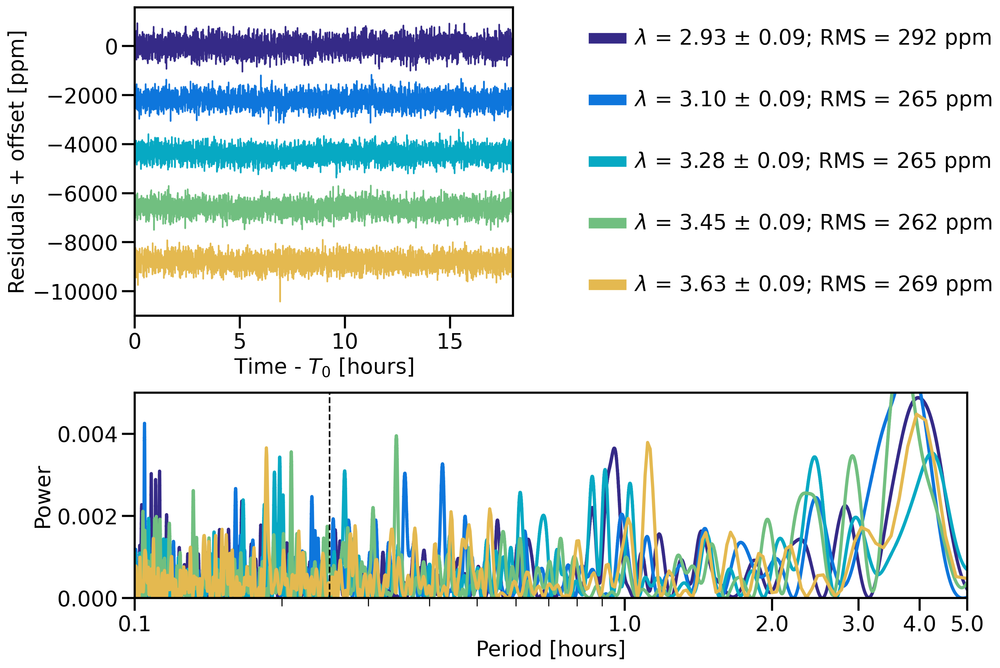
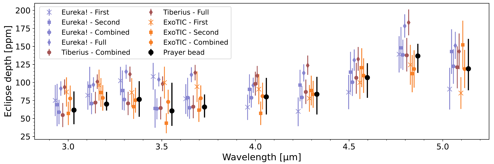

$\newcommand{\ensuremath}{}$
$\newcommand{\xspace}{}$
$\newcommand{\object}[1]{\texttt{#1}}$
$\newcommand{\farcs}{{.}''}$
$\newcommand{\farcm}{{.}'}$
$\newcommand{\arcsec}{''}$
$\newcommand{\arcmin}{'}$
$\newcommand{\ion}[2]{#1#2}$
$\newcommand{\textsc}[1]{\textrm{#1}}$
$\newcommand{\hl}[1]{\textrm{#1}}$
$\newcommand{\footnote}[1]{}$
$\newcommand{\prelim}[1]{\colorbox{white!70!cyan}{\parbox{0.85\columnwidth}{\texttt{PRELIM: #1}}}}$
$\newcommand{\eureka}[1]{\texttt{Eureka!}{#1}}$
$\newcommand{\tiberius}[1]{\texttt{Tiberius}{#1}}$
$\newcommand{\exotic}[1]{\texttt{ExoTIC-JEDI}{#1}}$

# A dark, bare rock for TOI-1685 b from a JWST NIRSpec G395H phase curve

<mark>Appeared on: 2024-12-05</mark> -  _26 pages, 19 figures, 8 tables. Submitted to AAS Journals_

R. Luque, et al. -- incl., <mark>E.-M. Ahrer</mark>

**Abstract:** $\noindent$ We report JWST NIRSpec/G395H observations of TOI-1685 b, a hot rocky super-Earth orbiting an M2.5V star, during a full orbit. We obtain transmission and emission spectra of the planet and characterize the properties of the phase curve, including its amplitude and offset. The transmission spectrum rules out clear $H_2$ -dominated atmospheres, while secondary atmospheres (made of water, methane, or carbon dioxide) cannot be statistically distinguished from a flat line. The emission spectrum is featureless and consistent with a blackbody-like brightness temperature, helping rule out thick atmospheres with high mean molecular weight. Collecting all evidence, the properties of TOI-1685 b are consistent with a blackbody with no heat redistribution and a low albedo, with a dayside brightness temperature $0.98\pm0.07$ times that of a perfect blackbody in the NIRSpec NRS2 wavelength range (3.823--5.172 µm). Our results add to the growing number of seemingly airless M-star rocky planets, thus constraining the location of the `Cosmic Shoreline'.Three independent data reductions have been carried out, all showing a high-amplitude correlated noise component in the white and spectroscopic light curves. The correlated noise properties are different between the NRS1 and NRS2 detectors -- importantly the timescales of the strongest components (4.5 hours and 2.5 hours, respectively) -- suggesting the noise is from instrumental rather than astrophysical origins. We encourage the community to look into the systematics of NIRSpec for long time-series observations.

**Figure 9. -** The white-light phase curve of TOI-1685 b from 2.844-3.715 µm (NRS1, left column) and 3.823-5.172 µm (NRS2, right column) from JWST. Top: data from the $\eureka$ reduction (purple) and planet flux model fit to the data (gold). Bottom: residuals of the fit. Circles show binned data every 25 integrations to improve visualization.  (*fig:phasecurve*)

**Figure 7. -** Results of running the residuals of the white-light and spectroscopic light curves through a Lomb-Scargle periodogram. (a) A gallery of the residuals from the \texttt{Eureka!} pipeline for each spectroscopic channel. (b) The periodogram results. The color of the lines between panels a and b are for the same white-light or spectroscopic channel. The residuals show uncorrelated noise at periods of $< 0.5$ hours. (*fig:nrs1_ls*)

**Figure 12. -** Emission spectrum of TOI-1685 b using NIRSpec/G395H. Different data reductions follow the same color convention as Fig. \ref{fig:transmission_all}. Different symbols show different parts of the time series used in the fit as described in Sect. \ref{subsec:specchan}. Black circles represent the final emission spectrum from the prayer-bead analysis carried out in Sect. \ref{subsubsec:prayerbead}. The different datasets are offset slightly in wavelength to improve visualization.  (*fig:emission_all*)

