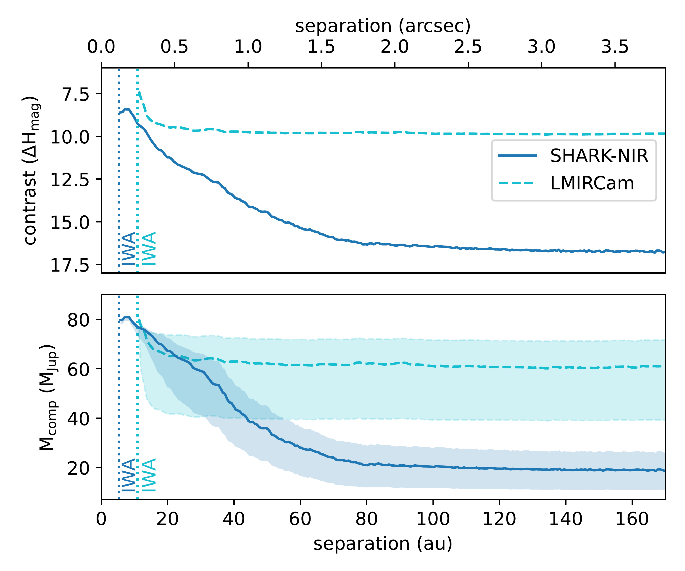
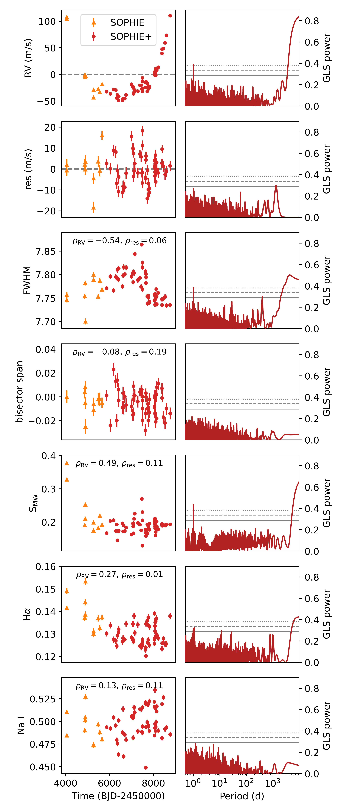

$\newcommand{\ensuremath}{}$
$\newcommand{\xspace}{}$
$\newcommand{\object}[1]{\texttt{#1}}$
$\newcommand{\farcs}{{.}''}$
$\newcommand{\farcm}{{.}'}$
$\newcommand{\arcsec}{''}$
$\newcommand{\arcmin}{'}$
$\newcommand{\ion}[2]{#1#2}$
$\newcommand{\textsc}[1]{\textrm{#1}}$
$\newcommand{\hl}[1]{\textrm{#1}}$
$\newcommand{\footnote}[1]{}$
$\newcommand{\gcm}{\ensuremath{ \rm{g} \rm{cm}^{-3}}\xspace}$
$\newcommand{\yr}{\ensuremath{ \rm a}\xspace}$
$\newcommand{\pc}{\ensuremath{ \rm pc}\xspace}$
$\newcommand{\Lsun}{\ensuremath{ {\rm L}_{\odot}}\xspace}$
$\newcommand{\Msun}{\ensuremath{ {\rm M}_{\odot}}\xspace}$
$\newcommand{\Rsun}{\ensuremath{ {\rm R}_{\odot}}\xspace}$
$\newcommand{\Mjup}{\ensuremath{ {\rm M}_{\rm Jup}}\xspace}$
$\newcommand{\mps}{\ensuremath{ {\rm m s}^{-1}}\xspace}$
$\newcommand{\kmps}{\ensuremath{ {\rm km s}^{-1}}\xspace}$
$\newcommand{\days}{\ensuremath{ \rm d}\xspace}$
$\newcommand{\au}{\ensuremath{ \rm au}\xspace}$
$\newcommand{\deg}{\ensuremath{ \rm deg}\xspace}$
$\newcommand{\sresinob}{\ensuremath{\sqrt{e_{\rm b}}\sin{\omega_{\rm b}}}\xspace}$
$\newcommand{\srecosob}{\ensuremath{\sqrt{e_{\rm b}}\cos{\omega_{\rm b}}}\xspace}$
$\newcommand$
$\newcommand$
$\newcommand{\gaia}{Gaia\xspace}$
$\newcommand{\hip}{Hipparcos\xspace}$
$\newcommand{\orvara}{\texttt{orvara}\xspace}$
$\newcommand{\exofast}{\texttt{EXOFASTv2}\xspace}$
$\newcommand{\smw}{\ensuremath{S_{\rm MW}}\xspace}$
$\newcommand{\deg}{\ensuremath{ {\rm deg}}\xspace}$
$\newcommand{\fd}{\ensuremath{^{\mathrm d}}}$
$\newcommand{\fh}{\ensuremath{^{\mathrm h}}}$
$\newcommand{\fm}{\ensuremath{^{\mathrm m}}}$
$\newcommand{\fs}{\ensuremath{^{\mathrm s}}}$
$\newcommand{\fdg}{\ensuremath{^\circ}}$
$\newcommand{\fmin}{\ensuremath{^\prime}}$
$\newcommand{\fsec}{\ensuremath{^{\prime\prime}}}$
$\newcommand{\teff}{\ensuremath{T_{\rm eff}}\xspace}$
$\newcommand{\logg}{\ensuremath{\log g}\xspace}$
$\newcommand{\gmag}{\ensuremath{G}\xspace}$
$\newcommand{\gbp}{\ensuremath{G_{\rm BP}}\xspace}$
$\newcommand{\grp}{\ensuremath{G_{\rm RP}}\xspace}$
$\newcommand{\parallax}{\ensuremath{\varpi}\xspace}$
$\newcommand{\feh}{\ensuremath{[\rm Fe/H]}\xspace}$
$\newcommand{\uprior}{\ensuremath{\mathcal{U}}}$
$\newcommand{\mum}{{ \mum}\xspace}$
$\newcommand{\mas}{ {mas}\xspace}$
$\newcommand{\masyr}{{mas a^{-1}}\xspace}$

# A multi-technique detection of an eccentric giant planet around accelerating star HD 57625

<mark>Appeared on: 2024-12-10</mark> -  _12 pages, 8 figures, accepted for publication in A&A_

D. Barbato, et al. -- incl., <mark>G. Chauvin</mark>, <mark>T. Henning</mark>, <mark>L. Mohr</mark>

**Abstract:** The synergy between different detection methods is a key asset in exoplanetology, allowing for both precise characterization of detected exoplanets and robust constraints even in the case of non-detection. Recently, the interplay between imaging, radial velocities and astrometry has produced significant advancements in exoplanetary science. We report a first result of an ongoing survey performed with SHARK-NIR, the new high-contrast near-infrared imaging camera at the Large Binocular Telescope, in parallel with LBTI/LMIRCam in order to detect planetary companions around stars with significant proper motion anomaly. In this work we focus on HD 57625, a F8 star for which we determine a $4.8^{+3.7}_{-2.9}$ Ga age, exhibiting significant astrometric acceleration and for which archival radial velocities hint at the presence of a previously undetected massive long-period companion. We analyse the imaging data we collected with SHARK-NIR and LMIRCam in synergy with the available public SOPHIE radial velocity time series and Hipparcos-Gaia proper motion anomaly. With this joint multi-technique analysis, we aim at characterizing the companion responsible for the astrometric and radial velocity signals. The imaging observations result in a non-detection, indicating the companion to be in the substellar regime. This is confirmed by the synergic analysis of archival radial velocity and astrometric measurements resulting in the detection of HD 57625 b, a ${8.43}_{-0.91}^{+1.1}$ $\Mjup$ planetary companion with an orbital separation of ${5.70}_{-0.13}^{+0.14}$ $\au$ and ${0.52}_{-0.03}^{+0.04}$ eccentricity. HD 57625 b joins the small but growing population of giant planets in outer orbits with true mass determination provided by the synergic usage of multiple detection methods, proving once again the importance of multi-technique analysis in providing robust characterization of planetary companions.

**Figure 4. -** Proper motion anomaly sensitivity curve for HD 57625. The dark green curve shows the PMa-compatible companion masses as a function of orbital separations, the shaded region corresponding to the 1$\sigma$ uncertainty range. The blue and cyan curves represent the SHARK-NIR and LMIRCam mass limits as in Fig. \ref{fig:contrast}. Horizontal lines indicate the  brown dwarf (brown) and stellar mass (orange) thresholds. The positions of HD 57625 b as obtained by the RV-only fit and by the joint RV and PMa fit are shown as a red and white circle, respectively, while the distant stellar companion is shown as a yellow star. (*fig:pma*)

**Figure 1. -** _Top panel:_ contrast curve for the imaging observation of HD 57625 conducted on the night of February 24th 2024 UT. _Bottom panel_: mass limits derived using the AMES-COND models, the thick curve corresponding to the nominal 4.8 Ga stellar age, the shaded region corresponding to the age uncertainty. In both panels, the blue solid curves refer to the SHARK-NIR H-band observations and the cyan dashed lines refer to the LMIRCam L$^\prime$-band observation, with similarly colour-coded vertical dotted lines indicating the Inner Working Angle (IWA) of each instrument. (*fig:contrast*)

**Figure 2. -** _Left panels_: time series for the SOPHIE (orange triangles) and SOPHIE+ (red circles) radial velocity data of HD 57625, residual time series obtained after removing the detected Keplerian signal and activity indexes. For the activity indexes time series, the Pearson correlation coefficient with both original and residual RVs are noted. _Right panels_: corresponding generalised Lomb-Scargle periodograms of the time series, with horizontal solid, dashed and dotted lines marking the 10\%, 1\% and 0.1\% FAP thresholds. (*fig:rvgls*)

